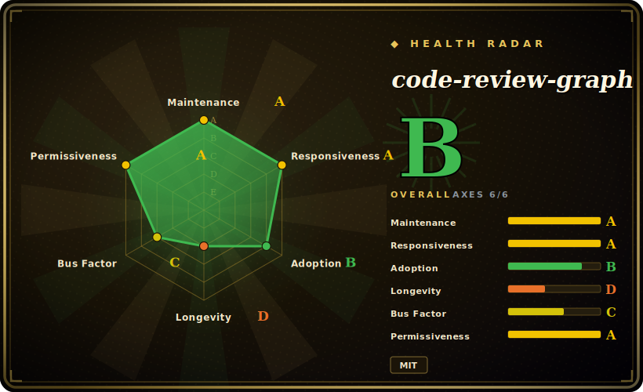

# code-review-graph

A local-first code-intelligence graph: Tree-sitter parses your repo into a SQLite graph of functions/classes/edges, then serves your AI coding tool the minimal blast-radius context via MCP so it reads only what matters.

## When to use

You're a developer pairing with an AI coding assistant (Claude Code, Cursor, Codex, etc.) on a medium-to-large repo, and you keep watching it burn context re-reading half the tree just to answer "what does this change affect?" or "how does auth work here?". Every review task balloons the token bill and the agent still misses a caller two hops away. You want the agent to read *the right ~15 files*, not grep blindly across 28,000. You install code-review-graph, run `build` once (~10s for 500 files), and from then on the agent calls MCP tools like `get_impact_radius` and `get_review_context`: the graph traces every caller, dependent, and test of a changed file and hands back a compact structural slice instead of raw source. On the repos in its own benchmark it reports a median ~82x per-question token reduction, and incremental updates re-index a 2,900-file project in under 2 seconds on file save.

It's also a fit when you want risk-scored PR review *in CI without sending code anywhere*: the same analysis runs as a composite GitHub Action that builds and queries the graph entirely on your runner, posts a sticky comment with risk-scored functions and test gaps, and can gate merges via `fail-on-risk`. If you live in a monorepo and want a background daemon (`crg-daemon`) keeping multiple repos' graphs fresh, that ships in-box too.

## When NOT to use

- **You want a general-purpose graph database, not a code-context layer.** This is a fixed code-intelligence pipeline (AST → SQLite → blast-radius), not a queryable graph store you build apps on. For an actual property/Cypher graph DB use [FalkorDB](falkordb.md).
- **Trivial / single-file changes.** The maintainer's own limitations note that graph context can *exceed* a naive file read for small edits — the structural metadata is overhead you don't recoup until changes span multiple files.
- **You need trustworthy recall numbers today.** The headline "recall 1.0" is explicitly **circular** — ground truth is derived from the same graph the predictor walks. The honest co-change mode is acknowledged as "substantially lower" and **not yet published**. [推断] treat impact accuracy as directional, not a guarantee.
- **Cross-file call resolution beyond Python.** Flow detection is documented at ~33% recall and only reliable on Python framework patterns (FastAPI/httpx); JS/Go flow and search ranking (MRR 0.35) are stated weak spots.
- **Bus-factor / maturity risk.** It is a single-maintainer, Beta-classified project at v2.3.x (first commit 2026-02). Pinning the GitHub Action to a tag and a fast release cadence are mitigations, but lock-in to its `.code-review-graph/` SQLite format and MCP tool surface is real.
- **You need pure document/passage RAG over prose.** This indexes code structure, not arbitrary documents — for hierarchical document retrieval see [PageIndex](pageindex.md).

## Comparison

| Alternative | In index | Our verdict | Tradeoff |
|---|---|---|---|
| [FalkorDB](falkordb.md) | ✅ | Use this page for its stated niche; choose FalkorDB when you need a real Redis-based property graph DB with Cypher + vector search you query directly. | A real Redis-based property graph DB with Cypher + vector search you query directly; a *substrate*, not a turnkey code-context tool. code-review-graph gives you the whole AST→graph→MCP pipeline out of the box but on its own fixed SQLite store. |
| [graphify](graphify.md) | ✅ | Use this page for its stated niche; choose graphify when you need also turns a codebase into a graph for agent retrieval. | Also turns a codebase into a graph for agent retrieval; overlapping intent. code-review-graph leans hard into blast-radius/review + an MCP server, broad language coverage, and a CI Action. Compare scope/maturity directly. |
| [PageIndex](pageindex.md) | ✅ | Use this page for its stated niche; choose PageIndex when you need reasoning-based hierarchical retrieval over *documents* (PDFs, long text), no vector DB. | Reasoning-based hierarchical retrieval over *documents* (PDFs, long text), no vector DB; different input domain — prose, not source ASTs. |
| Sourcegraph / SCIP | 未收录 | Use this page for its stated niche; choose Sourcegraph / SCIP when you need mature, multi-repo code intelligence and indexing at scale. | Mature, multi-repo code intelligence and indexing at scale; heavier infra, not a local single-binary MCP context-reducer aimed at agent token budgets. |
| Serena (MCP) | 未收录 | Use this page for its stated niche; choose Serena (MCP) when you need LSP-backed semantic code MCP server for agents. | LSP-backed semantic code MCP server for agents; symbol/LSP-driven rather than a persisted Tree-sitter graph with blast-radius + community/risk analysis. |
| GraphRAG (Microsoft) | 未收录 | Use this page for its stated niche; choose GraphRAG (Microsoft) when you need LLM-built entity/community graph for document RAG. | LLM-built entity/community graph for document RAG; aimed at unstructured corpora, not deterministic AST-derived code graphs. |

## Tech stack

- **Language:** Python (≥ 3.10, tested through 3.13).
- **Parsing:** Tree-sitter via `tree-sitter` + `tree-sitter-language-pack`; broad language coverage (Python, JS/TS/TSX, Go, Rust, Java, C/C++, C#, Ruby, Kotlin, Swift, PHP, Scala, Solidity, Dart, and more) plus Jupyter/Databricks `.ipynb`. Custom languages addable via `.code-review-graph/languages.toml`, no fork.
- **Graph/storage:** local SQLite in `.code-review-graph/` with FTS5 full-text search; `networkx` for graph algorithms; community detection via Leiden (optional `igraph`).
- **Serving:** MCP server (`mcp` + `fastmcp`) exposing ~30 tools and 5 prompt templates; CLI (`code-review-graph`) and daemon (`crg-daemon`).
- **Optional:** vector embeddings via sentence-transformers / Google Gemini / MiniMax / any OpenAI-compatible endpoint; Python call-resolution enrichment via Jedi; D3.js interactive visualization; export to GraphML / Neo4j Cypher / Obsidian / SVG.
- **CI:** composite GitHub Action for risk-scored PR comments.

## Dependencies

- **Runtime:** Python ≥ 3.10. Install via `pip install code-review-graph` (or `pipx`/`uvx`).
- **Required Python deps (v2.3.6):** `mcp` ≥ 1.0, `fastmcp` ≥ 3.2.4 (<4), `tree-sitter` ≥ 0.23, `tree-sitter-language-pack` ≥ 0.3, `networkx` ≥ 3.2, `watchdog` ≥ 4.0 (and `tomli` on Python < 3.11).
- **Core storage:** local SQLite file — **no external database or cloud service required** for the core graph.
- **Optional groups:** `[embeddings]` (sentence-transformers, numpy), `[google-embeddings]`, `[communities]` (igraph), `[enrichment]` (jedi), `[eval]` (matplotlib), `[wiki]` (ollama), or `[all]`.
- **External services are opt-in only:** cloud embeddings require explicit egress acknowledgement; the CI Action runs entirely on your own runner with no source sent out.

## Ops difficulty

**Low.** Single `pip`/`pipx`/`uvx` install plus one `install` command that auto-detects supported AI tools and writes their MCP config; `build` once, then hooks/watch/daemon keep it fresh. No database to run, no cloud account, state lives in a local SQLite file. It climbs to **low-to-medium** when you opt into semantic embeddings (model downloads, optional cloud egress and API keys), run the multi-repo daemon, or wire the GitHub Action with `fail-on-risk` as a merge gate. The optional dependency matrix (embeddings/communities/enrichment) is the main place version friction can surface.

## Health & viability

- **Maintenance (2026-06):** last push 2026-06-14, latest release v2.3.6 on 2026-06-10 — **active** with a fast release cadence. [推断] Cadence is the upside; for a project this young the same speed means an unstable API/format surface.
- **Governance / bus factor:** **single-maintainer, `User`-owned** (`tirth8205/code-review-graph`), Beta-classified. This is a real **bus-factor flag**: ~18k stars on a personal repo created only months ago is hype far outrunning institutional backing — there is no team or foundation behind the roadmap. [推断]
- **Age & Lindy (created 2026-02, ~0yr):** **young and hyped — fails the Lindy prior.** No track record, no proven multi-year survival; the star count says attention, not durability. Treat continuity as unproven and pin the GitHub Action to a tag. [推断]
- **Adoption / ecosystem:** broad language coverage and an MCP + CI surface drive the stars, but lock-in to its `.code-review-graph/` SQLite format and MCP tool surface is real, and self-reported benchmarks (the ~82x figures, "recall 1.0") are circular/unreproduced. [未验证]
- **Risk flags:** MIT (no relicense risk); the dominant risks are **abandonment / bus-factor** (single maintainer, ~0yr old) and format lock-in, not licensing. [推断]

## Caveats (unverified)

- [未验证] Latest release v2.3.6 published 2026-06-10; repo created 2026-02-26; pushed 2026-06-14 (per `gh` metadata 2026-06-26). Version cadence is fast; re-verify before pinning.
- [未验证] Star count ~18.9k (per `gh` 2026-06-26) — GitHub stars are unreliable and date-sensitive; treat as indicative only.
- [未验证] All token-reduction figures (~82x median, 528x max, "<2s" re-index, build/latency tables) are the project's own benchmark numbers on 6 self-selected repos; not independently reproduced here.
- [推断] Impact "recall 1.0" is self-described as circular (graph-derived ground truth); the honest co-change accuracy is unpublished, so real-world impact precision/recall is unknown.
- [未验证] Stated language coverage, ~30 MCP tools, and supported editor platforms come from the README; the exact working set may shift release-to-release.
- [未验证] License is MIT per both `gh licenseInfo` and `pyproject.toml`; single-maintainer ("Tirth"), Beta development status per packaging classifiers.
