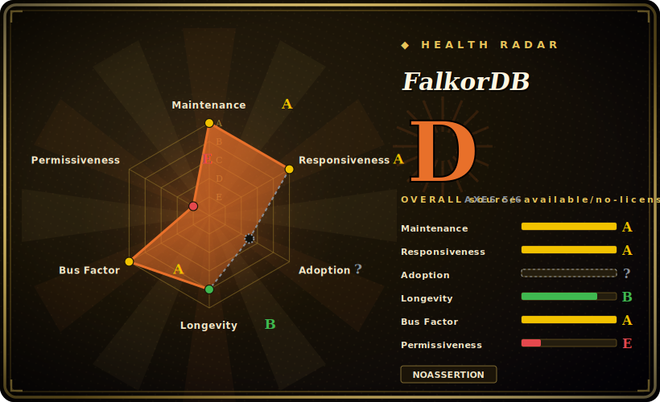

# FalkorDB

A sparse-matrix (GraphBLAS) property-graph database that runs as a Redis module, speaks OpenCypher, and adds vector + full-text indexing to back GraphRAG retrieval for LLM apps.

## When to use

You're building a GraphRAG pipeline: you've extracted entities and relationships from a corpus into a knowledge graph, and at query time you want to combine vector similarity ("find chunks near this question") with multi-hop graph traversal ("now walk from those entities to related facts and cite the path"). A pure vector store can't do the traversal, and a general-purpose graph database means standing up a separate, heavier service alongside your existing cache. FalkorDB resolves this by living inside Redis as a module: you load it, write OpenCypher to create graphs and `CREATE VECTOR INDEX` / full-text indexes, and run hybrid retrieval (vector + traversal + range filters) from one low-latency engine. Its GraphBLAS sparse-matrix core makes the linear-algebra-style traversals fast, and you can keep many named graphs on one server (`GRAPH.QUERY mygraph ...`) for per-tenant or per-document isolation.

You're also a good fit if you came from RedisGraph and need somewhere to land after Redis discontinued that module — FalkorDB picks up the OpenCypher-on-Redis model and ships a documented migration path, plus an official Python GraphRAG-SDK (a separate Apache-2.0 repo) that wires LLM-driven graph construction and retrieval on top, so you don't have to hand-build the ingestion loop.

## When NOT to use

- **You need a copyleft-free / permissively-licensed core.** FalkorDB's server is **SSPL-1.0** — not OSI-approved, and its "offer the software as a service" clause is hostile to building a managed service around it. If your org bans SSPL/AGPL-class licenses, this is a hard stop. (The GraphRAG-SDK client is Apache-2.0, but the database itself is SSPL.)
- **You want a horizontally-sharded graph across many machines.** It runs as a Redis module; scale-out is Redis-style (replication, multi-graph-per-node), not automatic graph sharding. Very large single graphs are bounded by one node's RAM. [推断]
- **Your data doesn't fit in memory.** Like Redis, the working set is memory-resident with RDB/AOF persistence; it is not a disk-first OLAP graph engine for petabyte stores. [推断]
- **You only need vector search.** If there's no graph/traversal value — just nearest-neighbor over embeddings — a dedicated vector store (or pgvector) is simpler and avoids a graph engine you'll underuse.
- **You want the de-facto-standard graph ecosystem.** Neo4j has far larger tooling, Bolt drivers, GDS algorithms, and hiring pool; FalkorDB is younger and OpenCypher-compatible but not a drop-in for Neo4j-specific features.
- **You can't tolerate Redis-module operational coupling.** You inherit Redis 7.4 version requirements, module loading, and the need to build with `--recurse-submodules` if compiling from source.

## Comparison

| Alternative | In index | Tradeoff |
|---|---|---|
| [graphify](graphify.md) | ✅ | Lightweight code/document-to-graph builder; FalkorDB is the storage+query engine, graphify is upstream graph construction — complementary, not a substitute. |
| [code-review-graph](code-review-graph.md) | ✅ | Domain-specific (code-review) graph tool; FalkorDB is a general graph DB you'd build such a tool on. |
| [PageIndex](pageindex.md) | ✅ | Reasoning-based document tree / retrieval index, not a graph database — different retrieval primitive (hierarchical index vs. property graph). |
| Neo4j | 未收录 | Industry-standard property graph with the largest ecosystem (Bolt, GDS, APOC); heavier, GPLv3/commercial. FalkorDB is faster on sparse-matrix traversals and Redis-embedded but younger and SSPL. |
| Memgraph | 未收录 | In-memory, Cypher-compatible, streaming-focused graph DB; BSL-licensed. Overlaps FalkorDB's in-memory niche without the Redis-module model. |
| Neptune (AWS) | 未收录 | Managed, multi-model (Gremlin/openCypher/SPARQL) graph service; no self-host, AWS lock-in. FalkorDB is self-hostable OSS-adjacent. |

## Tech stack

- **Language:** C (core, ~70% of repo), with C++ and a Rust component; tests in Python + Gherkin/Cucumber.
- **Graph engine:** [GraphBLAS](https://github.com/DrTimothyAldenDavis/GraphBLAS) sparse adjacency-matrix representation; query execution expressed as linear algebra.
- **Host:** Redis module (loaded via `loadmodule` / `MODULE LOAD`); requires Redis 7.4 for the latest version.
- **Query language:** OpenCypher with proprietary extensions; indexing: vector (similarity), full-text, range.
- **Build:** CMake + Make, vendored submodules under `deps/`.
- **Clients (official):** Java, Python, Node.js, Rust, Go, C#; community SDKs (Ruby, PHP, Elixir, etc.).
- **Higher-level:** GraphRAG-SDK (separate Apache-2.0 Python repo) for LLM-driven graph construction/retrieval.

## Dependencies

- **Runtime:** Redis 7.4 (host process); the FalkorDB module binary loaded into it.
- **From source:** `git clone --recurse-submodules`, a C/C++ toolchain (gcc/clang), CMake, Make; GraphBLAS and other deps are vendored as submodules.
- **Easiest path:** official Docker image (`docker run -p 6379:6379 -p 3000:3000 falkordb/falkordb`) bundling the engine + browser UI on port 3000.
- **For GraphRAG use:** the Python GraphRAG-SDK plus an LLM provider for entity/relationship extraction.

## Ops difficulty

**Low-to-medium.** Docker makes single-node trivial — one container gives you the engine, persistence, and a web UI. Day-to-day ops are essentially Redis ops: RDB/AOF persistence, `maxmemory` tuning, replication. Difficulty rises to **medium** when you (a) compile from source for a custom platform (submodule + GraphBLAS build), (b) need HA/replication topologies, or (c) push large graphs against a single node's RAM ceiling, since there's no built-in horizontal graph sharding. Memory sizing is the main capacity-planning concern.

## Health & viability

- **Maintenance (2026-06):** last push 2026-06, current release v4.18.11 — **active** with a mature version number and frequent point releases. [推断] The ~705 open issues read as engagement on a busy project, not neglect.
- **Governance / backing:** organization-owned (`FalkorDB/FalkorDB`) by the FalkorDB company — a single-vendor commercial-OSS project, not a foundation. [推断] Roadmap and license are vendor-controlled; bus factor is institutional rather than single-maintainer, but the vendor's business model (a managed offering) shapes direction.
- **Age & Lindy (created 2023-07, ~3yr):** moderately young but continuously active, and it inherits credibility as the **RedisGraph successor** (OpenCypher-on-Redis lineage). [推断] Past the abandoned-young failure mode; not yet a long-proven Lindy bet — call it an established-but-not-old engine.
- **Adoption / ecosystem:** ~4k stars (volatile, see Caveats); official multi-language clients and a GraphRAG-SDK aid adoption, but it competes against Neo4j's vastly larger ecosystem and hiring pool. [未验证]
- **Risk flags:** **SSPL-1.0 — the load-bearing flag.** Not OSI-approved; the "offer as a service" clause is hostile to building a managed service on it, and orgs that ban SSPL/AGPL-class licenses must stop here. This is a deliberate single-vendor licensing posture, not a relicense surprise. [推断]

## Caveats (unverified)

- [未验证] Stars ~4.66k as of 2026-06 (GitHub stars are unreliable and date-sensitive; indicative only).
- [推断] FalkorDB is widely described as a fork/successor of RedisGraph after Redis discontinued that module; a "RedisGraph to FalkorDB" migration guide exists, but the in-repo README does not state the fork lineage explicitly — confirm against the project's own history before asserting it.
- [推断] Single-node RAM ceiling and lack of automatic graph sharding are inferred from the Redis-module architecture, not a quoted limitation; verify against current docs for your scale.
- [推断] In-memory working set with RDB/AOF persistence is inferred from the Redis-module model; the README does not spell out the storage architecture.
- [未验证] Exact language byte split (C ~70%, plus C++/Rust/Python) is from the GitHub language breakdown at verification time and shifts release-to-release.
- [未验证] The set of official client SDKs and indexing features (vector / full-text / range) is from project docs at verification time; check the current docs for your version.
