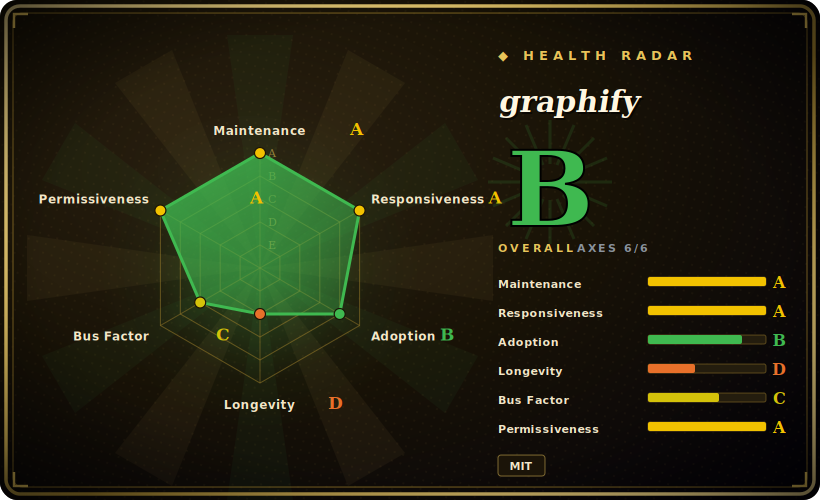

# graphify

A Python CLI + MCP server (also packaged as an AI-coding-assistant skill) that turns a folder of code, schemas, scripts, docs and media into a portable, queryable knowledge graph an agent can ask instead of grepping.

## When to use

You're a coding agent (or the engineer wiring one) dropped into an unfamiliar mid-to-large repo, and the user keeps asking cross-cutting questions — "what calls this auth handler", "where does this SQL table get written", "which module owns config loading". Plain `grep`/ripgrep gives you string hits with no structure: you burn context re-reading files to reconstruct call flow and ownership. graphify extracts an AST graph locally with tree-sitter (36 grammars), sends non-code files (docs, PDFs, images) to an LLM for semantic nodes, runs Leiden community detection to cluster the result into architectural "communities", and writes a portable `graph.json` plus an interactive `graph.html` and a `GRAPH_REPORT.md`. You then run `graphify query "question"` or hit it as an MCP server, getting structured answers (with `EXTRACTED`/`INFERRED`/`AMBIGUOUS` confidence labels) instead of raw file dumps.

It fits especially well when the graph spans more than just app code — graphify deliberately ingests SQL schemas, infra (Terraform/HCL), package manifests, R/shell scripts and docs into one graph, so an agent can reason about app-code + database + infrastructure together. Because it installs as a `/graphify` skill across many agents (Claude Code, Codex, Cursor, Gemini CLI, OpenCode, Aider and more) and ships an MCP mode, it slots into an existing agent loop without you building bespoke retrieval plumbing.

## When NOT to use

- **You want a persistent, multi-writer graph database.** graphify's native store is a one-shot `graph.json` (with a 512 MiB default cap); it does Cypher *export* to Neo4j/FalkorDB but is not itself a transactional graph DB. If you need a live, queryable, concurrently-updated graph backend, use [FalkorDB](falkordb.md) or Neo4j directly.
- **Huge monorepos / very large graphs.** The interactive HTML visualization is practically capped around ~5000 nodes [未验证]; beyond that you work with raw JSON, and extraction over a massive tree means many LLM calls for non-code files (cost + latency).
- **You need deterministic, offline-only extraction.** Code AST extraction is local, but semantic nodes for docs/PDFs/images require an LLM backend (Anthropic/OpenAI/Gemini/Ollama/Bedrock/etc.) — that means API keys, cost, non-determinism, and sending file contents to a model unless you run a local Ollama backend.
- **You want a stable, frozen API.** Releases are very frequent (143+ releases, multiple per week as of 2026-06); this is fast-moving single-maintainer-scale software [推断] — pin versions and expect churn in commands/output format.
- **Pure document RAG over prose with no code.** If your corpus is articles/PDFs and you want passage retrieval (not a code/entity graph), a document-structure or vector approach like [PageIndex](pageindex.md) is a more direct fit.
- **You only need code-review-specific graphs.** For PR/diff-scoped review graphs, [code-review-graph](code-review-graph.md) targets that narrower workflow.

## Comparison

| Alternative | In index | Tradeoff |
|---|---|---|
| [FalkorDB](falkordb.md) | ✅ | A real persistent graph database (Redis-based, Cypher); graphify can *push* to it. Use FalkorDB when you need a live multi-query graph store, graphify when you want one-shot extraction + agent-facing query. |
| [PageIndex](pageindex.md) | 未收录 | Reasoning-based document-structure indexing for RAG over long docs/PDFs; no code AST or call-graph. Different problem: prose retrieval vs code/entity graph. |
| [code-review-graph](code-review-graph.md) | ✅ | Narrow PR/code-review graph workflow; graphify is whole-repo + multi-language + multi-modal and broader in scope. |
| Sourcegraph / SCIP | 未收录 | Industrial-grade precise code intelligence (cross-repo, language servers); heavier infra and not agent-skill-shaped. graphify is lighter, LLM-augmented, drops into an agent loop. |
| GitHub `code2graph` / tree-sitter scripts | 未收录 | Roll-your-own AST graphs; more control, but you build query, clustering, viz, and agent integration yourself. |

## Tech stack

- **Language:** Python (100% per repo statistics, 2026-06).
- **Parsing:** tree-sitter with 36 bundled grammar parsers (Python, TS/JS, Go, Rust, Java, C/C++, C#, Kotlin, Ruby, PHP, Swift, SQL, Terraform/HCL, Apex, CUDA, and more).
- **Graph analysis:** Leiden community detection (optional extra; noted Python < 3.13 only).
- **Outputs:** `graph.json` (full graph), `graph.html` (interactive viz), `GRAPH_REPORT.md`.
- **Interfaces:** CLI (`graphify extract|query|export|install`), MCP server (`python -m graphify.serve`, stdio/HTTP), and a `/graphify` skill installed into many agents.
- **LLM backends (for non-code semantic nodes):** Anthropic, OpenAI, Gemini, DeepSpeek/Moonshot, Azure OpenAI, Bedrock, or local Ollama.

## Dependencies

- **Runtime:** Python 3.10+ [未验证]; install via `uv tool install graphifyy` (recommended), `pipx install graphifyy`, or `pip install graphifyy`. Note the PyPI package is **`graphifyy`** (double-y) while the CLI command is `graphify`.
- **Optional extras (pip):** `pdf`, `office` (DOCX/XLSX), `video` (faster-whisper + yt-dlp), `neo4j`, `falkordb`, `postgres`, `terraform`, `ollama`, `openai`/`gemini`/`anthropic`/`bedrock`/`azure`, `sql`, `mcp`, `leiden`, `chinese` (jieba), `all`.
- **External services:** an LLM backend (cloud API key or local Ollama) is required to graph non-code files; pure code-AST extraction is local. Optional downstream graph DBs: Neo4j, FalkorDB, PostgreSQL introspection.
- **Security note:** v0.8.49 bumped `starlette` to address CVE-2026-48818 and CVE-2026-54283 (per release notes; see Caveats).

## Ops difficulty

**Low-to-medium.** The happy path is a single CLI install plus `graphify extract .` / `graphify query`, or a one-line skill install into an existing agent — no server to run for basic use, output is a portable JSON file. It rises to **medium** once you add an LLM backend (key management, per-file cost/latency, sending contents to a model), run the MCP server as a long-lived process, push to Neo4j/FalkorDB, or work past the HTML/node and 512 MiB graph ceilings on large repos. The very high release cadence also means version pinning is part of ops hygiene here.

## Health & viability

- **Maintenance — active.** Last pushed 2026-06, not archived, very high release cadence (143+ releases, multiple per week as of 2026-06) [未验证]. Activity is not the worry here; churn is — the velocity that signals "alive" also means CLI surface and output schema move between minor versions, so pin a version.
- **Governance / bus factor — single-maintainer-scale, a real flag.** The repo is **User**-owned (`safishamsi/graphify`) with ~73k stars [未验证] — a high star-to-bus-factor ratio. No foundation or vendor backs the roadmap; one person's attention is the dependency. `[推断]` If that maintainer stops, the project stalls.
- **Age & Lindy — young, unproven (created 2026-04, ~2 months old as of 2026-06).** Too new to have earned a Lindy prior: heavy stars on a months-old single-maintainer repo are hype, not a track record. Treat it as promising-but-unsettled, not a safe long-term bet.
- **Risk flags — fast churn + LLM-dependency + CVE hygiene.** Frequent releases mean breaking changes; non-code extraction sends file contents to an LLM backend; v0.8.49 bumped `starlette` for CVE-2026-48818/54283 (per release notes, not independently confirmed) [未验证]. MIT license — no relicense/open-core flag observed.

## Caveats (unverified)

- [未验证] Latest release v0.8.49 published 2026-06-25; ~73.1k stars (as of 2026-06-28, via GitHub API) — the count is API-verified, but its adoption meaning is unverified, and GitHub stars are unreliable and date-sensitive; treat as indicative only.
- [未验证] Minimum Python 3.10 and the "36 tree-sitter grammars" / supported-file-type list come from the README; verify against the installed version before relying on a specific language/format.
- [未验证] The ~5000-node HTML practical limit and 512 MiB default graph cap are documented defaults; real ceilings depend on machine memory and graph density.
- [未验证] Security CVE fixes (starlette) cited from release notes; not independently confirmed against an advisory database.
- [推断] "143+ releases, multiple per week" implies fast-moving, small-team software with potential churn in CLI surface and output schema between minor versions.
- [推断] graphify is best classified as a `tool` (CLI + MCP server) rather than a pure skill-pack, since it has a real tech stack, dependencies and ops surface beyond a prompt bundle.
