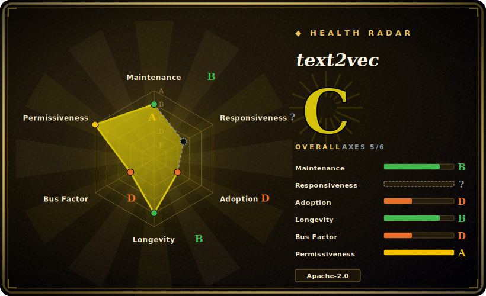

# text2vec

A Python library that turns text into vectors for semantic similarity and retrieval — bundling Word2Vec, BM25, Sentence-BERT, CoSENT and BGE-style methods behind one `pip install`, with a strong Chinese-language focus.

## When to use

You're an NLP engineer at a Chinese-market company building a FAQ/semantic-search feature: a user types a question and you need to find the closest match among thousands of canned answers. You don't want to stand up a heavyweight retrieval stack or fight with raw `transformers` boilerplate just to get sentence embeddings, and most English-first embedding tutorials trained on Western corpora underperform on your Chinese text. You `pip install text2vec`, load one of the bundled Chinese models (a CoSENT or Sentence-BERT checkpoint, or Tencent's Chinese Word2Vec), and call `model.encode(sentences)` to get vectors — then cosine-similarity or BM25 ranks candidates. The library is opinionated toward Chinese semantic matching out of the box, so you get usable similarity scores without curating your own training set first.

You also reach for it when you want to *fine-tune* a sentence embedder on your own labeled pairs (the repo ships CoSENT/SBERT training loops and reports benchmark numbers on Chinese STS datasets like ATEC, BQ, LCQMC, PAWSX, STS-B), or when you need a quick CLI to batch-vectorize a corpus and serve it over FastAPI/Jina.

## When NOT to use

- **You want a full vector database / retrieval engine.** text2vec produces embeddings; it does not store, index (ANN), or serve them at scale. Pair it with FAISS, Milvus, or pgvector — it is the *encoder*, not the index.
- **Your workload is English-first or broadly multilingual.** The library's defaults and benchmarks center on Chinese; for English or many-language retrieval, the upstream `sentence-transformers` ecosystem or a multilingual BGE/E5 model used directly may serve you better. [推断]
- **You need the absolute latest embedding SOTA.** It wraps established methods (SBERT, CoSENT, BGE); newer instruction-tuned or large embedding models (e.g. via the MTEB leaderboard) may outrank the bundled checkpoints — verify against current benchmarks for your task.
- **You're already standardized on `sentence-transformers` / HuggingFace directly.** text2vec is a convenience wrapper over that stack; if you already use it, the extra layer adds little beyond the Chinese-model curation and training scripts.
- **Single-maintainer dependency is a dealbreaker.** This is one person's project (see Health) — fine as a library you vendor, riskier as a load-bearing dependency you expect long-term support on.

## Comparison

| Alternative | In index | Tradeoff |
|---|---|---|
| sentence-transformers (SBERT) | 未收录 | The upstream library text2vec builds on; broader model zoo and English/multilingual coverage, but less Chinese-curated out of the box and no bundled BM25/Word2Vec convenience. |
| BGE / FlagEmbedding (BAAI) | 未收录 | State-of-the-art open embedding models (incl. strong Chinese); text2vec can load BGE, but FlagEmbedding is the canonical home for the latest checkpoints and rerankers. |
| FAISS / Milvus | 未收录 | Vector indexes, not encoders — complementary, not substitutes; you still need an embedder like text2vec in front. |
| OpenAI / Cohere embedding APIs | 未收录 | Hosted, no self-hosting or GPU, strong quality — but paid, network-dependent, and sends text to a third party; text2vec runs fully local. |

## Tech stack

- **Language:** Python (3.x).
- **Core deps:** PyTorch and Hugging Face `transformers`; uses `sentence-transformers` for model loading/encoding. [推断]
- **Models:** bundled/loadable checkpoints — Tencent Chinese Word2Vec (200-d), Sentence-BERT, CoSENT, and BGE-style fine-tuned models distributed via the HuggingFace Hub.
- **Methods:** Word2Vec, RankBM25 (lexical), Sentence-BERT, CoSENT (ranking-sensitive loss), contrastive BGE-style fine-tuning.
- **Serving:** optional CLI for batch vectorization; FastAPI / Jina (gRPC) deployment paths mentioned in the README.

## Dependencies

- **Runtime:** Python + PyTorch; model weights pulled from the HuggingFace Hub on first use (network access required for the initial download).
- **Hardware:** runs on CPU; a CUDA GPU accelerates encoding and is needed for practical fine-tuning (README benchmarks cite a Tesla V100). [未验证]
- **No external services** required for inference once weights are cached — embeddings are computed locally.

## Ops difficulty

**Low.** For inference it's a `pip install` and a `model.encode()` call — no datastore, no service to operate. The main operational concerns are the usual ML ones: pinning the model + library versions for reproducibility, the first-run weight download (size/network), and provisioning a GPU if you fine-tune or encode large corpora. Putting it into production means deciding where embeddings live (you bring your own vector index) and how you version the encoder, but the library itself adds no clustering or infra burden.

## Health & viability

- **Maintenance (2026-06).** Last pushed 2026-02; latest tag v1.2.9. Commit cadence has slowed from its earlier peak but the repo is **not archived** and saw activity within the last few months — call it lightly-maintained/active, not abandoned. [推断]
- **Governance / bus factor.** A **single-maintainer** project (shibing624) with a long tail of minor contributors — the bus factor is effectively one. High stars (~5.0k) on a solo project is social proof of usefulness, not of sustained support. [推断]
- **Age & Lindy verdict.** Created 2019-11, ~6.5 years old and still receiving updates — a moderate Lindy signal: it has outlived the hype cycle of many embedding libraries and remains usable, though the single-maintainer cadence tempers the bet. [推断]
- **Adoption.** Widely used in the Chinese NLP community (~5.0k stars, 428 forks, on PyPI); a practical default for Chinese semantic matching. The thin open-issue count (7) reads as either responsive triage or low current activity. [未验证]
- **Risk flags.** Apache-2.0 (clean, commercial-friendly, no relicense history found). Main flag is bus-factor; secondary is that it wraps fast-moving upstreams (`transformers`/`sentence-transformers`) and may lag their latest models. [推断]

## Caveats (unverified)

- [未验证] ~5.0k stars / 428 forks and v1.2.9 as of 2026-06; star and version numbers are date-sensitive — treat as indicative.
- [未验证] Exact pinned versions of PyTorch / transformers / sentence-transformers are set by the repo's manifest at install time and shift across releases — not asserting specific versions here.
- [推断] "Chinese-first" is inferred from the README's model curation and Chinese-benchmark focus; English/multilingual quality is supported but less documented — benchmark for your own language before committing.
- [推断] Maintenance level ("lightly-maintained/active") is inferred from commit recency and a single maintainer, not from a stated support policy.
- [未验证] GPU requirement for fine-tuning and the V100 benchmark figure come from the README; not independently re-measured.
