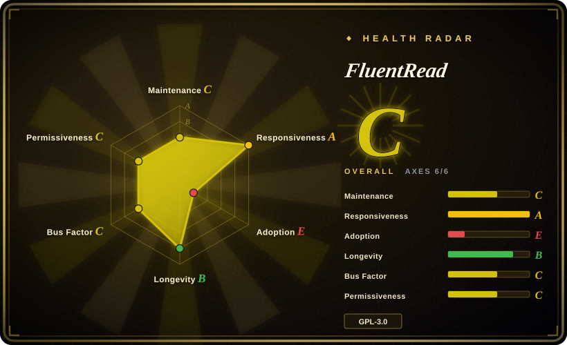

# FluentRead

An open immersive-translation browser extension for bilingual webpage reading, selected-text translation, full-page translation, back-translation, and 20+ translation engines including OpenAI, DeepSeek, Kimi, Claude, Gemini, Ollama, and OpenAI-compatible custom endpoints.

## When to use

You're a Chinese-speaking user or team who wants an open-source immersive-translation extension that feels close to the commercial Immersive Translate workflow: bilingual side-by-side text, translation-only mode, selected-text translation, a floating full-page translation entry point, and a broad list of traditional and AI engines. You want to keep configuration local, use your own OpenAI/DeepSeek/Kimi/Claude/Gemini/Ollama credentials, and avoid depending on an official closed-source extension repo.

Pick FluentRead when the core job is webpage reading and translation, not a full language-learning suite. It is older than Read Frog and explicitly positions itself as “Open Immersive Translate”; choose it over Margin Read when you need Firefox/Edge/Chrome store availability and many built-in engines, and choose it over Read Frog when a simpler translation-first UX is more valuable than TTS, YouTube subtitle translation, and language-learning extras.

## When NOT to use

- **You need permissive-license reuse or closed-source redistribution.** Use [Margin Read](margin-read.md) instead; FluentRead is GPL-3.0.
- **You need the clearest documented OpenAI-compatible/local endpoint story.** Use [Margin Read](margin-read.md) or verify FluentRead's custom engine in source before adopting; FluentRead supports a `custom` OpenAI-compatible service and documents Ollama setup, but its protocol surface is less explicitly productized than Margin Read's README.
- **You need subtitle/TTS/language-learning workflows.** Use [Read Frog](read-frog.md) instead; FluentRead's verified scope is page/selection/full-text translation, back-translation, caching, and engines.
- **You want a strongly multi-maintainer project.** Use [Read Frog](read-frog.md) if broader contributor activity matters; FluentRead's contribution counts are heavily concentrated in the owner account.
- **You cannot accept browser-side provider calls.** Use a server-side translation proxy you control or browser built-in translation; FluentRead sends text to third-party or configured endpoints from the extension, so provider privacy, billing, and rate limits become your responsibility.
- **You need GitHub release cadence as an audit artifact.** Use [Pair Translate](pair-translate.md) or [Margin Read](margin-read.md); FluentRead had no GitHub Releases or tags returned in the checked API snapshot, so store/package versioning must be verified elsewhere.

## Comparison

| Alternative | In index | Our verdict | Tradeoff |
|---|---|---|---|
| [Read Frog](read-frog.md) | ✅ | Choose Read Frog when learning features, TTS, subtitle translation, batching, and more active release automation outweigh a larger surface area; choose FluentRead for a focused open immersive-translation UX. | Read Frog is richer and very active but younger and broader; FluentRead is translation-first and older, but has stronger single-maintainer concentration. |
| [Margin Read](margin-read.md) | ✅ | Choose Margin Read when MIT licensing, explicit BYOK/local endpoint docs, and privacy threat modeling are decisive; choose FluentRead when many engines and cross-store browser support matter more. | Margin Read is permissive and transparent but early Chrome/Chromium-first; FluentRead is mature-looking for end users but GPL and less explicit on endpoint protocol details. |
| [Pair Translate](pair-translate.md) | ✅ | Choose Pair Translate when you want a lighter bilingual extension with release zips and many provider templates; choose FluentRead when the goal is closer to full immersive-translation reading. | Pair Translate is lighter and has verified local templates; FluentRead is more directly branded around immersive translation and has a larger star count. |
| Immersive Translate official repo | 未收录 | Do not use the official repo as the open-source candidate; use FluentRead when source availability and self-managed engines are required. | Immersive Translate is the product benchmark, but its public repo does not contain the extension source code. |
| DeepL / Google Translate browser features | 未收录 | Choose built-in/vendor translation when low setup and vendor-managed quality matter; choose FluentRead when local config, multiple engines, and bilingual webpage layout are the job. | Vendor/browser translation is easier but usually not BYOK/custom-endpoint friendly and less configurable for bilingual reading. |

## Tech stack

- **Extension framework:** WXT Manifest V3 with Vue 3, Element Plus, webextension-polyfill, WXT storage, and Vite.
- **Translation services:** traditional engines such as Microsoft, Google, DeepL/DeepLX, Xiaoniu, Youdao, Tencent; AI engines such as OpenAI, Azure OpenAI, Gemini, Claude, DeepSeek, Moonshot/Kimi, Groq, OpenRouter, Ollama/custom, and more.
- **Custom engine:** source contains a `custom` service defaulting to `http://localhost:11434/v1/chat/completions`, using a bearer token and OpenAI-compatible `choices[0].message.content` response shape.
- **Docs stack:** VitePress/VuePress docs alongside extension source.
- **Tooling:** pnpm 9.x, TypeScript, vue-tsc, Biome/ESLint-style checks via scripts, and WXT zip/build targets.

## Dependencies

- **Runtime:** Chrome, Edge, Firefox, or another compatible browser extension environment.
- **Provider credentials:** API key/token/AK/SK/appid/secret fields depending on the chosen engine.
- **Local Ollama/custom endpoint:** Ollama setup requires CORS configuration such as `OLLAMA_ORIGINS="*"` in the FAQ's quick path; that convenience should be reviewed before using it on a shared machine.
- **Build:** pnpm, Node/TypeScript/Vite/WXT toolchain.

## Ops difficulty

**Low for personal use, medium for private-model use.** Store installation and ordinary API-key configuration are easy. Complexity appears when you need private/local model routing: the extension calls configured endpoints from the browser, so CORS, HTTP vs HTTPS, API-key storage, endpoint availability, and provider response compatibility all become operational constraints. Teams should also document which engines are allowed and how secrets are rotated.

## Health & viability

- **Maintenance (2026-07).** Repo is not archived and was pushed in 2026-03; package manifest version is 0.0.28. No GitHub Releases/tags were returned, so release cadence is less auditable from GitHub alone.
- **Governance / bus factor.** User-owned repo with contributions heavily concentrated in `Bistutu`; this is the primary viability weakness despite strong adoption.
- **Age & Lindy.** Created 2023-12, giving more history than the 2025/2026 alternatives, but still young for a browser extension that users may rely on daily.
- **Adoption.** ~7.3k stars and Chrome/Edge/Firefox install links indicate meaningful user interest; store metrics were not checked.
- **Risk flags.** GPL-3.0, browser-side text egress to selected providers, no verified governance/security docs, and the Ollama CORS workaround deserve explicit review.

## Caveats (unverified)

- [未验证] Chrome/Edge/Firefox store versions, install counts, and review status were not checked.
- [未验证] API keys/secrets appear in extension config fields, but encryption-at-rest and full storage lifecycle were not audited.
- [未验证] All listed engines were not runtime-tested; docs and source lists are not a substitute for provider-by-provider verification.
- [未验证] Issue/PR responsiveness was not deeply measured beyond repo metadata and contributor concentration.
- [推断] Single-maintainer risk is inferred from top contributor counts and User ownership; private/community governance outside the public repo was not verified.
