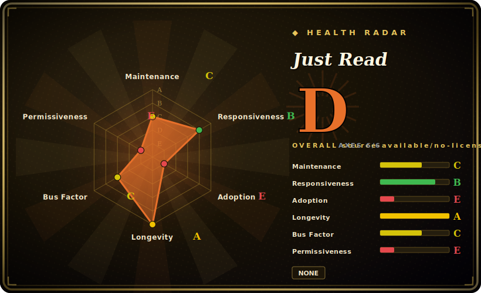

# Just Read

A customizable "read mode" browser extension that strips ads, modals, and navigation from article pages and reformats them into a clean, readable view — with optional editing, highlighting, and (premium) cross-device save and OpenAI summaries.

## When to use

You're someone who reads a lot of web articles and is sick of news sites that bury a 600-word story under cookie banners, autoplay video, three modals, and a sticky nav. You don't want to copy text into a notes app; you just want the article, readable, in place. You install Just Read in Chrome/Edge/Brave/Opera or Firefox, click the toolbar button (or hit a keyboard shortcut), and the page collapses to just the content in a font and width you've configured. You can tweak the theme, edit out a stray pull-quote, highlight passages, and even add comments — it's a reader mode that lets you *shape* the result rather than take a fixed template.

You also reach for it when you want per-site control: Just Read lets you save custom selectors so that on a site it consistently mis-parses, you teach it which element is the article once and it remembers. If you connect an OpenAI API key you can have it summarize the article, and the paid Premium tier adds cross-device saving of cleaned pages. For the common case — "make this specific article readable right now, my way" — it's a lightweight, in-browser tool with no backend to run.

## When NOT to use

- **You need an auditable, freely-licensed codebase.** The repo has **no open-source LICENSE file** — usage is governed by a EULA (`docs/EULA.md`), and the project has a paid Premium tier. Treat the code as *source-available under a EULA, not OSS*; don't assume MIT/permissive reuse rights. [未验证]
- **You want a read-it-later library / archive.** Free Just Read is a per-page reformatter; durable cross-device saving is a **Premium** (paid, hosted) feature with article limits. For a full archive workflow, Pocket/Instapaper/Wallabag/Readwise fit better.
- **You're outside extension-capable browsers.** It's a browser extension (Chromium browsers + Firefox); on mobile it only works in browsers that support extensions (Kiwi, Yandex, etc.) and some features may not work there.
- **You need it to reformat non-article pages.** The README explicitly scopes it to *article-type pages*; dashboards, apps, and complex layouts are out of scope and "liable to not perform as one might expect."
- **You want a vendor-independent, multi-maintainer project.** It's effectively a single-developer project tied to one person and a hosted Premium service (justread.link); that's both the governance risk and the lock-in surface for the paid features.

## Comparison

| Alternative | In index | Tradeoff |
|---|---|---|
| Built-in browser Reader Mode (Firefox/Safari/Edge) | 未收录 | Zero install, baked into the browser; far less customizable, no per-site selectors, no editing/highlighting/summaries. |
| Mozilla Readability (library) | 未收录 | The open-source MPL parsing engine behind many reader modes; a library to build on, not a ready-to-use extension. |
| Postlight Reader (ex-Mercury) | 未收录 | Open-source readability extension/parser; cleaner licensing story, but less actively maintained and fewer edit/highlight features. |
| Pocket / Instapaper / Wallabag | 未收录 | Read-it-later services with durable cross-device libraries; heavier (account + backend) and aimed at saving, not in-place reformatting (Wallabag is self-hostable). |
| Reader View extensions (various) | 未收录 | Many small clones exist; vary widely in parsing quality, licensing, and trustworthiness — Just Read's edge is its customization and selector memory. |

## Tech stack

- **Language:** JavaScript — a WebExtension (content script + options page) running in the browser; no server component for the core free features. [推断]
- **Parsing:** client-side DOM heuristics to pick the article element, with user-defined CSS selectors stored per domain for sites it gets wrong.
- **Optional integrations:** OpenAI API (user-supplied key) for summaries; a hosted backend (justread.link) for Premium cross-device save and account/email storage.
- **Distribution:** Chrome Web Store, Firefox Add-ons, and Microsoft Edge Add-ons.

## Dependencies

- **Runtime:** an extension-capable browser (Chrome/Edge/Brave/Opera/Firefox, or mobile browsers that support extensions). No server to run for free features.
- **Optional:** an OpenAI API key (yours) for summarization; a Just Read account + Premium purchase for hosted cross-device saving.
- **Build:** a Node/JS toolchain to build the extension from source if not installing from a store.

## Ops difficulty

**Low — it's a client-side browser extension.** Install from a store, configure the options page, done; there's nothing to deploy or operate for the free path. The only "ops" appear if you depend on the hosted Premium features (account, cross-device saving), which are run by the maintainer's service — not something you operate, but a dependency on a third party and its article limits. Building from source is a standard JS-extension build.

## Health & viability

- **Maintenance (2026-06).** Last pushed 2026-05 with commits through March–May 2026 — **actively maintained**. Not archived. [推断]
- **Governance / bus factor.** Single-maintainer (`ZachSaucier` is effectively the only contributor) and a **User**-owned repo with a hosted commercial side (justread.link) — a clear single-point-of-failure both for the code and for the Premium service. **Flagged.** [推断]
- **Age & Lindy verdict.** Created 2015-10 (~10 years) and still active ⇒ a reasonable Lindy signal for a personal project; it has survived a decade of free-time maintenance, which is itself a positive durability indicator. [推断]
- **Adoption.** ~1.3k stars and listings on three extension stores indicate real user adoption for a niche utility; no large contributor community behind it. [未验证]
- **Risk flags.** **No OSS license** (EULA-governed, source-available) plus an **open-core/freemium** model (free reformatter, paid hosted save) — the main risk flags. If the maintainer steps away, the Premium service and any future updates are at risk. [未验证]

## Caveats (unverified)

- [未验证] License: the repo has no SPDX LICENSE file; the README points to a EULA (`docs/EULA.md`) and a paid Premium tier — so this is *source-available under a EULA*, not confirmed open source. Reuse/redistribution rights are unverified; "Unlicensed (EULA)" in frontmatter reflects this.
- [未验证] ~1.3k stars, 144 forks, 11 open issues as of 2026-06 — volatile, date-sensitive figures.
- [未验证] Premium article limit was described as ~300 saved articles in the README; this is the maintainer's stated cap and may change.
- [推断] WebExtension architecture (content script + options page, client-side parsing) is inferred from the project description and standard reader-mode design, not a code audit.
- [未验证] The exact set of features gated behind Premium vs free shifts over time; verify against the current extension and justread.link.
