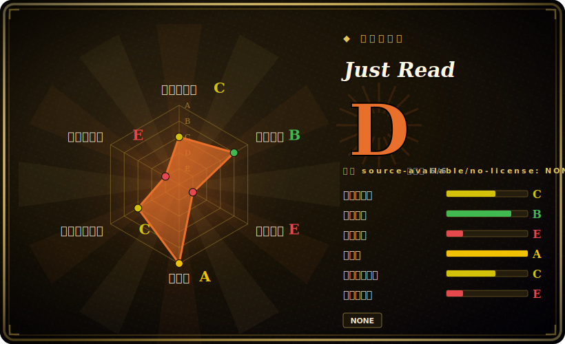

# Just Read

一个可定制的“阅读模式”浏览器扩展，把文章页里的广告、弹窗和导航剥掉，重排成干净可读的视图——还带可选的编辑、高亮，以及（付费版的）跨设备保存和 OpenAI 摘要。

## 何时使用

你是个读很多网页文章的人，受够了新闻站把一篇 600 字的报道埋在 cookie 横幅、自动播放视频、三个弹窗和粘性导航底下。你不想把正文复制到笔记应用里；你就想要那篇文章，原地、可读。你在 Chrome/Edge/Brave/Opera 或 Firefox 里装上 Just Read，点工具栏按钮（或按快捷键），页面就坍缩成只剩正文，字体和宽度按你配置的来。你可以调主题、抹掉一段碍眼的引文、给段落高亮，甚至加批注——这是一个让你*塑形*结果而非套固定模板的阅读模式。

当你想要按站点精细控制时，你也会选它：Just Read 允许你保存自定义选择器，对于某个总是解析错的站点，你教它一次哪个元素是正文，它就记住。如果你接上 OpenAI API key，它能给文章生成摘要；付费 Premium 档还加上跨设备保存清理后的页面。对于常见场景——“现在就把这篇文章按我的方式弄得可读”——它是一个轻量、跑在浏览器里、无后端可运维的工具。

## 何时不用

- **你需要一份可审计、自由许可的代码库。** 仓库**没有开源 LICENSE 文件**——使用受 EULA（`docs/EULA.md`）约束，且项目有付费 Premium 档。请把代码当作*在 EULA 下源码可见，而非 OSS*；别假设有 MIT/宽松的复用权。[未验证]
- **你想要稍后读的资料库 / 归档。** 免费版 Just Read 是按页重排器；持久的跨设备保存是 **Premium**（付费、托管）特性且有文章数量上限。要完整归档工作流，Pocket/Instapaper/Wallabag/Readwise 更合适。
- **你不在支持扩展的浏览器里。** 它是浏览器扩展（Chromium 系加 Firefox）；在移动端只在支持扩展的浏览器里能用（Kiwi、Yandex 等），且部分功能可能失效。
- **你要它重排非文章页。** README 明确把它限定在*文章型页面*；看板、应用和复杂布局不在范围内，“很可能表现不如预期”。
- **你想要一个不依赖单一厂商、多人维护的项目。** 它实际上是绑定在一个人加一个托管 Premium 服务（justread.link）上的单人项目；这既是治理风险，也是付费功能的锁定面。

## 横向对比

| 替代品 | 是否收录 | 取舍 |
|---|---|---|
| 浏览器内置阅读模式（Firefox/Safari/Edge） | 未收录 | 零安装、内建于浏览器；可定制性差得多，没有按站点选择器，没有编辑/高亮/摘要。 |
| Mozilla Readability（库） | 未收录 | 许多阅读模式背后那个开源 MPL 解析引擎；是用来构建的库，不是开箱即用的扩展。 |
| Postlight Reader（前 Mercury） | 未收录 | 开源的可读性扩展/解析器；许可更清晰，但维护没那么活跃、编辑/高亮特性更少。 |
| Pocket / Instapaper / Wallabag | 未收录 | 带持久跨设备库的稍后读服务；更重（账号加后端）且面向保存而非原地重排（Wallabag 可自建）。 |
| 各类 Reader View 扩展 | 未收录 | 存在很多小克隆；解析质量、许可与可信度参差不齐——Just Read 的优势在于定制和选择器记忆。 |

## 技术栈

- **语言：** JavaScript——一个 WebExtension（content script 加 options 页），跑在浏览器里；核心免费功能没有服务器组件。[推断]
- **解析：** 客户端 DOM 启发式挑选正文元素，对解析错的站点用按域名保存的用户自定义 CSS 选择器。
- **可选集成：** OpenAI API（用户自带 key）做摘要；托管后端（justread.link）做 Premium 跨设备保存与账号/邮箱存储。
- **分发：** Chrome Web Store、Firefox Add-ons 和 Microsoft Edge Add-ons。

## 依赖

- **运行时：** 一个支持扩展的浏览器（Chrome/Edge/Brave/Opera/Firefox，或支持扩展的移动浏览器）。免费功能没有服务器要跑。
- **可选：** 用于摘要的 OpenAI API key（你自己的）；用于托管跨设备保存的 Just Read 账号加 Premium 购买。
- **构建：** 若不从商店安装而从源码构建，需要 Node/JS 工具链。

## 运维难度

**低——它是客户端浏览器扩展。** 从商店安装、配置 options 页，完事；免费路径没有任何东西要部署或运维。只有当你依赖托管的 Premium 功能（账号、跨设备保存）时才出现“运维”，而那由维护者的服务运行——不是你来运维，但是对第三方及其文章上限的依赖。从源码构建是标准的 JS 扩展构建。

## 健康度与可持续性

- **维护（2026-06）。** 最后 push 于 2026-05，提交一直到 2026 年 3—5 月——**活跃维护**。未归档。[推断]
- **治理 / bus factor。** 单一维护者（`ZachSaucier` 实际是唯一贡献者）、**User** 所有的仓库，外加一个托管商业侧（justread.link）——无论对代码还是对 Premium 服务都是明显的单点故障。**已标记。**[推断]
- **年龄与 Lindy 判断。** 2015-10 创建（约 10 年）且仍活跃⇒对一个个人项目来说是合理的 Lindy 信号；它熬过了十年的业余时间维护，这本身就是正面的耐久性指标。[推断]
- **采用度。** 约 1.3k star，并在三个扩展商店上架，对一个小众工具说明有真实用户采用；背后没有大的贡献者社区。[未验证]
- **风险标记。** **无 OSS 许可**（受 EULA 约束、源码可见）加上 **open-core/freemium** 模式（免费重排、付费托管保存）——是主要风险标记。若维护者撤手，Premium 服务和后续更新都有风险。[未验证]

## 存疑（未验证）

- [未验证] 许可：仓库没有 SPDX LICENSE 文件；README 指向一份 EULA（`docs/EULA.md`）和付费 Premium 档——所以这是*在 EULA 下源码可见*，并非已确认的开源。复用/再分发权未经核实；frontmatter 里的“Unlicensed (EULA)”反映了这点。
- [未验证] 截至 2026-06 约 1.3k star、144 fork、11 个 open issue——易变且对时间敏感的数字。
- [未验证] Premium 文章上限在 README 里被描述为约 300 篇已保存文章；这是维护者声明的上限，可能变化。
- [推断] WebExtension 架构（content script 加 options 页、客户端解析）是从项目描述和标准阅读模式设计推断的，并非代码审计。
- [未验证] Premium 与免费之间到底门控了哪些特性随时间变化；请对照当前扩展与 justread.link 核实。
