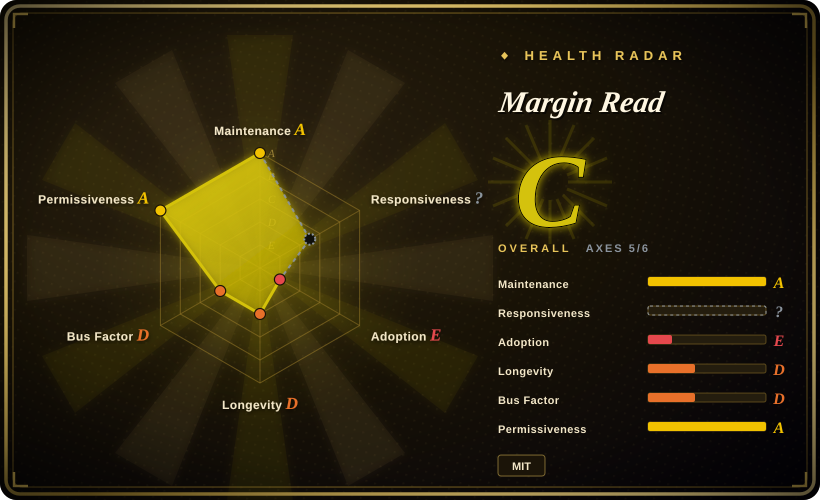

# Margin Read

A privacy-first bilingual webpage translation extension for Chrome/Chromium that is explicitly BYOK: no bundled API key, configurable OpenAI/Anthropic/Gemini and compatible endpoints, local OpenAI-compatible runtimes, threat-model documentation, and MIT licensing.

## When to use

You're a technical user who already has an OpenAI-compatible gateway, Ollama, LM Studio, llama.cpp, or a private model endpoint and wants a browser translator that makes that boundary explicit. You do not need a full commercial immersive-translation clone; you want bilingual webpage segments, your own provider credentials, a configurable endpoint, and a documented threat model that says what is sent, what is cached, and which risks remain.

Choose Margin Read when the deciding constraint is control: MIT license, no bundled API key, no login/cloud sync/default telemetry per project docs, explicit OpenAI/Anthropic/Gemini-compatible provider adapters, and local endpoint examples. Pick Read Frog or FluentRead instead when end-user completeness, Firefox/Edge store coverage, subtitle/TTS features, or a larger community matters more than licensing and architectural transparency.

## When NOT to use

- **You need a complete drop-in Immersive Translate replacement today.** Use [Read Frog](read-frog.md) or [FluentRead](fluentread.md); Margin Read is an early MVP and explicitly lacks PDF, EPUB, OCR, input-box translation, cloud sync, accounts, and an official paid quota system.
- **You need Firefox as a primary target.** Use [Read Frog](read-frog.md), [FluentRead](fluentread.md), or [Pair Translate](pair-translate.md); Margin Read targets Chrome/Chromium Manifest V3 first and marks Firefox as not primary yet.
- **You want the strongest adoption/Lindy signal.** Use [Read Frog](read-frog.md) or [FluentRead](fluentread.md); Margin Read was created in 2026 and had only dozens of stars in the checked snapshot.
- **You cannot trust browser extension storage for API keys.** Use a server-side translation proxy with no keys in the browser; Margin Read's own threat model says extension storage is not a secure vault.
- **You translate highly interactive apps or unusual DOMs.** Use a more mature extension first; the README calls out rough edges on complex apps, unusual layouts, and aggressive DOM rewriting.
- **You need verified subtitle support.** Use [Read Frog](read-frog.md); Margin Read docs contained an inconsistency between README exclusions and changelog/beta-guide YouTube caption testing, so treat subtitle support as unresolved.

## Comparison

| Alternative | In index | Our verdict | Tradeoff |
|---|---|---|---|
| [Read Frog](read-frog.md) | ✅ | Choose Read Frog when mature features and cross-store distribution beat licensing simplicity; choose Margin Read when MIT licensing, BYOK, local endpoint clarity, and privacy documentation are non-negotiable. | Read Frog is richer and more adopted but GPL/commercial dual licensed; Margin Read is transparent and permissive but early. |
| [FluentRead](fluentread.md) | ✅ | Choose FluentRead when a Chinese-first open immersive translator with many engines is the goal; choose Margin Read when you need an auditable model-gateway/local-runtime setup. | FluentRead has broader end-user translation features and store coverage; Margin Read has clearer provider boundaries and a smaller surface. |
| [Pair Translate](pair-translate.md) | ✅ | Choose Pair Translate when you want a lightweight translator with verified provider templates and Firefox/Edge links; choose Margin Read when the privacy threat model and MIT license decide the choice. | Pair Translate is more browser-diverse and active, but GPL-3.0; Margin Read is more permissive and explicit, but Chrome/Chromium-first. |
| Immersive Translate official repo | 未收录 | Use the official project only as a UX benchmark; choose Margin Read when open source, source auditability, and self-managed endpoints are required. | Familiar product category, but the public official repo is not a source-code repo for the extension. |
| A custom userscript/proxy | 未收录 | Build a custom userscript only when your translation surface is tiny and policy-heavy; choose Margin Read when a maintained extension skeleton with provider adapters saves work. | Custom code gives full policy control but loses store packaging, options UI, cache behavior, and provider adapter maintenance. |

## Tech stack

- **Monorepo:** pnpm workspace with `apps/extension` and an Astro website.
- **Extension:** Manifest V3, TypeScript, Vite, CRXJS, service worker, content scripts, options page, `activeTab`/`storage` permissions, and `<all_urls>` host/content-script access.
- **Provider SDKs:** OpenAI, Anthropic SDK, and Google GenAI SDK, with provider registry entries for OpenAI, OpenAI-compatible, Anthropic, Anthropic-compatible, and Google.
- **Local endpoints:** documented examples for LM Studio, Ollama, llama.cpp server, omlx, and generic compatible endpoints.
- **Quality/security automation:** CI runs type checks, lint, tests, build, extension packaging, release-readiness checks; CodeQL runs JavaScript/TypeScript analysis with `security-extended`.

## Dependencies

- **Runtime:** Chrome stable or Chromium-based browsers with Manifest V3 support.
- **Provider credentials/endpoints:** raw provider API key, or empty key for compatible local endpoints where supported.
- **Local model servers:** LM Studio, Ollama, llama.cpp server, omlx, or another OpenAI/Anthropic-compatible endpoint if you want local translation.
- **Browser profile trust:** API keys and cached translations live in the browser profile; treat that profile as trusted.
- **Build:** pnpm 10.x, TypeScript, Vite/CRXJS, Vitest, and the extension packaging scripts.

## Ops difficulty

**Low for a technical individual, medium for policy-controlled use.** Installing the Chrome extension and pointing it at an API endpoint is easy. The hard part is the local/provider boundary: you must run and secure the model server, keep endpoint URLs compatible, decide persistent vs session cache, and accept that browser extension storage is not a vault. For a team, the recommended operational shape is a controlled OpenAI-compatible gateway and a written rule for which sites may be translated.

## Health & viability

- **Maintenance (2026-07).** Latest observed release was v0.3.7 on 2026-06-15, with CI, release, and CodeQL workflows; maintenance hygiene is good for a very young repo.
- **Governance / bus factor.** Organization-owned, but public contributor counts are dominated by one contributor; bus factor is still effectively low.
- **Age & Lindy.** Created 2026-05, so there is almost no Lindy evidence. Treat it as a promising early project, not a proven long-term dependency.
- **Adoption.** ~27 stars and 4 forks in the checked snapshot: adoption is tiny compared with Read Frog or FluentRead.
- **Risk flags.** Early MVP status, Chrome/Chromium-first support, broad `<all_urls>` host access, API keys in extension storage, and provider-side logging risk are the key concerns.

## Caveats (unverified)

- [未验证] Chrome Web Store listing details, install count, approval status, and current published version were not independently checked.
- [未验证] Runtime behavior was not tested; provider support is based on README plus provider registry/default settings paths.
- [未验证] Absence of default telemetry was not proven by full-source audit; it is based on README, principles, and threat-model claims.
- [未验证] Release artifacts were not checked for reproducible builds from source.
- [推断] Bus-factor risk is inferred from public contributor distribution; private organization team structure was not verified.
- [未验证] YouTube caption/subtitle support is inconsistent across README and changelog/beta docs; do not rely on it without testing.
