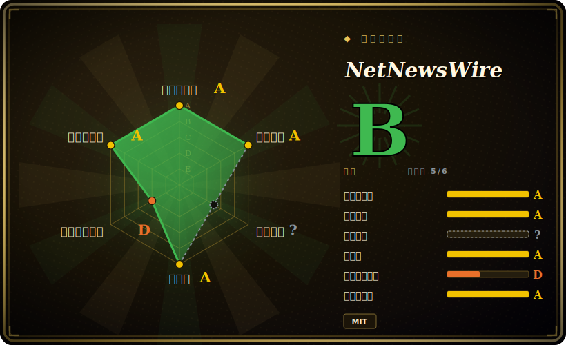

# NetNewsWire

一个免费、开源、原生的 macOS/iOS RSS/Atom 订阅阅读器——快、无遥测，作者正是当年开创 Mac 订阅阅读器品类的那位开发者。

## 何时使用

你是 Mac 加 iPhone 用户，读得很多——一堆你宁愿不收进邮箱的 newsletter、十来个技术博客、几个新闻站、一些小众订阅源——你眼看着算法时间线变成了噪音。你想要一种*按时间顺序、订阅列表归你所有*的阅读体验：订阅源、按序读、标已读、翻下一个。你不想用一个把阅读习惯卖给广告网络的 web 应用，也不想要一个耗电的 Electron 重壳。你从 Mac App Store 装上 NetNewsWire（或自己从源码构建），把你从旧阅读器导出的 OPML 喂进去，就得到一个原生的 AppKit/UIKit 应用，在 Mac 和 iPhone 之间同步，老老实实把订阅源摆给你看——开始用不需要账号，没有订阅费，没有广告。

当你已经把订阅放在某个同步服务里——Feedly、Feedbin、iCloud、Inoreader、NewsBlur，或自建的 FreshRSS / Reader API 端点——而你只想在上面套一个干净的原生客户端而非那个服务自带的 web UI 时，你也会选它。NetNewsWire 是*阅读客户端*，不是同步后端：你带来账号，它给你一个快速的 Apple 平台前端，带键盘快捷键、内置阅读视图，以及缓存好可离线读的文章。

## 何时不用

- **你不在 Apple 平台上。** 它只支持 macOS 加 iOS/iPadOS——没有 Windows、Linux、Android 或 web 版。需要跨平台的话，这是硬性不行。
- **你想要一个自建的同步服务器。** NetNewsWire 是客户端；它*透过*服务（iCloud、Feedbin、Feedly 等）同步，但不替其他设备/应用托管你的订阅源。要自己跑的服务器，那是 FreshRSS / Miniflux / Tiny Tiny RSS 的地盘。
- **你想要稍后读 / 标注 / 网页剪藏套件。** 它读订阅源，不是 Instapaper/Pocket/Readwise。没有高亮、知识库式打标签，也没有全文归档工作流。
- **你依赖社交 / “智能”发现流。** 这是刻意做成的朴素时间线阅读器。没有算法推荐，没有内置社交图谱。
- **你需要一份成熟的商业支持合同。** 它是志愿者/社区的开源应用，没有付费档；支持靠 GitHub issue 和社区，不是 SLA。

## 横向对比

| 替代品 | 是否收录 | 我们的评价 | 取舍 |
|---|---|---|---|
| Reeder | 未收录 | 当前页用于它的主场景；如果更看重“打磨精良的商业 Apple 平台阅读器，同步支持广”，再选 Reeder。 | 打磨精良的商业 Apple 平台阅读器，同步支持广；闭源且收费，而 NetNewsWire 免费/MIT、可审计。 |
| FreshRSS | 未收录 | 当前页用于它的主场景；如果更看重“自建的 PHP 订阅*服务器*加 web UI”，再选 FreshRSS。 | 自建的 PHP 订阅*服务器*加 web UI；你自己跑，它同步给很多客户端（含 NetNewsWire）——是后端，不是原生客户端。 |
| Miniflux | 未收录 | 当前页用于它的主场景；如果更看重“极简的自建 Go 订阅阅读器（服务器加 web）”，再选 Miniflux。 | 极简的自建 Go 订阅阅读器（服务器加 web）；单二进制后端，本身没有原生 Apple 应用。 |
| Feedly / Inoreader | 未收录 | 当前页用于它的主场景；如果更看重“带发现和规则的托管 SaaS 阅读器”，再选 Feedly / Inoreader。 | 带发现和规则的托管 SaaS 阅读器；跨平台、功能多但专有且吃数据——NetNewsWire 可作为其中部分服务的原生客户端。 |
| NewsBlur | 未收录 | 当前页用于它的主场景；如果更看重“开源的托管阅读器，带训练/智能特性”，再选 NewsBlur。 | 开源的托管阅读器，带训练/智能特性；是一整套服务栈，对比 NetNewsWire 的本地优先原生客户端。 |

## 技术栈

- **语言：** Swift，面向 Apple 原生 UI 框架（macOS 上 AppKit，iOS/iPadOS 上 UIKit）。[推断]
- **同步账号：** 内置支持 iCloud、Feedbin、Feedly、Inoreader、NewsBlur、The Old Reader、BazQux、FreshRSS / 兼容 Reader API 的端点，以及本地设备内账号。[未验证]
- **订阅格式：** RSS、Atom、JSON Feed；订阅用 OPML 导入/导出。
- **构建：** Xcode 工程；通过 Mac App Store 和 iOS App Store 分发，也可从源码构建。

## 依赖

- **运行时：** 一台 Mac（macOS）和/或 iPhone/iPad（iOS/iPadOS）；单设备使用不需要服务器。
- **可选同步后端：** 想跨设备同步的话，需要其中一个受支持服务的账号（在 Apple 平台上 iCloud 是零额外注册的路径）。
- **构建期：** 从源码构建需要 Xcode 加 Swift 工具链；最低 OS/Xcode 版本由仓库决定且随时间前移。[未验证]

## 运维难度

**低——它是终端用户应用，不是服务。** 对用户而言，“运维”就是从 App Store 安装并（可选）登录一个同步账号。没有任何东西要部署或运维。负担只在*贡献者/构建者*这一侧：clone、用 Xcode 打开、对上所需的 Xcode/SDK 版本。如果你自建*同步*层（如 FreshRSS），那个服务器的运维是另一回事，不属于 NetNewsWire。

## 健康度与可持续性

- **维护（2026-06）。** 最后 push 于 2026-06；iOS 7.1 与 mac 7.1 在 2026 年 6 月发布，中间还有 beta 构建——明显是**活跃**开发而非吃老本。未归档。
- **治理 / bus factor。** 由 Brent Simmons（`brentsimmons`）创建并主导，他几十年前就写过初代 NetNewsWire；除领衔者外有真实的贡献者列表（vincode-io、Wevah、kielgillard 等），但项目方向与这位知名开发者强绑定——是个中等程度的 bus-factor 考量。[推断]
- **年龄与 Lindy 判断。** 本仓库始于 2017-05（约 9 年），而 NetNewsWire 这个*名字/应用*远比仓库更老——它是寿命最长的 Mac 订阅阅读器之一——且仍在活跃发布⇒**强 Lindy** 信号。（仓库年龄低估了真实项目年龄。[未验证]）
- **采用度。** 约 10.2k star、700+ fork，在 Apple/RSS 社区里是被熟知并推荐的应用；MIT 许可、免费、无变现压力。[未验证]
- **风险标记。** 志愿者/社区模式意味着没有商业 SLA，路线图节奏取决于贡献者时间；仅限 Apple 的范围是可移植性天花板，不是健康风险。未发现 relicense 历史。[推断]

## 存疑（未验证）

- [未验证] 截至 2026-06 约 10.2k star、708 fork、863 个 open issue——star/issue 数易变且对时间敏感，仅供参考。
- [未验证] 受支持的同步服务集合（Feedbin/Feedly/Inoreader/NewsBlur/iCloud/FreshRSS/Reader API……）出自项目文档且随版本变动；依赖某个账号类型前请对照当前应用核实。
- [推断] AppKit/UIKit 原生实现与纯 Swift 栈是从语言元数据和它“原生”阅读器的定位推断的，并非代码审计结论。
- [未验证] 仓库的 `created_at`（2017-05）反映的是这个 GitHub 仓库，而非初代 NetNewsWire 真正的首发日期，后者要早得多。
- [未验证] 从源码构建所需的最低 macOS/iOS 与 Xcode 版本由仓库决定且随时间变化，这里不断言具体数字。
