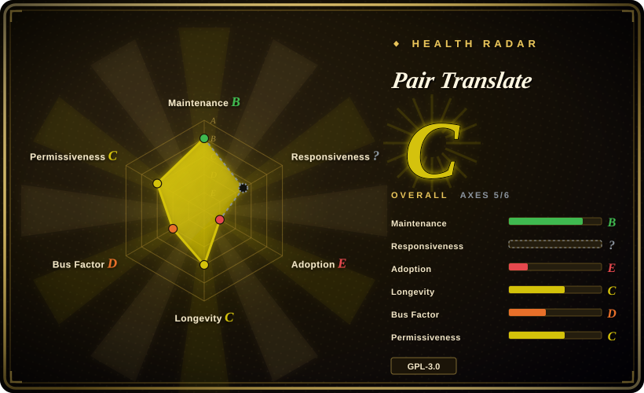

# Pair Translate

A lightweight open-source bilingual webpage translation extension that appends translations beside original text, supports selection/word translation, and verifies both traditional translation services and LLM providers including OpenAI-compatible local templates such as LM Studio and Ollama.

## When to use

You're reading foreign-language pages and want a smaller bilingual extension: translate page text in place, keep original and translated text together, use selection/word translation, and configure either traditional providers (Microsoft, Google, DeepL/DeepLX, browser translation) or LLM providers (OpenAI-style, Anthropic, Gemini). You want direct browser-to-provider requests rather than a central SaaS account, and you are comfortable entering API keys or base URLs in extension settings.

Choose Pair Translate when Read Frog and FluentRead feel too heavy, but Margin Read is too early or too Chrome-centric. It is a middle candidate: active releases, Chrome/Firefox assets, Edge store link, verified LLM templates including LM Studio and Ollama, and a smaller feature surface. The tradeoff is GPL-3.0, a young single-maintainer repo, and browser-side API-key/provider calls.

## When NOT to use

- **You need permissive-license reuse.** Use [Margin Read](margin-read.md); Pair Translate is GPL-3.0.
- **You need the most mature immersive-translation feature set.** Use [Read Frog](read-frog.md) or [FluentRead](fluentread.md); Pair Translate is lighter and does not try to match every Immersive Translate workflow.
- **You need language-learning extras such as TTS and YouTube subtitles.** Use [Read Frog](read-frog.md); Pair Translate's verified scope is page/selection/word translation plus provider templates.
- **You need a privacy threat model written as explicitly as Margin Read's.** Use [Margin Read](margin-read.md); Pair Translate claims no data collection and direct provider requests, but the claim was not independently audited end-to-end.
- **You cannot expose API keys to browser-side SDKs.** Use a server-side gateway; Pair Translate's LLM clients use browser-side OpenAI/Anthropic SDKs with `dangerouslyAllowBrowser: true`.
- **You require proven long-term viability.** Use a more established option; Pair Translate was created in 2025 and public contributions are concentrated in one maintainer.

## Comparison

| Alternative | In index | Our verdict | Tradeoff |
|---|---|---|---|
| [Read Frog](read-frog.md) | ✅ | Choose Read Frog when language learning, TTS, subtitle translation, and a larger community justify more complexity; choose Pair Translate when a lighter bilingual translator with direct provider templates is enough. | Read Frog is richer and more adopted; Pair Translate is smaller and easier to reason about but less feature-complete. |
| [FluentRead](fluentread.md) | ✅ | Choose FluentRead when you want a more full immersive-translation UX; choose Pair Translate when provider templates and lighter page/selection translation are the deciding features. | FluentRead is closer to the commercial immersive-translation workflow; Pair Translate is leaner with explicit LLM settings UI. |
| [Margin Read](margin-read.md) | ✅ | Choose Margin Read when MIT license and documented privacy/local endpoint boundaries are hard requirements; choose Pair Translate when Firefox/Edge links and a more active release stream matter more. | Margin Read is permissive and explicitly privacy-scoped but very early; Pair Translate is GPL and younger than FluentRead but has active v2 releases. |
| Immersive Translate official repo | 未收录 | Use the official project only as a product benchmark; choose Pair Translate when you require source code and direct provider requests. | Official repo is not the extension source; Pair Translate is auditable but smaller and less mature. |
| Browser built-in translation | 未收录 | Choose built-in translation when zero extension settings and no API-key handling matter; choose Pair Translate when you need bilingual layout and custom provider/model control. | Built-in translation is simpler and safer for casual use; Pair Translate provides model/provider control at the cost of extension trust and secret handling. |

## Tech stack

- **Extension framework:** WXT with SolidJS, Solid Router, Tailwind CSS 4, DaisyUI, and WXT i18n/auto-icons.
- **Translation services:** Microsoft, Google, DeepL, DeepLX, and browser built-in Translator/LanguageDetector where available.
- **LLM layer:** OpenAI, Anthropic SDK, Google GenAI, plus schema/UI support for `apiSpec`, `baseUrl`, `apiKey`, model, temperature, max tokens, thinking budget, and `extraBody`.
- **Provider templates:** OpenAI, Azure OpenAI, LM Studio, Ollama, OpenRouter, Cohere, Hugging Face Inference, AI21 Labs, Mistral, Stability AI, Replicate, Aleph Alpha, GLM, DeepSeek, and Other.
- **Tooling:** Bun, TypeScript, Biome, WXT build/zip scripts, and GitHub Actions lint/release workflows.

## Dependencies

- **Runtime:** Chrome, Firefox, Edge, or another compatible browser extension environment.
- **Provider credentials:** API keys for Google/DeepL/LLM providers, or provider-specific auth; Microsoft can use an Edge translator token path in the default service.
- **Local models:** LM Studio and Ollama templates are verified in defaults; endpoint compatibility still depends on the local server and model.
- **Build:** Bun, WXT, TypeScript, SolidJS, Tailwind/DaisyUI, and the package's build scripts.

## Ops difficulty

**Low for ordinary browser use, medium for provider governance.** End users install the extension and configure providers. Teams must treat it like any BYOK browser extension: decide which services may receive text, store/rotate API keys, verify local endpoint CORS and availability, and understand that provider billing/rate limits/outages affect page translation directly. The smaller surface helps, but it does not remove the browser-side secret and text-egress problem.

## Health & viability

- **Maintenance (2026-07).** Latest observed release was v2.5.1 on 2026-06-30 with Chrome/Firefox/source release assets; recent tags and release workflow indicate active maintenance.
- **Governance / bus factor.** User-owned repo with public contributions dominated by `Cookee24`; `.github/SECURITY.md` exists, but bus factor remains low.
- **Age & Lindy.** Created 2025-10, so it has less than a year of history; activity is positive, but long-term durability is not proven.
- **Adoption.** ~462 stars and 37 forks are meaningful for a niche extension, but much smaller than Read Frog or FluentRead.
- **Risk flags.** GPL-3.0, broad `<all_urls>` host access, browser-side LLM SDKs/API keys, provider text egress, and reliance on provider-specific endpoints are the main risks.

## Caveats (unverified)

- [未验证] Chrome/Firefox/Edge store publication status, approval state, and current store versions were not checked.
- [未验证] The README's “No data is collected” claim was not audited across all code paths and third-party SDK behavior.
- [未验证] API-key encryption/protection at rest was not verified; only settings schema/UI/client usage was checked.
- [未验证] All provider templates were not live-tested against current provider APIs.
- [未验证] GitHub `open_issues_count` includes issues plus PRs; exact non-PR issue count was not separately established.
- [推断] Bus factor risk comes from public contributor counts and User ownership; private collaboration outside GitHub was not verified.
