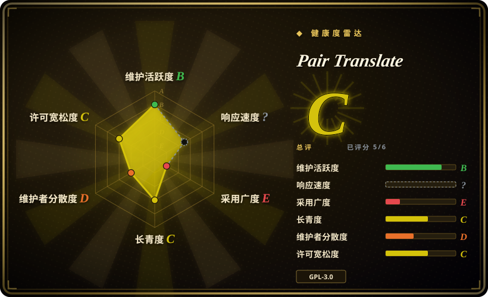

# Pair Translate

一个轻量开源双语网页翻译扩展，把译文追加在原文旁边，支持选段／查词翻译，并验证了传统翻译服务和 LLM provider，包括 LM Studio、Ollama 这类 OpenAI-compatible 本地模板。

## 何时使用

你在读外语网页，想要一个更小的双语扩展：原地翻译页面文字，把原文和译文放在一起，支持选段／查词翻译，还能配置传统 provider（Microsoft、Google、DeepL／DeepLX、浏览器翻译）或 LLM provider（OpenAI-style、Anthropic、Gemini）。你希望请求从浏览器直接发给 provider，而不是经过中心化 SaaS 账号，并且能接受在扩展设置里填 API key 或 base URL。

当 Read Frog 和 FluentRead 显得太重，而 Margin Read 又太早期或太 Chrome-centric 时，选 Pair Translate。它是中间候选：活跃 release、Chrome／Firefox assets、Edge 商店链接、已验证的 LM Studio 和 Ollama 等 LLM 模板，以及较小功能面。代价是 GPL-3.0、年轻单维护者仓库，以及浏览器侧 API key／provider 调用。

## 何时不用

- **你需要宽松许可复用。** 改用 [Margin Read](margin-read.zh.md)；Pair Translate 是 GPL-3.0。
- **你需要最成熟的沉浸式翻译功能集。** 改用 [Read Frog](read-frog.zh.md) 或 [FluentRead](fluentread.zh.md)；Pair Translate 更轻，不试图覆盖每个 Immersive Translate 工作流。
- **你需要 TTS、YouTube 字幕等语言学习附加功能。** 改用 [Read Frog](read-frog.zh.md)；Pair Translate 已验证范围是页面／选段／查词翻译和 provider 模板。
- **你需要像 Margin Read 那样明确写出的隐私 threat model。** 改用 [Margin Read](margin-read.zh.md)；Pair Translate 声称不收集数据且请求直发 provider，但该声明没有端到端独立审计。
- **你不能把 API key 暴露给浏览器侧 SDK。** 改用 server-side gateway；Pair Translate 的 LLM client 使用浏览器侧 OpenAI／Anthropic SDK，并带 `dangerouslyAllowBrowser: true`。
- **你要求已证明的长期可持续性。** 改用更成熟选项；Pair Translate 创建于 2025 年，公开贡献集中在一名维护者。

## 横向对比

| 替代品 | 是否收录 | 我们的评价 | 取舍 |
|---|---|---|---|
| [Read Frog](read-frog.zh.md) | ✅ | 当语言学习、TTS、字幕翻译和更大社区值得承受更多复杂度时，选 Read Frog；当一个带 direct provider templates 的轻量双语翻译器足够时，选 Pair Translate。 | Read Frog 更丰富、采用更多；Pair Translate 更小、更容易推理，但功能没那么完整。 |
| [FluentRead](fluentread.zh.md) | ✅ | 当你想要更完整的沉浸式翻译 UX 时，选 FluentRead；当 provider 模板和更轻的页面／选段翻译是决定因素时，选 Pair Translate。 | FluentRead 更接近商业沉浸式翻译工作流；Pair Translate 更轻，并有明确 LLM 设置 UI。 |
| [Margin Read](margin-read.zh.md) | ✅ | 当 MIT 许可和文档化隐私／本地端点边界是硬要求时，选 Margin Read；当 Firefox／Edge 链接和更活跃 release stream 更重要时，选 Pair Translate。 | Margin Read 宽松许可且隐私边界明确，但非常早期；Pair Translate 是 GPL，并比 FluentRead 年轻，但已有活跃 v2 release。 |
| Immersive Translate 官方仓库 | 未收录 | 只把官方项目当产品标杆；当你要求源码和 direct provider requests 时，选 Pair Translate。 | 官方仓库不是扩展源码；Pair Translate 可审计，但更小、更不成熟。 |
| 浏览器内置翻译 | 未收录 | 当零扩展设置、无需处理 API key 更重要时，选内置翻译；当你需要双语布局和自定义 provider／model 控制时，选 Pair Translate。 | 内置翻译对日常使用更简单、更安全；Pair Translate 提供 model／provider 控制，但要承担扩展信任和 secret 处理成本。 |

## 技术栈

- **扩展框架：** WXT，配 SolidJS、Solid Router、Tailwind CSS 4、DaisyUI，以及 WXT i18n／auto-icons。
- **翻译服务：** Microsoft、Google、DeepL、DeepLX，以及可用时的浏览器内置 Translator／LanguageDetector。
- **LLM 层：** OpenAI、Anthropic SDK、Google GenAI，外加 schema／UI 支持 `apiSpec`、`baseUrl`、`apiKey`、model、temperature、max tokens、thinking budget 和 `extraBody`。
- **Provider 模板：** OpenAI、Azure OpenAI、LM Studio、Ollama、OpenRouter、Cohere、Hugging Face Inference、AI21 Labs、Mistral、Stability AI、Replicate、Aleph Alpha、GLM、DeepSeek 和 Other。
- **工具链：** Bun、TypeScript、Biome、WXT build／zip scripts，以及 GitHub Actions lint／release workflows。

## 依赖

- **运行时：** Chrome、Firefox、Edge，或其他兼容浏览器扩展环境。
- **Provider 凭据：** Google／DeepL／LLM provider 的 API key，或 provider-specific auth；默认 Microsoft service 可使用 Edge translator token path。
- **本地模型：** LM Studio 和 Ollama 模板已在 defaults 里验证；端点兼容性仍取决于本地 server 和模型。
- **构建：** Bun、WXT、TypeScript、SolidJS、Tailwind／DaisyUI 和 package 构建脚本。

## 运维难度

**普通浏览器使用低，provider 治理中等。** 终端用户安装扩展并配置 provider。团队需要把它当作 BYOK 浏览器扩展处理：决定哪些服务可接收文本、保存／轮换 API key、验证本地 endpoint CORS 和可用性，并理解 provider 计费、rate limit 和故障会直接影响网页翻译。更小的表面积有帮助，但不会消除浏览器侧 secret 和文本外发问题。

## 健康度与可持续性

- **维护（2026-07）。** 观察到的最新 release 是 2026-06-30 的 v2.5.1，带 Chrome／Firefox／source release assets；近期 tags 和 release workflow 表明维护活跃。
- **治理 / bus factor。** User-owned 仓库，公开贡献由 `Cookee24` 主导；存在 `.github/SECURITY.md`，但 bus factor 仍低。
- **年龄与 Lindy。** 创建于 2025-10，历史不到一年；活跃是正面信号，但长期耐久性未证明。
- **采用度。** 约 462 star 和 37 fork，对小众扩展有意义，但远小于 Read Frog 或 FluentRead。
- **风险标记。** GPL-3.0、宽泛 `<all_urls>` host access、浏览器侧 LLM SDK／API key、provider 文本外发，以及依赖 provider-specific endpoints，是主要风险。

## 存疑（未验证）

- [未验证] Chrome／Firefox／Edge 商店发布状态、审核状态和当前商店版本没有检查。
- [未验证] README 的“No data is collected”声明没有覆盖所有代码路径和第三方 SDK 行为做审计。
- [未验证] API key 静态加密／保护没有验证；只检查了 settings schema／UI／client 用法。
- [未验证] 所有 provider 模板没有针对当前 provider API live-test。
- [未验证] GitHub `open_issues_count` 包含 issues 和 PRs；非 PR issue 精确数量没有单独确认。
- [推断] Bus factor 风险来自公开 contributor counts 和 User ownership；GitHub 外的私有协作没有验证。
