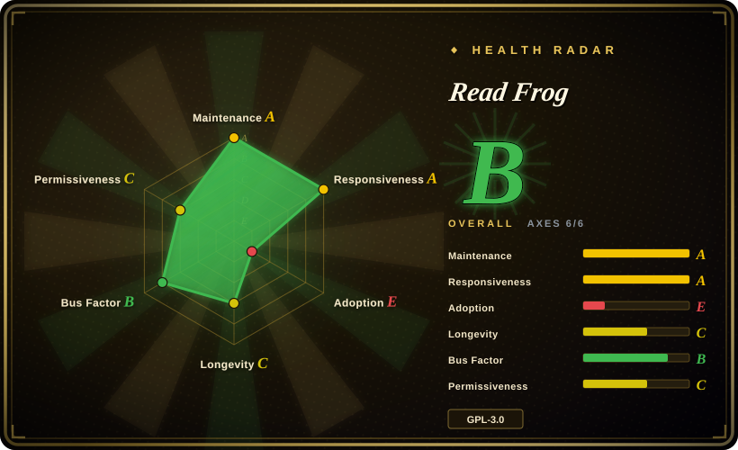

# Read Frog

An open-source AI browser language-learning extension for immersive webpage translation, bilingual/original-only reading, selection translation, YouTube subtitle translation, TTS, and provider-configurable AI translation across OpenAI, DeepSeek, Claude, Gemini, Ollama, and other services.

## When to use

You're a bilingual reader or language learner who wants a browser extension that behaves like an open-source immersive translator, not just a popup dictionary. You read articles, documentation, and videos across languages, want the original text beside the translation when learning, and sometimes want translation-only output when speed matters. You also want to bring your own provider account: OpenAI, DeepSeek, Claude, Gemini, Grok, Groq, Mistral, Ollama, or an OpenAI-compatible/custom endpoint, configured inside the extension rather than routed through a vendor quota system.

Read Frog is the high-feature candidate in this set: choose it over Margin Read when you need Chrome/Edge/Firefox store distribution, bilingual page translation, selection explanation, YouTube subtitles, TTS, batching, and a larger community; choose it over FluentRead when language-learning features and broader AI-provider plumbing matter more than a simpler immersive-translation UX. The tradeoff is a younger, GPL/commercial-dual-licensed, broad-permission extension with more moving parts.

## When NOT to use

- **You need permissive-license redistribution or closed-source embedding.** Use [Margin Read](margin-read.md) instead: Read Frog is GPL-3.0 with a commercial dual-license note, and contributions grant both GPLv3 and commercial-license rights to FEELIO TECHNOLOGIES LTD.
- **You want a minimal, privacy-scoped translator that sends only selected segments by design.** Use [Margin Read](margin-read.md) instead; Read Frog's context-aware translation can provide page title and a Markdown version of page content to the configured AI provider, which is more powerful but a wider data surface.
- **You only need a lightweight bilingual overlay without language-learning extras.** Use [Pair Translate](pair-translate.md) if its simpler page/selection translation is enough, or [FluentRead](fluentread.md) if you want a Chinese-first immersive translator with a smaller feature story.
- **You cannot tolerate broad extension permissions.** Use a browser's built-in translation/reader mode or a narrower selected-text tool; Read Frog's WXT manifest includes `*://*/*` host permissions plus `cookies`, `identity`, `scripting`, `tabs`, and `webNavigation`.
- **You need long Lindy history.** Use an older browser translation extension or a built-in browser translation feature; Read Frog is active and popular, but the repo was created in 2025, so long-term durability is still unproven.
- **You want to avoid telemetry/auth code paths entirely.** Use [Margin Read](margin-read.md) or audit a fork; Read Frog depends on `posthog-js` and `better-auth`, and the exact runtime telemetry behavior was not fully audited.

## Comparison

| Alternative | In index | Our verdict | Tradeoff |
|---|---|---|---|
| [FluentRead](fluentread.md) | ✅ | Choose FluentRead when you want a more focused open immersive-translation extension with many translation engines; choose Read Frog when language-learning features, TTS, YouTube subtitles, batching, and provider breadth are decisive. | FluentRead is simpler and older; Read Frog is richer and more active, but also younger and broader in permissions/provider surface. |
| [Margin Read](margin-read.md) | ✅ | Choose Margin Read when BYOK, local OpenAI-compatible endpoints, privacy documentation, and MIT licensing are the hard constraints; choose Read Frog when you need a mature store-distributed feature set. | Margin Read is transparent and permissively licensed, but early Chrome/Chromium MVP; Read Frog is fuller-featured and cross-store but GPL/commercial dual licensed. |
| [Pair Translate](pair-translate.md) | ✅ | Choose Pair Translate when a lighter bilingual translator with many provider templates is enough; choose Read Frog when language-learning workflows and subtitle/TTS features matter. | Pair Translate has a smaller scope and simpler permissions; Read Frog brings more features and community but more complexity. |
| Immersive Translate official repo | 未收录 | Do not treat the official Immersive Translate repo as an open-source source-code candidate; use it only as a product benchmark because its README says the repository does not contain the extension source code. | Immersive Translate is the familiar product category, but the public repo is releases/issues rather than auditable source. |
| Browser built-in translation | 未收录 | Choose built-in browser translation when zero extension trust and no provider keys matter more than customization; choose Read Frog when you need BYOK AI providers and bilingual learning features. | Built-in translation has lower setup and trust cost, but lacks custom model endpoints, prompt/model control, and learning-oriented workflows. |

## Tech stack

- **Extension framework:** WXT Manifest V3 with React 19, React Router, Base UI/Radix-style components, Tailwind-related tooling, and Dexie for local browser data.
- **AI/provider layer:** Vercel `ai` SDK plus multiple `@ai-sdk/*` providers, `ai-sdk-ollama`, and OpenAI-compatible provider support.
- **Browser support:** Chrome Web Store, Microsoft Edge Add-ons, and Firefox Add-ons; build scripts include Chrome/Edge/Firefox targets.
- **Permissions:** storage, tabs, alarms, cookies, context menus, identity, scripting, webNavigation, and broad host permissions; non-Firefox builds also add offscreen and sidePanel.
- **Tooling:** pnpm, TypeScript, Vitest, ESLint, Nx, Changesets, Husky, and GitHub Actions release automation.

## Dependencies

- **Runtime:** Chrome, Edge, Firefox, or a compatible extension-capable browser.
- **Provider credentials:** API keys or local endpoints for the configured AI/translation services; free non-key providers may be available but quality and rate limits vary.
- **Local models:** Ollama/custom endpoints are documented, but the exact setup depends on provider CORS, endpoint compatibility, and model availability.
- **Build:** Node 22.22+ per `devEngines`, pnpm 11.x, and the WXT/TypeScript toolchain.

## Ops difficulty

**Low for use, medium for trusted deployment.** Installing from a store and adding provider keys is straightforward. The operational burden rises when you self-build, pin versions, audit telemetry/auth paths, run local model endpoints, or govern which pages may be translated. Because configured providers can receive selected/page context, the real ops/security work is policy: which provider endpoints are allowed, how API keys are stored, and whether sensitive sites should be excluded.

## Health & viability

- **Maintenance (2026-07).** Latest observed release was v1.38.0 on 2026-07-07, with active pushes and release automation; maintenance signal is strong.
- **Governance / bus factor.** The repo is User-owned, but top contributors show several active humans rather than a pure one-person repo; commercial dual licensing and FEELIO contribution terms mean roadmap control is still centralized.
- **Age & Lindy.** Created 2025-04, so the project is young despite rapid adoption; high stars are a positive adoption signal, not a long-term durability proof.
- **Adoption.** ~8.3k stars, hundreds of forks, and Chrome/Edge/Firefox distribution point to meaningful user interest; store user counts were not verified.
- **Risk flags.** GPL-3.0 plus commercial dual licensing, broad browser permissions, provider-side text egress, and unverified telemetry/auth behavior are the main selection risks.

## Caveats (unverified)

- [未验证] Store listing status, store user counts, and exact store versions were not verified beyond README links and GitHub release assets.
- [未验证] Exact telemetry behavior, event schema, and opt-in/opt-out state were not audited; `posthog-js` and auth configuration are present in the dependency/config surface.
- [未验证] API-key storage protections and encryption-at-rest behavior were not audited.
- [未验证] Every listed provider and custom endpoint was not runtime-tested; provider breadth is based on README, manifests, and dependency/source signals.
- [推断] The broad-permission risk is inferred from the WXT manifest and normal extension threat modeling; concrete risk depends on which pages and providers the user configures.
