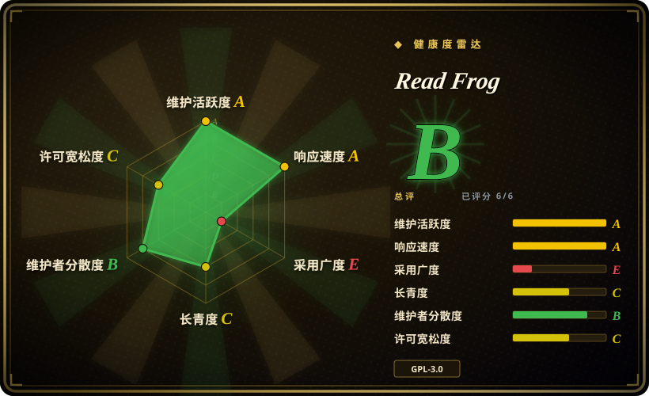

# Read Frog

一个开源 AI 浏览器语言学习扩展，面向沉浸式网页翻译、双语/仅译文阅读、划词翻译、YouTube 字幕翻译、TTS，以及 OpenAI、DeepSeek、Claude、Gemini、Ollama 等服务商和自定义端点的可配置 AI 翻译。

## 何时使用

你是双语读者或语言学习者，想要的不是弹窗词典，而是像开源沉浸式翻译一样工作的浏览器扩展。你读文章、文档和视频时，希望学习场景下原文和译文并排，赶进度时又能只看译文。你还想带自己的服务商账号：OpenAI、DeepSeek、Claude、Gemini、Grok、Groq、Mistral、Ollama，或 OpenAI-compatible／自定义端点，都在扩展内配置，而不是走某个厂商内置额度。

在这组项目里，Read Frog 是高功能候选：当你需要 Chrome／Edge／Firefox 商店分发、双语网页翻译、划词解释、YouTube 字幕、TTS、批量请求和更大的社区时，选它而不是 Margin Read；当语言学习功能和更广的 AI provider 接线比更简洁的沉浸式翻译体验更重要时，选它而不是 FluentRead。代价是它更年轻、采用 GPL／商业双授权、权限面更宽，部件也更多。

## 何时不用

- **你需要宽松许可的再分发或闭源嵌入。** 改用 [Margin Read](margin-read.zh.md)：Read Frog 是 GPL-3.0，并带商业双授权说明，贡献条款还要求把 GPLv3 与商业许可权授予 FEELIO TECHNOLOGIES LTD。
- **你想要默认只发送所选片段、隐私边界更窄的翻译器。** 改用 [Margin Read](margin-read.zh.md)；Read Frog 的上下文感知翻译可把页面标题和 Markdown 化页面内容提供给已配置的 AI provider，能力更强但数据面更宽。
- **你只需要轻量双语覆盖层，不需要语言学习附加功能。** 如果简单网页／划词翻译足够，选 [Pair Translate](pair-translate.zh.md)；如果想要中文生态更友好的沉浸式翻译器，选 [FluentRead](fluentread.zh.md)。
- **你不能接受宽泛扩展权限。** 改用浏览器内置翻译／阅读模式，或更窄的划词工具；Read Frog 的 WXT manifest 包含 `*://*/*` host permissions，以及 `cookies`、`identity`、`scripting`、`tabs`、`webNavigation` 等权限。
- **你需要很长的 Lindy 历史。** 改用更老的浏览器翻译扩展或浏览器内置翻译；Read Frog 活跃且受欢迎，但仓库创建于 2025 年，长期耐久性还没有被时间证明。
- **你想完全避开 telemetry／auth 代码路径。** 改用 [Margin Read](margin-read.zh.md) 或审计一个 fork；Read Frog 依赖 `posthog-js` 和 `better-auth`，实际运行时 telemetry 行为本轮没有完整审计。

## 横向对比

| 替代品 | 是否收录 | 我们的评价 | 取舍 |
|---|---|---|---|
| [FluentRead](fluentread.zh.md) | ✅ | 当你想要更聚焦、支持许多翻译引擎的开源沉浸式翻译扩展时，选 FluentRead；当语言学习、TTS、YouTube 字幕、批量请求和 provider 广度是决定因素时，选 Read Frog。 | FluentRead 更简洁且历史更长；Read Frog 功能更丰富、更新更活跃，但更年轻，权限和 provider 面也更宽。 |
| [Margin Read](margin-read.zh.md) | ✅ | 当 BYOK、本地 OpenAI-compatible 端点、隐私文档和 MIT 许可是硬约束时，选 Margin Read；当你需要更成熟的商店分发功能集时，选 Read Frog。 | Margin Read 透明且宽松许可，但仍是早期 Chrome／Chromium MVP；Read Frog 功能更完整且跨商店，但 GPL／商业双授权。 |
| [Pair Translate](pair-translate.zh.md) | ✅ | 当较轻量的双语翻译器和许多 provider 模板已经足够时，选 Pair Translate；当语言学习流程和字幕／TTS 更重要时，选 Read Frog。 | Pair Translate 范围更小、权限更简单；Read Frog 带来更多功能和社区，也带来更多复杂度。 |
| Immersive Translate 官方仓库 | 未收录 | 不要把官方 Immersive Translate 仓库当作开源源码候选；它只适合作为产品标杆，因为 README 说明该仓库不包含扩展源码。 | Immersive Translate 是熟悉的产品类别，但公开仓库更像 releases／issues，而不是可审计源码。 |
| 浏览器内置翻译 | 未收录 | 当零扩展信任成本和无需 provider key 更重要时，选浏览器内置翻译；当你需要 BYOK AI provider 和双语学习功能时，选 Read Frog。 | 内置翻译设置和信任成本更低，但缺少自定义模型端点、prompt／model 控制和面向学习的工作流。 |

## 技术栈

- **扩展框架：** WXT Manifest V3，配 React 19、React Router、Base UI／Radix 风格组件、Tailwind 相关工具，以及用 Dexie 存本地浏览器数据。
- **AI／provider 层：** Vercel `ai` SDK，加多个 `@ai-sdk/*` provider、`ai-sdk-ollama` 和 OpenAI-compatible provider 支持。
- **浏览器支持：** Chrome Web Store、Microsoft Edge Add-ons 和 Firefox Add-ons；构建脚本包含 Chrome／Edge／Firefox 目标。
- **权限：** storage、tabs、alarms、cookies、context menus、identity、scripting、webNavigation 和宽泛 host permissions；非 Firefox 构建还添加 offscreen 与 sidePanel。
- **工具链：** pnpm、TypeScript、Vitest、ESLint、Nx、Changesets、Husky 和 GitHub Actions release automation。

## 依赖

- **运行时：** Chrome、Edge、Firefox，或兼容的支持扩展浏览器。
- **服务商凭据：** 给已配置 AI／翻译服务使用的 API key 或本地端点；可能有无需 key 的免费 provider，但质量和 rate limit 各异。
- **本地模型：** 文档写到 Ollama／custom endpoints，但具体配置取决于 provider CORS、端点兼容性和模型可用性。
- **构建：** `devEngines` 要求 Node 22.22+，再加 pnpm 11.x 和 WXT／TypeScript 工具链。

## 运维难度

**使用低，可信部署中等。** 从商店安装并填入 provider key 很直接。真正的负担出现在自构建、锁版本、审计 telemetry／auth 路径、运行本地模型端点，或管控哪些页面允许翻译时。因为已配置 provider 可能收到所选文本或页面上下文，真正的运维／安全工作是策略：允许哪些 provider endpoint，API key 如何保存，以及敏感站点是否应排除。

## 健康度与可持续性

- **维护（2026-07）。** 观察到的最新 release 是 2026-07-07 的 v1.38.0，且有活跃 push 与 release automation；维护信号强。
- **治理 / bus factor。** 仓库由 User 拥有，但 top contributors 显示有多名活跃人类贡献者，并非纯单人仓库；商业双授权和 FEELIO 贡献条款意味着路线图控制仍集中。
- **年龄与 Lindy。** 创建于 2025-04，所以尽管采用增长快，项目仍年轻；高 star 是正向采用信号，不是长期耐久性的证明。
- **采用度。** 约 8.3k star、数百 fork，以及 Chrome／Edge／Firefox 分发表明有明显用户兴趣；商店用户数未核验。
- **风险标记。** GPL-3.0 加商业双授权、宽泛浏览器权限、provider 侧文本外发，以及未核验的 telemetry／auth 行为，是主要选型风险。

## 存疑（未验证）

- [未验证] 商店上架状态、商店用户数和精确商店版本没有核验，只核对了 README 链接和 GitHub release assets。
- [未验证] telemetry 行为、事件 schema、opt-in／opt-out 状态没有审计；依赖和配置面存在 `posthog-js` 与 auth 配置。
- [未验证] API key 的存储保护和静态加密行为没有审计。
- [未验证] 没有运行时测试每个列出的 provider 和 custom endpoint；provider 广度来自 README、manifest、依赖和源码信号。
- [推断] 宽权限风险来自 WXT manifest 和常规扩展 threat modeling；具体风险取决于用户配置了哪些页面和 provider。
