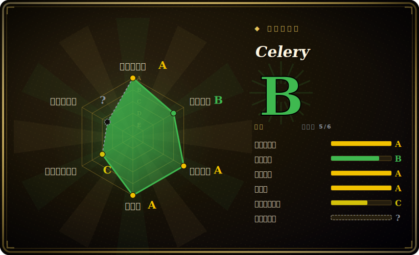

# Celery

Python 事实标准的分布式任务队列：通过消息 broker（RabbitMQ/Redis）把异步、后台作业交给一组 worker 执行，自带重试、定时调度（beat）、路由，以及可选的 result backend。

## 何时使用

你在用 Python 写 Web 应用——Django 或 FastAPI——你的请求处理器开始干太多事了。发欢迎邮件、生成 PDF 发票、转码上传文件、调用三个慢吞吞的第三方 API：这些全都卡在 HTTP 响应里，p99 一路往上爬。你不想让用户盯着转圈等一个跑 20 秒的内联作业，又不能简单地开线程——因为你需要这些活儿能挺过进程重启、还能跨机器横向扩展。于是你拿起 Celery：把那个慢函数标成 `@app.task`，在视图里调 `process_upload.delay(upload_id)`，请求立刻返回。一组独立的 Celery worker——可以在同一台机上，也可以是一整片机群——从 RabbitMQ 或 Redis 上把作业取走执行，第三方 API 超时就带退避重试。

应用长大后，你会用上框架的其余部分：`beat` 跑类 cron 的周期任务（夜间报表、缓存预热）、用路由把重型 GPU 作业送进专属队列和 worker 池、用 `chain`/`group`/`chord` 这些 canvas 原语来扇出再汇合、限速，以及在调用方真要返回值时配一个 result backend（Redis/DB）。它就是那个无聊但久经验证的默认选项——「把这段 Python 活儿稍后、在别处、可靠地跑掉」；加上周边生态（Flower 做监控、Django 集成、成熟的 broker 支持），你很少是第一个踩到某个坑的人。

## 何时不用

- **你的作业很简单、规模也不大。** Celery 背着实打实的运维重量——一个 broker，*外加* worker 进程，*往往还要* 一个 result backend，再加上这三者各自的故障模式。如果只是单个应用要跑几个后台作业，更轻的任务队列如 **RQ**、**Dramatiq**、**arq** 要搭起来、要理清楚都省事得多。
- **你要的是数据管线 / DAG 编排器。** Celery 跑的是相互独立的任务；它不是用来表达「B 在 A 成功后跑，然后 C、D 并行，回填上周二，把 DAG 画给我看」的。带依赖与血缘的定时多步数据工作流，请用 [Airflow](../workflow-orchestration/airflow.zh.md)（或 Prefect/Dagster）。
- **你不在 Python 上。** Celery 是个 Python 框架。JVM/Spring 团队想要带看板、托管式的调度器，应看 [XXL-JOB](xxl-job.zh.md)；其他生态各有其物（Ruby 的 Sidekiq、Node 的 BullMQ）。
- **你需要恰好一次或严格顺序保证。** Celery 默认是至少一次——任务可能被跑多于一次（重投递、可见性超时），所以你的任务必须幂等。若需要强投递/顺序语义，那是 broker/流的设计问题，Celery 不会白送给你。[推断]
- **你想要开箱即用的深度可观测性。** 弄清一个任务*为什么*卡住、丢失或重复，历来是 Celery 的一个坑——在 worker/broker/backend 这个三角里排查（尤其拿 Redis 当 broker 时）需要运维功力。请为 Flower/指标和 broker 层排查预留预算。

## 横向对比

| 替代品 | 是否收录 | 我们的评价 | 取舍 |
|---|---|---|---|
| RQ（Redis Queue） | 未收录 | 当前页用于它的主场景；如果更看重“极简、仅 Redis 的 Python 队列”，再选 RQ（Redis Queue）。 | 极简、仅 Redis 的 Python 队列；上手和读代码都简单，但 broker 不可选、调度/路由更弱、吞吐调优也不如 Celery。 |
| Dramatiq | 未收录 | 当前页用于它的主场景；如果更看重“现代 Python 任务队列（RabbitMQ/Redis），定位是更简单、更可靠的 Celery 替代”，再选 Dramatiq。 | 现代 Python 任务队列（RabbitMQ/Redis），定位是更简单、更可靠的 Celery 替代；生态更小，canvas/工作流原语也更少。 |
| arq | 未收录 | 当前页用于它的主场景；如果更看重“原生 asyncio、基于 Redis、非常轻量”，再选 arq。 | 原生 asyncio、基于 Redis、非常轻量；很适合 async 应用，但功能集相对 Celery 的路由/beat/canvas 偏少。 |
| [Airflow](../workflow-orchestration/airflow.zh.md) | ✅ | 当前页用于它的主场景；如果更看重“面向带依赖的多步 DAG **工作流**、带血缘与 UI 的调度器”，再选 Airflow。 | 面向带依赖的多步 DAG **工作流**、带血缘与 UI 的调度器——是另一种活：数据管线编排，而非低延迟的后台任务卸载。 |
| [XXL-JOB](xxl-job.zh.md) | ✅ | 当前页用于它的主场景；如果更看重“JVM 生态的分布式调度器，自带管理看板”，再选 XXL-JOB。 | JVM 生态的分布式调度器，自带管理看板；是 Java 世界的答案，不适配 Python 代码库。 |
| Sidekiq / BullMQ | 未收录 | 当前页用于它的主场景；如果更看重“Ruby（Sidekiq）和 Node（BullMQ）的对应物”，再选 Sidekiq / BullMQ。 | Ruby（Sidekiq）和 Node（BullMQ）的对应物；问题形状相同，只是语言生态不同。 |

## 技术栈

- **语言：** Python（纯 Python 框架；跑在 CPython 上，支持现代 3.x）。
- **Broker（可插拔传输层）：** RabbitMQ（AMQP，参考 broker）与 Redis 是一等公民；其他（如 SQS）也存在但支持程度不一——请核实你那个传输层的功能对等性。[未验证]
- **Result backend（可选）：** Redis、数据库（SQLAlchemy/Django ORM）、RabbitMQ/RPC 等——仅在调用方需要消费任务返回值或状态时才需要。
- **核心库：** `kombu`（消息/传输抽象）、`billiard`（进程池）、`click`（CLI）。定时靠 `celery beat`；监控常用 Flower。
- **原语：** 任务、队列/路由、重试、限速，以及用于组合工作流的 canvas（`chain`、`group`、`chord`、`map`、`chunks`）。

## 依赖

- **一个消息 broker（必需）：** 你必须自己跑 RabbitMQ 或 Redis（或其他受支持的传输层）。这是主干——Celery 本身不附带。
- **一个 result backend（可选）：** 仅当你需要任务结果/状态时才需要（常用 Redis 或某个 DB）。很多 fire-and-forget 场景直接省掉。
- **worker 进程：** 与应用并行运行的一个或多个 Celery worker 进程（用周期任务的话还要 `beat`），由 systemd/Docker/Kubernetes 托管。
- **Python 运行时 + broker 客户端库**（如经 kombu 引入的 `redis`/`amqp`），装在你的环境里。

## 运维难度

**中到高。** 玩具级搭建很简单——`pip install celery`，指向本地 Redis，起一个 worker 就行。重量在生产环境才显现：此时你要把（至少）一个 broker 和一片 worker 机群当作长期有状态基础设施来运营，往往还加一个 result backend。你得托管并自动扩缩 worker、定 prefetch/并发、把 acks-late 和可见性超时设对（尤其用 Redis 当 broker 时，配错会导致任务重复或丢失）、盯队列深度和死/卡任务，还要在不丢在途作业的前提下滚动发布 worker 代码。经典痛点是可观测性：当一个任务消失或跑了两遍，你是在 worker、broker、backend 三处同时排查。Flower、broker 看板，以及任务级指标/幂等，在规模上线后都不是可选项。

## 健康度与可持续性

- **维护（2026-06）。** 仓库最后 push 于 2026-06，并在 v5.x 线上持续发版（最新发布 v5.6.3，2026-03）——处于**活跃**而非吃老本；未归档。[推断]
- **治理 / bus factor。** 由 `celery` 这个 GitHub **组织**持有，多年来有广泛的贡献者群体，而非单一作者——但它由社区/志愿者维护，背后没有大型基金会或厂商出钱，所以持续的维护者带宽是要盯的点。[推断]
- **年龄与 Lindy 判断。** **2009-04 创建（约 17 年）**且**仍在活跃维护**⇒ **极强 Lindy** 信号——它是任何语言里最长寿、最久经实战的任务队列之一，是无聊但被验证过的默认选项，而非被炒作的新秀。[推断]
- **采用度与生态。** 在 Python 里无处不在：Django/Flask/FastAPI 技术栈的默认后台作业框架，真实部署基数巨大，文档成熟，broker 支持一等，生态完整（Flower、django-celery-beat/results、各种集成）。约 28.6k star 是广泛采用的佐证。[未验证]
- **风险标记。** 无 relicense 历史——全程 **BSD-3-Clause** 宽松许可；主要风险是上文那套运维复杂度 / 可调试性，外加依赖社区维护而非有资金的背书方。[推断]

## 存疑（未验证）

- [未验证] 截至 2026-06，约 28.6k GitHub star、最新发布 v5.6.3（2026-03）——star 数和版本号对时间敏感、会漂移，仅供参考。
- [未验证] 创建日期 2009-04、「约 17 年」年龄是依此处对项目历史的记述，请对照仓库实际创建日期复核。
- [未验证] broker/传输层的功能对等性各不相同（RabbitMQ vs Redis vs SQS 等）且随版本变动；请确认你依赖的那个传输层支持你需要的功能。
- [推断] 至少一次投递、「任务必须幂等」/ 无恰好一次保证这套说法，是把分布式队列的一般推理套到 Celery 上，并非引用的承诺——且行为取决于 broker 与 ack/可见性配置。
- [推断]「中到高」的运维难度与「可观测性是坑」的表述，是从 worker/broker/backend 架构得出的判断，而非实测基准。
