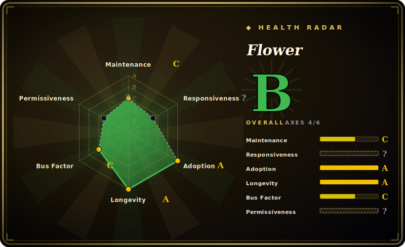

# Flower

A real-time web dashboard and admin tool for Celery — it shows live task/worker state, lets you inspect and control workers, and exposes a REST API and Prometheus metrics for a running Celery cluster.

## When to use

You're running a Celery deployment in production and you're flying blind: tasks are queued in Redis or RabbitMQ, workers are processing them somewhere, but when something stalls you're grepping worker logs and guessing. You drop in Flower as a separate process pointed at the same broker (`celery flower --broker=...`) and immediately get a web UI showing every worker, its concurrency and pool, the live stream of tasks with their args/results/runtime, and which tasks are pending, succeeded, retried, or failed. When a worker is wedged you can inspect it, rate-limit it, revoke a task, or restart its pool from the browser instead of SSHing around. You wire its `/metrics` endpoint into Prometheus so task throughput and failure rates show up next to the rest of your dashboards, and you put it behind your auth (basic auth, OAuth) since it can control workers.

You reach for Flower specifically because it's the de-facto, purpose-built monitor for Celery — it speaks Celery's events natively, so there's no exporter to write or schema to map. If your team already runs Celery and just needs *visibility and basic control* without standing up a full APM stack, Flower is the lightweight answer.

## When NOT to use

- **You're not running Celery.** Flower is Celery-specific. For arbitrary queues (Sidekiq, RQ, Dramatiq, BullMQ) or a non-Celery stack, it doesn't apply — use that system's own dashboard.
- **You need durable historical analytics.** Flower's task history is in-memory by default and bounded; it's a *real-time* monitor, not a long-term store. For trend analysis, push events to Prometheus/your TSDB or a results backend rather than relying on Flower to retain them.
- **You need full APM (traces, profiling, alerting).** Flower shows state and basic metrics; it has no tracing, profiling, or alerting engine. Pair it with Prometheus+Alertmanager/Grafana or an APM product for that.
- **You're exposing it carelessly.** It can revoke tasks and restart worker pools — an unauthenticated Flower is a remote-control panel for your queue. It must sit behind auth and not be public. [推断]
- **You want guaranteed event delivery for accounting.** Flower observes Celery's event stream, which is best-effort; don't treat its counts as a billing-grade ledger.

## Comparison

| Alternative | In index | Our verdict | Tradeoff |
|---|---|---|---|
| [Celery](celery.md) | ✅ | Use this page for its stated niche; choose Celery when you need the task framework Flower monitors. | The task framework Flower monitors; Celery's own `inspect`/`control` CLI gives raw access but no UI. Flower is the dashboard *for* Celery, not a substitute. |
| Prometheus + Grafana (celery-exporter) | 未收录 | Use this page for its stated niche; choose Prometheus + Grafana (celery-exporter) when you need better for long-term metrics, alerting, and unified dashboards. | Better for long-term metrics, alerting, and unified dashboards; more to operate and no live per-task drill-down or worker control. Often run *alongside* Flower. |
| Celery `events`/`inspect` CLI | 未收录 | Use this page for its stated niche; choose Celery events/inspect CLI when you need built into Celery, zero extra process. | Built into Celery, zero extra process; terminal-only, no web UI, no REST API, no at-a-glance fleet view. |
| [Apache Airflow](../workflow-orchestration/airflow.md) UI | ✅ | Use this page for its stated niche; choose Apache Airflow UI when you need a DAG orchestrator's UI, not a Celery task monitor. | A DAG orchestrator's UI, not a Celery task monitor — different tool for a different model (scheduled workflows vs. ad-hoc tasks). |
| Datadog / Sentry / commercial APM | 未收录 | Use this page for its stated niche; choose Datadog / Sentry / commercial APM when you need full observability with alerting and traces. | Full observability with alerting and traces; paid, heavier, and not Celery-purpose-built the way Flower is. |

## Tech stack

- **Language:** Python; a Tornado-based web server serving the dashboard and REST API.
- **Integration:** consumes Celery's native event stream and worker control protocol over the broker — no separate agent on workers.
- **Interfaces:** web UI, a JSON REST API for task/worker inspection and control, and a Prometheus `/metrics` endpoint.
- **Auth:** pluggable — HTTP basic auth, Google/GitHub/GitLab OAuth, and reverse-proxy auth.

## Dependencies

- **Runtime:** Python plus Celery and the same broker your app uses (Redis, RabbitMQ, etc.); Flower connects to that broker to read events and send control commands.
- **Deploy unit:** a single extra process/container alongside your Celery cluster; commonly run via `celery flower` or the `mher/flower` Docker image.
- **Install:** `pip install flower` from PyPI, or the published Docker image.

## Ops difficulty

**Low.** It's one stateless process you point at your broker — `pip install flower` (or the Docker image), set the broker URL, put it behind auth, and expose its port. There's no datastore to run for Flower itself. The real operational care is **security** (it controls workers, so never expose it unauthenticated) and remembering that its in-memory history doesn't survive restarts, so anything you need long-term must go to Prometheus or a results backend. At fleet scale you may run one Flower per Celery cluster and front it with your ingress/auth proxy. Compared to standing up a full metrics-and-alerting stack, Flower is the easy, drop-in piece.

## Health & viability

- **Maintenance (2026-06).** Last pushed 2026-06-22; the repo is actively maintained, though it favors a rolling/stable model over frequent tagged releases — **active**, not abandoned. Not archived. [推断]
- **Governance / bus factor.** Owned by an **individual account** (`mher`) with ~7.2k stars — a high-stars, single-owner project is a **bus-factor flag**: contribution comes partly from the Celery maintainer circle (ask, auvipy), but the namespace and final say rest with one person. [推断]
- **Age & Lindy verdict.** Created 2012-07, ~14 years old and **still active** ⇒ a **strong Lindy** signal; it has been *the* Celery dashboard for over a decade and is the obvious default. [推断]
- **Adoption.** The de-facto monitor wherever Celery runs in production — ~7.2k stars and a widely-pulled Docker image indicate broad real-world use. [未验证]
- **Risk flags.** License is BSD-3-Clause (confirmed from the LICENSE file; GitHub's API reports `NOASSERTION`), no relicense history found; the main flags are single-owner governance and the security exposure of an admin tool. [推断]

## Caveats (unverified)

- [未验证] License: GitHub's API returns `NOASSERTION`, but the repo's LICENSE file is a 3-clause BSD license (Copyright Mher Movsisyan and contributors) — recorded here as BSD-3-Clause.
- [未验证] ~7.2k GitHub stars as of 2026-06; the repo had no GitHub *Releases* entries at check time and uses a rolling-stable model, so a precise "latest version/date" isn't asserted.
- [推断] Task history retention is in-memory and bounded by default; durability and limits depend on configuration and version — verify before relying on Flower for historical data.
- [推断] Worker-control capabilities make an unauthenticated deployment dangerous; the auth-required posture is inferred from the tool's function, not a measured security claim.
- [未验证] Tornado web server and OAuth provider support are stated from project docs/history; exact supported providers and Python versions shift across releases.
