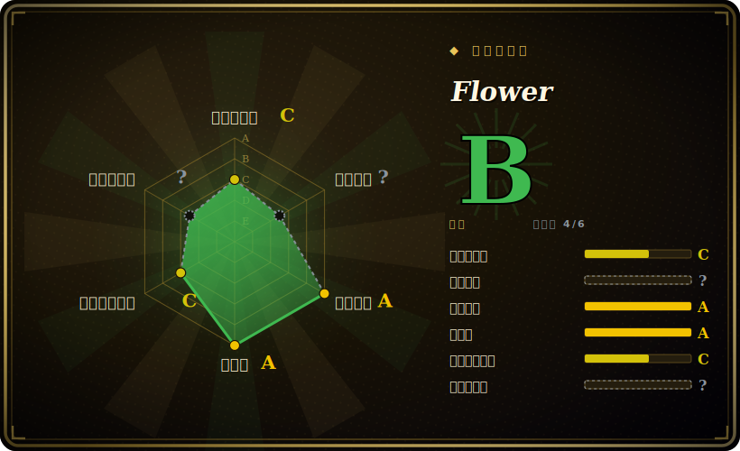

# Flower

面向 Celery 的实时 Web 看板与管理工具——展示任务/worker 的实时状态，可巡检并控制 worker，并为运行中的 Celery 集群暴露 REST API 与 Prometheus 指标。

## 何时使用

你在生产环境跑 Celery，却像盲飞：任务排在 Redis 或 RabbitMQ 里，worker 在某处处理它们，可一旦卡住，你就只能 grep worker 日志连蒙带猜。你把 Flower 作为一个独立进程指向同一个 broker 拉起（`celery flower --broker=...`），马上就有了一个 Web UI：每个 worker、它的并发与 pool、任务的实时流（连同参数/结果/耗时），以及哪些任务在 pending、成功、重试或失败。某个 worker 卡死时，你可以在浏览器里巡检它、限速、撤销某个任务，或重启它的 pool，而不必到处 SSH。你把它的 `/metrics` 端点接进 Prometheus，于是任务吞吐和失败率就和你其余的看板并列显示；又因为它能控制 worker，你把它放在你的鉴权（basic auth、OAuth）后面。

你专门选 Flower，是因为它是 Celery 事实上的、专门打造的监控工具——它原生说 Celery 的事件，所以无需写 exporter、也无需映射 schema。如果你的团队已经在跑 Celery，只是想要*可见性和基本控制*而不想搭一整套 APM，Flower 就是那个轻量的答案。

## 何时不用

- **你没在跑 Celery。** Flower 是 Celery 专属。对任意队列（Sidekiq、RQ、Dramatiq、BullMQ）或非 Celery 栈，它都不适用——请用那个系统自己的看板。
- **你需要持久的历史分析。** Flower 的任务历史默认在内存里且有上限；它是*实时*监控，不是长期存储。要做趋势分析，请把事件推到 Prometheus/你的 TSDB 或结果后端，而不是指望 Flower 保留它们。
- **你需要完整 APM（追踪、剖析、告警）。** Flower 展示状态和基础指标；它没有追踪、剖析或告警引擎。要这些，请配 Prometheus+Alertmanager/Grafana 或某个 APM 产品。
- **你随手把它暴露出去。** 它能撤销任务、重启 worker pool——一个未鉴权的 Flower 就是你队列的远程遥控面板。它必须放在鉴权之后，不能公网裸奔。[推断]
- **你想要用于计费的可靠事件投递。** Flower 观测的是 Celery 尽力而为的事件流；别把它的计数当作计费级账本。

## 横向对比

| 替代品 | 是否收录 | 取舍 |
|---|---|---|
| [Celery](celery.zh.md) | ✅ | Flower 所监控的任务框架；Celery 自带的 `inspect`/`control` CLI 给的是裸访问但无 UI。Flower 是*为* Celery 配的看板，不是替代品。 |
| Prometheus + Grafana（celery-exporter） | 未收录 | 在长期指标、告警和统一看板上更好；运维更重，且无实时逐任务下钻或 worker 控制。常与 Flower *并用*。 |
| Celery `events`/`inspect` CLI | 未收录 | 内建于 Celery，零额外进程；仅限终端，无 Web UI、无 REST API、无一眼总览的集群视图。 |
| [Apache Airflow](../workflow-orchestration/airflow.zh.md) UI | ✅ | 是 DAG 编排器的 UI，不是 Celery 任务监控——面向不同模型的不同工具（定时工作流 vs. 临时任务）。 |
| Datadog / Sentry / 商业 APM | 未收录 | 带告警和追踪的完整可观测性；付费、更重，且不像 Flower 那样为 Celery 量身打造。 |

## 技术栈

- **语言：** Python；基于 Tornado 的 Web 服务器，提供看板与 REST API。
- **集成：** 通过 broker 消费 Celery 的原生事件流与 worker 控制协议——worker 上无需额外 agent。
- **接口：** Web UI、用于任务/worker 巡检与控制的 JSON REST API，以及 Prometheus `/metrics` 端点。
- **鉴权：** 可插拔——HTTP basic auth、Google/GitHub/GitLab OAuth，以及反向代理鉴权。

## 依赖

- **运行时：** Python，加上 Celery 和你应用所用的同一个 broker（Redis、RabbitMQ 等）；Flower 连到那个 broker 读事件、发控制命令。
- **部署单元：** 紧贴 Celery 集群的一个额外进程/容器；常用 `celery flower` 或 `mher/flower` Docker 镜像拉起。
- **安装：** 从 PyPI `pip install flower`，或用发布的 Docker 镜像。

## 运维难度

**低。** 它是一个无状态进程，指向你的 broker 即可——`pip install flower`（或用 Docker 镜像）、设好 broker URL、放在鉴权后面、暴露端口。Flower 自身没有要运维的数据存储。真正要小心的是**安全**（它能控制 worker，所以绝不能未鉴权暴露），以及记住它的内存历史不会在重启后保留，凡需长期保存的都得送到 Prometheus 或结果后端。在集群规模下，你可能每个 Celery 集群跑一个 Flower，并用你的 ingress/鉴权代理罩在前面。相比搭一整套指标加告警栈，Flower 是那块轻松即插即用的。

## 健康度与可持续性

- **维护（2026-06）。** 最后 push 于 2026-06-22；仓库在活跃维护，只是更偏滚动/稳定模型而非频繁打 tag 发版——处于**活跃**而非废弃。未归档。[推断]
- **治理 / bus factor。** 归属一个**个人账号**（`mher`）且约 7.2k star——高 star 加单一所有者是一个 **bus-factor 风险标记**：贡献部分来自 Celery 维护者圈子（ask、auvipy），但命名空间与最终话语权落在一个人身上。[推断]
- **年龄与 Lindy 判断。** 2012-07 创建，约 14 年且**仍活跃**⇒ **强 Lindy** 信号；它做 Celery 看板已逾十年，是显而易见的默认选择。[推断]
- **采用度。** 凡生产环境跑 Celery 处，它都是事实上的监控——约 7.2k star 和广泛拉取的 Docker 镜像表明真实使用面很广。[未验证]
- **风险标记。** 许可为 BSD-3-Clause（已从 LICENSE 文件确认，GitHub API 报 `NOASSERTION`），未发现 relicense 历史；主要标记是单一所有者治理，以及作为管理工具的安全暴露面。[推断]

## 存疑（未验证）

- [未验证] 许可：GitHub API 返回 `NOASSERTION`，但仓库 LICENSE 文件是三条款 BSD 许可（Copyright Mher Movsisyan and contributors）——此处记为 BSD-3-Clause。
- [未验证] 截至 2026-06 约 7.2k GitHub star；检查时仓库无 GitHub *Releases* 条目，采用滚动稳定模型，因此不断言精确的“最新版本/日期”。
- [推断] 任务历史默认在内存且有上限；持久性与上限取决于配置和版本——依赖 Flower 保存历史数据前请先核实。
- [推断] worker 控制能力使未鉴权部署很危险；“必须鉴权”是从工具功能推断，而非实测安全结论。
- [未验证] Tornado Web 服务器与 OAuth provider 支持取自项目文档/历史；确切支持的 provider 和 Python 版本随版本变动。
