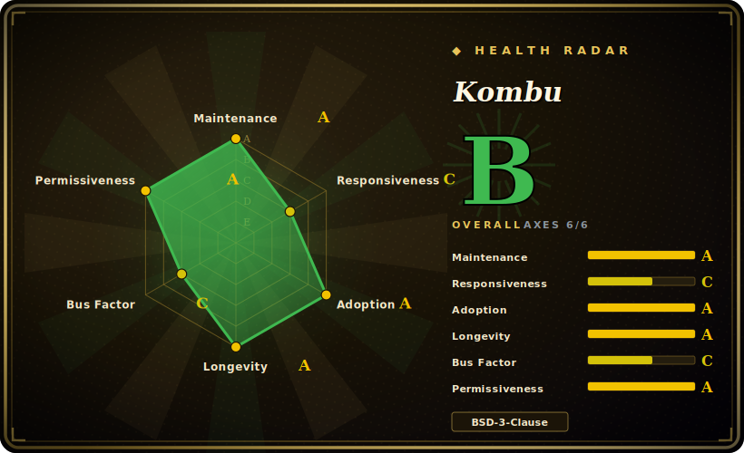

# Kombu

A Python messaging library that gives one idiomatic high-level API over many message brokers — AMQP/RabbitMQ plus pluggable "virtual" transports (Redis, Amazon SQS, MongoDB, ZooKeeper, in-memory) — and is the transport layer Celery is built on.

## When to use

You're a backend engineer building a Python service that needs to publish and consume messages, and you don't want to hard-code the AMQP wire details or marry your code to one broker. Today you're on RabbitMQ, but ops is talking about moving to Redis or Amazon SQS, and you'd rather not rewrite your producers and consumers when that happens. You pull in Kombu, declare your exchanges/queues as Python objects, and write a `Producer`/`Consumer` against its high-level API. The same code runs over `amqp://`, `redis://`, or `sqs://` by swapping a connection URL, because Kombu abstracts each broker behind a common transport interface, and it handles the messaging plumbing — connection pooling, automatic reconnection, serialization (JSON/pickle/msgpack/YAML), and compression — that you'd otherwise reimplement.

You also reach for Kombu when you're building framework-level infrastructure rather than an app: a task queue, an event bus, or a worker pool where you need fine control over acknowledgement, prefetch, and consumer mixins. It's the foundation Celery itself uses, so if you've outgrown Celery's task abstraction but still want a battle-tested broker layer, Kombu is the lower-level primitive to build on directly.

## When NOT to use

- **You just need to run background tasks.** If your goal is "call a function later, with retries and a worker pool", use [Celery](celery.md) (which sits on top of Kombu) rather than wiring producers/consumers by hand. Kombu is the plumbing, not the task framework.
- **You're not on Python.** Kombu is Python-only. For polyglot messaging, talk to the broker via its native client or a cross-language protocol (raw AMQP, Kafka, NATS).
- **You want a full event-streaming platform.** Kombu is a broker *client/abstraction*, not a log-structured stream store. For high-throughput, replayable event streams with consumer-group semantics, Kafka/Redpanda/Pulsar are the right tier.
- **You need every broker to behave identically.** The virtual transports (Redis, SQS, …) emulate AMQP semantics imperfectly — features like exchange types, priorities, and delivery guarantees differ per backend. Portability is "swap the URL", not "identical behavior". [推断]
- **You want first-class async/await.** Kombu's core consumer model is synchronous/event-loop-driven in the Celery style; if your stack is built around `asyncio`, an async-native AMQP client (e.g. `aio-pika`) may fit better. [未验证]

## Comparison

| Alternative | In index | Tradeoff |
|---|---|---|
| [Celery](celery.md) | ✅ | A task queue built *on* Kombu; use Celery for "run this job", use Kombu when you need the raw broker abstraction. Not a substitute — a higher layer. |
| py-amqp / pika | 未收录 | Lower-level AMQP-only clients; less abstraction, no multi-broker portability, but fewer moving parts if you'll only ever use RabbitMQ. |
| aio-pika | 未收录 | Async-native AMQP client for `asyncio`; better async ergonomics, RabbitMQ-only, smaller scope than Kombu's multi-transport model. |
| confluent-kafka-python / kafka-python | 未收录 | Kafka clients for log-structured streaming; different semantics (replay, partitions, consumer groups) — right when you need a stream, not a broker. |
| NATS / Redis Streams (direct) | 未收录 | Talk to one system directly; simpler if you've committed to it, no broker-agnostic layer. |

## Tech stack

- **Language:** Python (pure Python library; supports the actively-maintained CPython versions). [未验证]
- **Core abstraction:** a pluggable **transport** interface — a real AMQP transport (via `py-amqp` or `qpid`) plus "virtual" transports that emulate AMQP semantics over other backends.
- **Built-in transports:** Redis, Amazon SQS, MongoDB, ZooKeeper, Pyro, SoftLayer MQ, and an in-memory transport for unit testing.
- **Serialization & framing:** pluggable serializers (JSON, pickle, msgpack, YAML) and compression; connection pooling and automatic failover/reconnect.

## Dependencies

- **Runtime:** Python plus a transport driver — `amqp` (py-amqp) for RabbitMQ, `redis` for the Redis transport, `boto3`/SQS deps for Amazon SQS, etc. You install only the extras for the broker you use.
- **A running broker (yours to operate):** RabbitMQ, Redis, an SQS account, MongoDB, or ZooKeeper depending on the transport. Kombu is a client; it doesn't run the broker.
- **Install:** `pip install kombu` from PyPI; broker-specific extras like `kombu[redis]` / `kombu[sqs]`.

## Ops difficulty

**Low for the library; the broker is the real ops.** Kombu adds no service of its own — it's a `pip` dependency inside your process, so there's nothing extra to deploy or monitor for Kombu itself. The operational weight is whatever **broker** you point it at: running and clustering RabbitMQ, sizing Redis and reasoning about its weaker delivery guarantees, or managing SQS quotas and visibility timeouts. The library-level concerns are getting prefetch/acknowledgement/heartbeat settings right so you don't lose or duplicate messages under failure, and being aware that each virtual transport has its own quirks. If you already run Celery, you're already running Kombu and its broker — this is the same operational surface.

## Health & viability

- **Maintenance (2026-06).** Last pushed 2026-06-27; v5.6.2 released 2025-12 with a steady minor/patch cadence through 2025 — **active**, not coasting. Not archived. [推断]
- **Governance / bus factor.** Lives under the **celery** GitHub organization with multiple long-term maintainers (ask, auvipy, thedrow, matusvalo, …), not a single-maintainer project — a healthier bus factor than a solo repo, though still community-run rather than foundation-governed. [推断]
- **Age & Lindy verdict.** Created 2010-06, ~16 years old and **still actively shipping** ⇒ a **strong Lindy** signal; it has been the broker layer under Celery for over a decade. [推断]
- **Adoption.** Effectively ubiquitous wherever Celery is used (Celery depends on it), giving it very broad transitive adoption far beyond its ~3.1k direct stars; mature docs on Read the Docs. [未验证]
- **Risk flags.** BSD-3-Clause, no relicense history found; main consideration is that virtual-transport parity with real AMQP is imperfect and shifts release-to-release. [推断]

## Caveats (unverified)

- [未验证] ~3.1k GitHub stars and v5.6.2 (2025-12) as of 2026-06; star/version numbers are date-sensitive — treat as indicative.
- [未验证] Supported Python versions and the exact set of broker extras change across releases — check the current `pyproject.toml`/docs before pinning.
- [推断] Virtual transports (Redis, SQS, MongoDB, …) emulate AMQP semantics with backend-specific gaps; "swap the URL" portability is not identical behavior across brokers.
- [未验证] Async/await ergonomics are limited relative to async-native AMQP clients; the core model follows Celery's event-loop/synchronous style.
