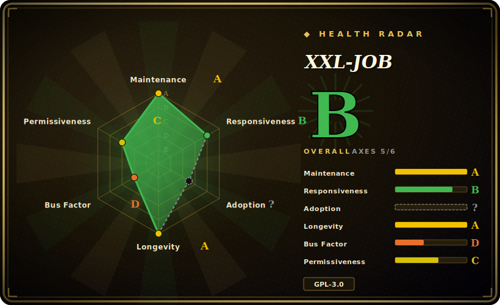

# XXL-JOB

A lightweight, distributed task-scheduling platform: a central web-based **admin/dispatcher** that triggers cron-style jobs against your application's **executors**, with sharded execution, failover, and a built-in UI — widely deployed in Chinese enterprises.

## When to use

You run a fleet of Java/Spring (Boot) services and you've accumulated a pile of scheduled work — nightly batch reports, data syncs, cache warmers, reconciliation jobs — currently scattered across `@Scheduled` annotations, crontabs on random boxes, and a few Quartz tables nobody fully understands. Nobody can answer "what jobs run, on which host, did last night's run succeed, and can I retrigger it?" without SSH-ing around. You want one place to register a job, set its cron expression, see its run history and logs, and get failover when the node that should have run it was down.

You drop the XXL-JOB **admin** in (one Spring Boot web app backed by a database), add the executor starter to each of your services, and annotate handler methods with `@XxlJob("...")`. Now scheduling lives in a visual console: you define jobs centrally, the dispatcher fires them on a cron, routes each trigger to an executor instance (round-robin, consistent-hash, failover, busyover, or **sharded** so each of N instances processes its 1/N slice), and you get per-execution logs, retry-on-failure, timeout, and a manual "run once" button. It's the centrally-managed, visual scheduler for a Java shop that has outgrown crontab but doesn't need a full data-pipeline engine.

## When NOT to use

- **You ship proprietary/closed-source software and license matters.** XXL-JOB is **GPL-3.0** (strong copyleft). Embedding it in a product you distribute can trigger copyleft obligations on your own code — get legal sign-off, or pick a permissively-licensed scheduler. This is the sharpest disqualifier. [未验证]
- **You're not a JVM shop.** Executors are first-class for Java/Spring; non-JVM languages can only be driven via generic "glue"/command executors (HTTP, shell, Python script runners), which is a second-class, clunkier path than native handlers.
- **You need HA with no single point of coordination.** The central admin/dispatcher is the brain; you can run multiple admin instances against a shared DB for redundancy, but the architecture is a **central scheduler** model — the database and dispatcher tier are the things you must keep highly available, not a leaderless mesh.
- **You want a streaming / event bus or message queue.** It's a *time/cron-triggered* job scheduler, not Kafka/RabbitMQ; it does not do event-driven streaming or pub/sub.
- **You're building a DAG data pipeline** — multi-step dependencies, backfills, lineage, dynamic task graphs. XXL-JOB has simple parent→child chaining, not real DAG orchestration; reach for [Airflow](../workflow-orchestration/airflow.md) (or a data-pipeline engine) instead.
- **Your team can't work in Chinese-first docs/community.** Documentation, issues, and the community are heavily Chinese; English coverage is thinner.

## Comparison

| Alternative | In index | Tradeoff |
|---|---|---|
| [Airflow](../workflow-orchestration/airflow.md) | ✅ | Python DAG orchestrator for data pipelines: dependencies, backfills, lineage, huge operator ecosystem. Far heavier to run, and overkill if you just need cron-triggered jobs across services. |
| Quartz | 未收录 | The classic embeddable Java scheduler library; powerful cron/trigger model but **no out-of-the-box admin UI, no distributed dispatcher, no run console** — XXL-JOB is essentially "Quartz + a management platform" in spirit. |
| Elastic-Job (ShardingSphere ElasticJob) | 未收录 | Java distributed scheduler with strong **sharding** built on ZooKeeper coordination; decentralized (no central admin) but heavier infra dependency and a steeper setup than XXL-JOB's DB-backed admin. |
| Spring Batch | 未收录 | A batch-processing *framework* (chunked read/process/write, restartability), not a scheduler — you still need something to trigger it. Complementary, not a substitute. |
| PowerJob | 未收录 | Newer Java distributed scheduler/compute platform; richer workflow/DAG and map-reduce-style execution, often pitched as a more modern XXL-JOB alternative — smaller install base. [未验证] |

## Tech stack

- **Language:** Java; the admin is a **Spring Boot** web application.
- **Architecture:** two tiers — a central **admin/scheduler** (web console + dispatcher) and **executors** embedded in your business apps via a starter; they communicate over HTTP/RPC.
- **Persistence:** a relational database (MySQL is the documented default) stores job definitions, scheduling state, execution logs, and registry info.
- **Scheduling:** cron-expression triggers, with routing strategies (first/last/round/random, consistent-hash, least-frequently/recently-used, failover, busyover, **sharding-broadcast**), plus timeout, retry, and child-job chaining.
- **UI:** a built-in web console for job CRUD, manual trigger, run history, and rolling execution logs.

## Dependencies

- **A database for the admin** — you must run a relational DB (MySQL by default) and apply XXL-JOB's schema; this is the scheduling/state store.
- **The admin/dispatcher service** — at least one Spring Boot admin instance (run several behind a load balancer against the shared DB for redundancy).
- **Executors in your apps** — each application that runs jobs pulls in the executor dependency and registers with the admin; the executors are where your `@XxlJob` handlers actually run.
- A JVM (and, in practice, a Spring/Spring Boot app) to host both admin and executors.

## Ops difficulty

**Low-to-medium.** Standing it up is straightforward for a Java team: deploy one Spring Boot admin, point it at a MySQL with the provided schema, and add the executor starter to your services — there's no ZooKeeper/etcd or external coordinator to operate (the DB is the coordination point). Day-to-day is mostly using the console. Difficulty rises with HA and scale: you must keep the **admin tier and its database** highly available (they're the SPOF surface), watch the execution-log table growth (it needs periodic cleanup), tune timeouts/retries/routing per job, and reason about behavior during admin or DB outages. Cross-language jobs via glue executors add operational rough edges.

## Health & viability

- **Maintenance (2026-06).** Repo last pushed 2026-06 — **active**, not archived; long release history over ~11 years. [推断]
- **Governance / bus factor.** Owned by a **single individual** (`xuxueli`, `owner.type` = User) who is the lead author — a real **bus-factor flag**: roadmap and merge authority concentrate on one person, even though the project is widely deployed. [推断]
- **Age & Lindy verdict.** Created **2015-11** (~11 years) and **still actively maintained** ⇒ a **strong Lindy** signal for its niche: a long-proven, battle-tested scheduler rather than a hyped newcomer. [推断]
- **Adoption.** ~30.3k stars and heavy real-world use, especially across Chinese enterprises, indicate strong adoption and a deep deployment base. [未验证]
- **Risk flags.** **GPL-3.0 copyleft** is the headline licensing risk for proprietary distribution; combined with single-lead-author governance and Chinese-first docs/community, these are the things to weigh before betting on it. [推断]

## Caveats (unverified)

- [未验证] ~30.3k stars and "active, pushed 2026-06" are point-in-time figures — star counts are unreliable and date-sensitive; re-verify against the live repo.
- [未验证] GPL-3.0 is the license reported for the repo; the precise copyleft obligations for your distribution model depend on how you embed/ship it — confirm with the `LICENSE` file and legal counsel, don't act on this page alone.
- [未验证] MySQL as the default/required datastore and the exact supported DB list come from the project's framing; verify the current docs for supported databases and schema.
- [未验证] "Heavily Chinese docs/community" and the relative thinness of English coverage are an impression from the project's origin and audience, not a measured claim.
- [推断] "Central scheduler = SPOF/HA concern" is an architectural inference; multi-admin-against-shared-DB redundancy exists, so treat it as a design tradeoff to plan for, not an outage guarantee.
- [推断] PowerJob being a "more modern alternative" with a smaller install base is a positioning inference, not a benchmarked comparison.
