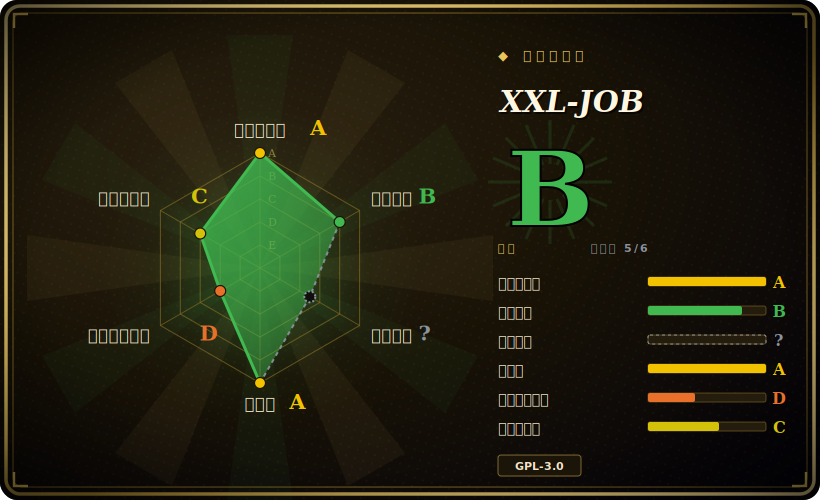

# XXL-JOB

一个轻量级的分布式任务调度平台：一个中心化的、基于 Web 的**调度中心（admin/dispatcher）**，按 cron 触发任务，分发到你应用里的**执行器（executor）**上，支持分片执行、failover 和内置 UI——在中国企业里被广泛部署。

## 何时使用

你运营着一批 Java/Spring（Boot）服务，攒下了一堆定时任务——夜间批量报表、数据同步、缓存预热、对账作业——现在散落在各处的 `@Scheduled` 注解、随便哪台机器上的 crontab，以及几张没人完全搞懂的 Quartz 表里。不 SSH 到处翻，没人答得上来「现在到底有哪些任务在跑、跑在哪台机器、昨晚那次成功了没、我能不能重跑一次」。你想要一个统一的地方来注册任务、设置 cron、看运行历史和日志，并在本该执行的节点宕机时拿到 failover。

你把 XXL-JOB 的**调度中心**装上（一个有数据库背书的 Spring Boot Web 应用），给每个服务加上 executor starter，再用 `@XxlJob("...")` 注解处理方法。现在调度就活在一个可视化控制台里：你集中定义任务，调度中心按 cron 触发，把每次触发路由到某个执行器实例（轮询、一致性 hash、failover、busyover，或**分片**——让 N 个实例各处理自己那 1/N 份），你还能拿到每次执行的日志、失败重试、超时控制，以及一个手动「执行一次」的按钮。对一个已经长大到 crontab 装不下、但又还不需要完整数据管线引擎的 Java 团队来说，它就是那个集中管理、可视化的调度器。

## 何时不用

- **你交付的是闭源/专有软件，且在意许可证。** XXL-JOB 是 **GPL-3.0**（强 copyleft）。把它嵌进你对外分发的产品，可能在你自己的代码上触发 copyleft 义务——先过法务，或者换一个宽松许可的调度器。这是最锋利的劝退点。[未验证]
- **你不是 JVM 技术栈。** 执行器是为 Java/Spring 一等公民设计的；非 JVM 语言只能靠通用的「胶水」/命令执行器（HTTP、shell、Python 脚本运行器）来驱动，这条路比原生 handler 二等、也更别扭。
- **你需要没有单点协调的高可用。** 中心化的调度中心是大脑；你可以跑多个 admin 实例共享同一个数据库做冗余，但架构本身是**中心调度**模型——你必须保证高可用的是数据库和调度层，而不是一张无主网格。
- **你想要流式 / 事件总线或消息队列。** 它是*按时间/cron 触发*的任务调度器，不是 Kafka/RabbitMQ；它不做事件驱动的流式处理或 pub/sub。
- **你在搭 DAG 数据管线**——多步依赖、回填（backfill）、血缘、动态任务图。XXL-JOB 只有简单的父子任务链，没有真正的 DAG 编排；这时该用 [Airflow](../workflow-orchestration/airflow.zh.md)（或某个数据管线引擎）。
- **你的团队没法用中文为主的文档/社区。** 文档、issue 和社区都以中文为主，英文覆盖更薄。

## 横向对比

| 替代品 | 是否收录 | 取舍 |
|---|---|---|
| [Airflow](../workflow-orchestration/airflow.zh.md) | ✅ | Python 写的数据管线 DAG 编排器：依赖、回填、血缘、庞大的 operator 生态。运维重得多，若你只是要跨服务的 cron 触发任务，属于杀鸡用牛刀。 |
| Quartz | 未收录 | 经典的可嵌入 Java 调度库；cron/trigger 模型强大，但**没有开箱即用的 admin UI、没有分布式调度器、没有运行控制台**——XXL-JOB 在精神上基本就是「Quartz + 一个管理平台」。 |
| Elastic-Job（ShardingSphere ElasticJob） | 未收录 | Java 分布式调度器，基于 ZooKeeper 协调，**分片**能力强；去中心化（无中心 admin），但基础设施依赖更重，搭建比 XXL-JOB 的 DB 背书 admin 更陡。 |
| Spring Batch | 未收录 | 一个批处理*框架*（分块 read/process/write、可重启），不是调度器——你仍需要别的东西来触发它。是互补，不是替代。 |
| PowerJob | 未收录 | 较新的 Java 分布式调度/计算平台；工作流/DAG 和 map-reduce 式执行更丰富，常被定位成更现代的 XXL-JOB 替代——装机量更小。[未验证] |

## 技术栈

- **语言：** Java；调度中心是一个 **Spring Boot** Web 应用。
- **架构：** 两层——中心化的**调度中心**（Web 控制台 + dispatcher），以及通过 starter 嵌进你业务应用里的**执行器**；两者通过 HTTP/RPC 通信。
- **持久化：** 一个关系型数据库（文档默认 MySQL）存储任务定义、调度状态、执行日志和注册信息。
- **调度：** cron 表达式触发，配多种路由策略（第一个/最后一个/轮询/随机、一致性 hash、最不频繁/最近最少使用、failover、busyover、**分片广播**），外加超时、重试和子任务链。
- **UI：** 内置 Web 控制台，做任务 CRUD、手动触发、运行历史和滚动执行日志。

## 依赖

- **调度中心需要一个数据库**——你必须跑一个关系型数据库（默认 MySQL）并导入 XXL-JOB 的 schema；这是调度/状态存储。
- **调度中心/dispatcher 服务**——至少一个 Spring Boot admin 实例（为冗余可在负载均衡后跑多个，共享同一数据库）。
- **你应用里的执行器**——每个要跑任务的应用都引入执行器依赖并向 admin 注册；你的 `@XxlJob` handler 实际就跑在执行器里。
- 一个 JVM（实践中是一个 Spring/Spring Boot 应用）来承载 admin 和执行器。

## 运维难度

**低到中。** 对 Java 团队来说搭起来很直接：部署一个 Spring Boot admin，指向一个导好 schema 的 MySQL，再给服务加上执行器 starter——没有 ZooKeeper/etcd 或外部协调器要运维（数据库就是协调点）。日常基本就是用控制台。难度随高可用和规模上升：你必须让**调度中心层和它的数据库**高可用（它们是 SPOF 面）、盯着执行日志表的增长（需要定期清理）、按任务调超时/重试/路由，并想清楚 admin 或 DB 故障时的行为。靠胶水执行器跑跨语言任务会带来一些运维毛刺。

## 健康度与可持续性

- **维护（2026-06）。** 仓库最后 push 于 2026-06——**活跃**，未归档；约 11 年里有很长的发布历史。[推断]
- **治理 / bus factor。** 由**单一个人**（`xuxueli`，`owner.type` = User）拥有，他是主要作者——这是个实打实的 **bus-factor 标记**：路线图和合并权集中在一个人身上，尽管项目被广泛部署。[推断]
- **年龄与 Lindy 判断。** **2015-11** 创建（约 11 年）且**仍在活跃维护**⇒ 对它的细分领域而言是**强 Lindy** 信号：一个久经验证、身经百战的调度器，而非被炒作的新秀。[推断]
- **采用度。** 约 30.3k star 加上大量真实使用，尤其在中国企业里，表明采用度强、部署基础深。[未验证]
- **风险标记。** **GPL-3.0 copyleft** 是面向专有分发的头号许可风险；叠加单一主作者治理和中文为主的文档/社区，这些是下注前要权衡的点。[推断]

## 存疑（未验证）

- [未验证] 约 30.3k star 和「活跃、2026-06 push」都是时间点数据——star 数不可靠且对时间敏感；请对照实时仓库重核。
- [未验证] GPL-3.0 是仓库标注的许可证；对你的分发模式而言，确切的 copyleft 义务取决于你如何嵌入/交付它——请以 `LICENSE` 文件和法务意见为准，别只凭本页行动。
- [未验证] MySQL 作为默认/必需数据存储以及确切的支持数据库列表来自项目自述；支持哪些数据库和 schema 请核对当前文档。
- [未验证]「文档/社区以中文为主」、英文覆盖相对薄，是从项目来源和受众得到的印象，不是实测结论。
- [推断]「中心调度 = SPOF/HA 隐患」是架构层面的推断；多 admin 共享 DB 的冗余是存在的，所以把它当成一个需要提前规划的设计取舍，而非宕机保证。
- [推断] PowerJob 是「更现代的替代品」且装机量更小，是定位上的推断，不是 benchmark 比较。
