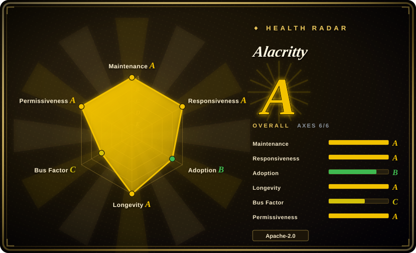

# Alacritty

A fast, cross-platform, OpenGL terminal emulator with sensible defaults and extensive configuration, designed to integrate with other applications rather than reimplement their functionality.

## When to use

You're a developer who spends hours in the terminal every day and wants the fastest, most responsive terminal emulator available. You pick Alacritty over WezTerm or Kitty because you want a terminal that does one thing exceptionally well — GPU-accelerated rendering — and delegates everything else to tools you already use. You pick it over iTerm2 because you need a cross-platform terminal that works identically on macOS, Linux, BSD, and Windows with the same configuration file, not a macOS-only app. You pick it over Warp because you value open-source transparency and minimalism over AI features and cloud integration. You are frustrated with terminal emulators that lag when scrolling through large log files or running `cat` on multi-megabyte outputs. You want a terminal that uses your GPU for rendering, offloading work from the CPU, and you already use tmux or screen for multiplexing.

## When NOT to use

- If you need a built-in terminal multiplexer with tabs and splits, use WezTerm, iTerm2, or Zellij instead of Alacritty, because Alacritty explicitly does not include tabs, splits, or session management.
- If you need font ligature support, use WezTerm or Kitty instead of Alacritty, because Alacritty does not support combining `!=` into a single glyph.
- If you are on a system without OpenGL 3.3+ support, use Windows Terminal or a CPU-based terminal instead of Alacritty, because Alacritty requires a modern GPU and graphics driver, and older systems or some VMs may not work.
- If you want a terminal with built-in AI or shell integration, use Warp instead of Alacritty, because Alacritty is a plain terminal emulator with no AI features, shell suggestions, or smart completions.
- If you need a fully stable, 1.0 product, use iTerm2 or Windows Terminal instead of Alacritty, because Alacritty is self-described as beta-level software, and while widely used as a daily driver, there are known missing features and bugs.

## Comparison

| Alternative | In index | Our verdict | Tradeoff |
| --- | --- | --- | --- |
| WezTerm | 未收录 | Use Alacritty for minimal, raw-performance GPU terminal emulation; choose WezTerm when you want a modern GPU-accelerated terminal with tabs, splits, and ligatures built in. | WezTerm has more built-in features (tabs, ligatures, multiplexing); Alacritty is faster and more minimal. |
| Kitty | 未收录 | Use Alacritty for minimal, raw-performance GPU terminal emulation; choose Kitty when you want a GPU-based terminal with advanced features like kittens (plugins) and image support. | Kitty has more features and a plugin system; Alacritty is simpler and more focused on raw performance. |
| iTerm2 | 未收录 | Use Alacritty for cross-platform, minimal GPU terminal emulation; choose iTerm2 when you want the most popular macOS terminal with deep macOS integration and extensive features. | iTerm2 is macOS-only and feature-rich; Alacritty is cross-platform and minimal. |
| Windows Terminal | 未收录 | Use Alacritty for cross-platform, minimal GPU terminal emulation; choose Windows Terminal when you want Microsoft's modern terminal for Windows with tabs and GPU acceleration. | Windows Terminal is Windows-only and integrates with WSL; Alacritty is cross-platform and simpler. |
| Warp | 未收录 | Use Alacritty for fully open-source, minimal, local terminal emulation; choose Warp when you want an AI-powered modern terminal with cloud features and IDE-like blocks. | Warp has AI features and modern UI; Alacritty is plain, fast, and fully local. |

## Tech stack

- **Rust** — primary implementation language
- **OpenGL** — GPU-accelerated rendering for smooth scrolling and large output
- **FreeType/FontConfig** — font rendering and configuration (platform-dependent)

## Dependencies

- A modern desktop OS (macOS, Linux, BSD, Windows)
- A GPU with OpenGL 3.3+ support and up-to-date graphics drivers
- A shell of your choice (Alacritty does not bundle one)

## Ops difficulty

**None.** Alacritty is a single binary. Install via package manager or download from releases. Configuration is a single YAML file. No daemon, no background service.

## Health & viability

- **Responsiveness**: Cannot be scored — no_traffic.
- **Maintenance**: Active — regular releases, responsive maintainers. 65k stars, 3.5k forks. The project is well-managed with clear issue triage.
- **Governance**: Maintained by the alacritty organization with multiple contributors. The original creator (jwilm) stepped back, but the project has successfully transitioned to community/organization maintenance.
- **Backing**: No corporate backing — a community-driven project under the alacritty GitHub organization. Sustained by volunteer contributions and community goodwill.
- **Adoption**: Very widely adopted among developers who prioritize terminal performance. Often recommended in Rust and developer communities as the default fast terminal.
- **Longevity**: ~10 years old (created 2016). Continuously maintained with no significant gaps. Good Lindy signal for a community project.
- **Risk flags**: Apache-2.0 is safe. No relicense history. The project is conservative about feature creep, which keeps it stable but may frustrate users wanting tabs, ligatures, or built-in multiplexing. The original maintainer transition was handled well.

## Caveats (unverified)

- [未验证] The exact OpenGL version requirement and compatibility with specific GPU drivers on Linux vary by distribution and hardware.
- [未验证] The beta-level readiness claim is self-assessed by the project; many users report stable daily use.
- [推断] As the terminal emulator landscape evolves, Alacritty's minimalism may cause it to lose users to feature-richer alternatives like WezTerm or Warp unless it finds a way to maintain its performance edge.
