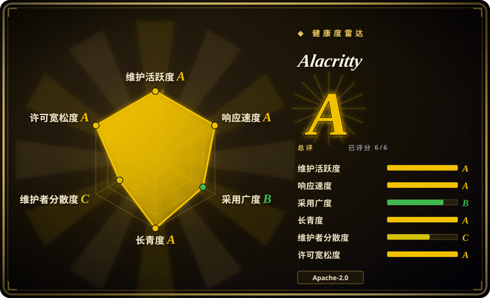

# Alacritty

快速、跨平台、基于 OpenGL 的终端模拟器，具备合理的默认设置与广泛的配置能力，设计上与其他应用集成而非重新实现它们的功能。

## 何时使用

你是一位每天在终端里花数小时的开发者，想要最快、最响应的终端模拟器。你选 Alacritty 而不选 WezTerm 或 Kitty，是因为你想要一个把一件事做到极致的终端——GPU 加速渲染——并把其他所有事交给你已有的工具。你选它而不选 iTerm2，是因为你需要一个在 macOS、Linux、BSD 和 Windows 上配置一致、行为统一的跨平台终端，而非仅限 macOS 的应用。你选它而不选 Warp，是因为你看重开源透明和极简主义，而非 AI 功能和云集成。你受够了在滚动大型日志文件或对多兆字节输出执行 `cat` 时 lag 的终端。你想要一个利用 GPU 渲染、把负载从 CPU 卸下的终端，而且你已经用 tmux 或 screen 做复用。

## 何时不用

- 如果你需要内置终端复用器（标签页和分屏），请用 WezTerm、iTerm2 或 Zellij，而不用 Alacritty，因为 Alacritty 明确不包含标签页、分屏或会话管理。
- 如果你需要字体连字支持，请用 WezTerm 或 Kitty，而不用 Alacritty，因为 Alacritty 不支持把 `!=` 合成单个字形。
- 如果你在不支持 OpenGL 3.3+ 的系统上，请用 Windows Terminal 或基于 CPU 的终端，而不用 Alacritty，因为 Alacritty 需要现代 GPU 和显卡驱动，老旧系统或部分虚拟机可能无法运行。
- 如果你想要内置 AI 或 shell 集成的终端，请用 Warp，而不用 Alacritty，因为 Alacritty 是纯粹的终端模拟器，没有 AI 功能、shell 建议或智能补全。
- 如果你需要完全稳定、1.0 的产品，请用 iTerm2 或 Windows Terminal，而不用 Alacritty，因为 Alacritty 自我定位为 beta 级软件，虽然许多人已将其作为日常工具，但仍有已知缺失功能和 bug。

## 横向对比

| 替代品 | 是否收录 | 我们的评价 | 取舍 |
|---|---|---|---|
| WezTerm | 未收录 | 需要极简、原生性能 GPU 终端模拟时选 Alacritty；需要现代 GPU 加速终端且内置标签页、分屏和连字时，再选 WezTerm。 | WezTerm 内置功能更多（标签页、连字、复用）；Alacritty 更快、更极简。 |
| Kitty | 未收录 | 需要极简、原生性能 GPU 终端模拟时选 Alacritty；需要基于 GPU 的终端且支持 kitten（插件）和图像等高级功能时，再选 Kitty。 | Kitty 功能更多、有插件系统；Alacritty 更简单、更专注于原生性能。 |
| iTerm2 | 未收录 | 需要跨平台、极简 GPU 终端模拟时选 Alacritty；需要最受欢迎的 macOS 终端且深度集成 macOS 和丰富功能时，再选 iTerm2。 | iTerm2 仅限 macOS、功能丰富；Alacritty 跨平台、极简。 |
| Windows Terminal | 未收录 | 需要跨平台、极简 GPU 终端模拟时选 Alacritty；需要微软为 Windows 打造的现代终端且支持标签页和 GPU 加速时，再选 Windows Terminal。 | Windows Terminal 仅限 Windows、集成 WSL；Alacritty 跨平台、更简单。 |
| Warp | 未收录 | 需要完全开源、极简、本地终端模拟时选 Alacritty；需要带 AI 功能和现代 UI 的终端时，再选 Warp。 | Warp 有 AI 功能和现代 UI；Alacritty 朴素、快速、完全本地。 |

## 技术栈

- **Rust**——主要实现语言
- **OpenGL**——GPU 加速渲染，实现流畅滚动与大型输出
- **FreeType/FontConfig**——字体渲染与配置（平台相关）

## 依赖

- 现代桌面操作系统（macOS、Linux、BSD、Windows）
- 支持 OpenGL 3.3+ 的 GPU 与最新显卡驱动
- 自选的 shell（Alacritty 不捆绑 shell）

## 运维难度

**无。** Alacritty 是单一二进制。通过包管理器安装或 release 下载。配置为单个 YAML 文件。无需守护进程、无需后台服务。

## 健康度与可持续性

- **维护：** 活跃——定期发布，维护者响应及时。65k star、3.5k fork。项目管理良好，issue 分类清晰。
- **治理：** 由 alacritty 组织维护，有多位贡献者。原创建者（jwilm）已退居幕后，但项目已成功过渡到社区/组织维护。
- **背书：** 无企业背书——alacritty GitHub 组织下的社区驱动项目。靠志愿贡献与社区 goodwill 维持。
- **采用：** 在重视终端性能的开发者中非常广泛。常在 Rust 与开发者社区被推荐为默认快速终端。
- **长期性：** 约 10 年（2016 年创建）。持续维护，无显著断档。对社区项目而言，Lindy 信号良好。
- **风险旗标：** Apache-2.0 安全。无 relicense 历史。项目对功能膨胀持保守态度，这保证了稳定，但可能让想要标签页、连字或内置复用的用户失望。原维护者过渡处理得当。

## 存疑（未验证）

- [未验证] 确切的 OpenGL 版本要求与 Linux 各发行版及硬件上的具体 GPU 驱动兼容性有所不同。
- [未验证] beta 级就绪声明是项目自我评估；许多用户报告日常使用稳定。
- [推断] 随着终端模拟器领域演进，Alacritty 的极简主义可能导致其用户流向 WezTerm 或 Warp 等功能更丰富的替代品，除非它能保持性能优势。
