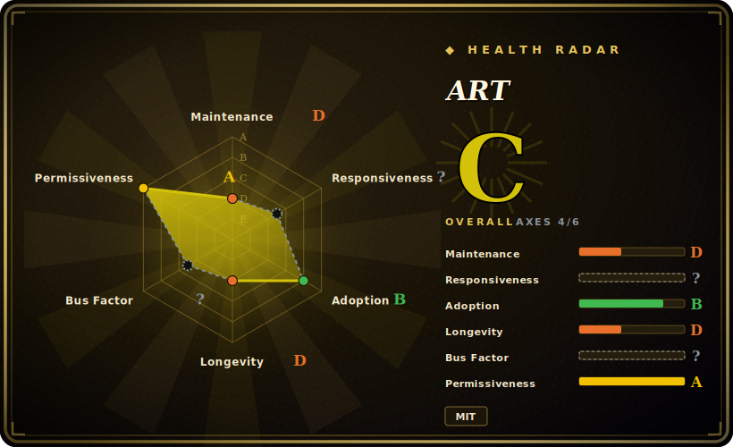

# ART

A pure-Python ASCII-art library: turn text into figlet-style large-font banners (`text2art`), insert single-character art pieces (`art`), and wrap output in decorative borders — hundreds of fonts and art pieces, no system dependencies.

## When to use

You're building a CLI tool and you want a polished startup banner — your tool's name in big ASCII letters, maybe boxed or decorated — without shelling out to a system `figlet` binary or bundling C dependencies. You `pip install art`, call `text2art("MyTool")`, and get the rendered banner as a string you can print, log, or embed. Because it's pure Python with the fonts shipped in-package, it works the same on Windows, macOS and Linux and in environments where you can't install system packages (CI, locked-down containers, serverless). You can pick from hundreds of fonts, fetch random art/decorations, and wrap text in borders — all from the library API or its CLI.

You reach for it when ASCII-art *text* is the deliverable: banners, splash screens, generated README art, Discord/Telegram bot output, terminal greetings, or test fixtures. It's a focused text→art generator with a stable, well-documented API and an unusually large bundled font/art catalog.

## When NOT to use

- **You want to convert an image/photo into ASCII.** art works on *text and characters*, not raster images — for picture-to-ASCII you need an image converter ([asciify](asciify.md), `ascii-magic`, `jp2a`), not this.
- **You're building a full-screen TUI or animation.** art produces strings, not a UI; for interactive screens, widgets or effects use a TUI library ([asciimatics](asciimatics.md), Textual, urwid).
- **You must match `figlet`'s exact fonts/output.** art has its own font set and rendering; if you need byte-for-byte figlet compatibility, use `pyfiglet` or the `figlet` binary instead.
- **You only need one banner, once, by hand.** For a one-off, an online figlet generator or the `figlet` CLI avoids adding a runtime dependency to your project.
- **Output size/performance is critical.** Large fonts produce wide multi-line output; in width-constrained or high-volume logging contexts, verify rendering fits and the call cost is acceptable. [未验证]

## Comparison

| Alternative | In index | Our verdict | Tradeoff |
|---|---|---|---|
| pyfiglet | 未收录 | Use this page for its stated niche; choose pyfiglet when you need pure-Python port of FIGlet with the canonical figlet font set. | Pure-Python port of FIGlet with the canonical figlet font set; the standard if you specifically want FIGlet fonts/compatibility, narrower scope (no decor/art-piece catalog). |
| figlet / toilet (CLI) | 未收录 | Use this page for its stated niche; choose figlet / toilet (CLI) when you need the classic C banner generators. | The classic C banner generators; require a system binary and aren't a Python API — fine for shell use, awkward to embed. |
| [asciify](asciify.md) | ✅ | Use this page for its stated niche; choose asciify when you need converts *images* to ASCII. | Converts *images* to ASCII — a different input entirely (raster, not text); complementary, not a substitute. |
| rich (figlet/markup) | 未收录 | Use this page for its stated niche; choose rich (figlet/markup) when you need styling library that can render large text and styled output as part of a bigger toolkit. | Styling library that can render large text and styled output as part of a bigger toolkit; broader but heavier if you only want art text. |
| ascii-magic / cowsay | 未收录 | Use this page for its stated niche; choose ascii-magic / cowsay when you need niche art generators (images / speech-bubble characters). | Niche art generators (images / speech-bubble characters); narrower and stylistically specific. |

## Tech stack

- **Language:** pure Python; fonts and art pieces are shipped inside the package (no system `figlet` needed).
- **API surface:** `text2art` (text→large-font banner), `art` (named single-piece art), `decor` (decorative borders), font/art listing helpers; plus a CLI.
- **Catalog:** hundreds of fonts and hundreds of named art pieces/decorations bundled in-repo (the README cites 600+ fonts and 700+ art pieces; exact counts grow per release). [未验证]
- **Distribution:** PyPI, conda, and a Docker/CLI path.

## Dependencies

- **Runtime:** Python only — **no third-party runtime dependencies** for the core library; the font/art data ships with the package. [未验证]
- **Install:** `pip install art` (or conda); the CLI comes with it.
- **No external services, network, or datastore** — fully offline, in-process string generation.

## Ops difficulty

**Low.** It's a zero-infra pure-Python library: `pip install`, call a function, get a string. Nothing to deploy or operate, no service, no state, no system binaries. The only practical consideration is that large-font output is wide and multi-line, so you handle wrapping/width in your own UI — there's no operational burden beyond that.

## Health & viability

- **Maintenance (2026-06).** Last pushed 2026-05 with a v6.x release line and a steady tagged-release cadence — **active**, not coasting. Not archived. [推断]
- **Governance / bus factor.** Driven primarily by the author (sepandhaghighi) with a recurring co-maintainer and contributors; a small-team/single-lead project but with sustained, disciplined releases and CI/coverage. [推断]
- **Age & Lindy verdict.** ~9 years old (created 2017-10) and **still actively shipping** ⇒ a **strong Lindy** signal: a mature, stable library that keeps moving. [推断]
- **Adoption.** ~2.5k stars, on PyPI/conda with a large bundled font/art catalog and good docs/test coverage — healthy adoption for a niche library. [未验证]
- **Risk flags.** MIT-licensed, no relicense history found; no significant risk flags beyond normal small-maintainer-team considerations. [推断]

## Caveats (unverified)

- [未验证] ~2.5k stars and v6.x as of 2026-06; star counts and version numbers drift — indicative only.
- [未验证] Font/art-piece counts (README cites 600+ fonts, 700+ art) grow release-to-release; treat as approximate, verify against the current release.
- [未验证] "No third-party runtime dependencies" for the core library is from the project's framing; confirm against the current packaging metadata for your version.
- [推断] "Active" and the release cadence are inferred from the 2026-05 last-push and tag history, not a precise release-interval measurement.
- [未验证] Width/performance of very large fonts in high-volume contexts is a general caution, not a measured benchmark for this library.
