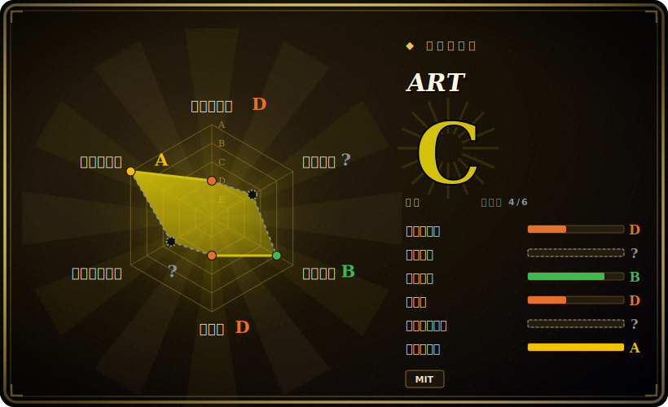

# ART

一个纯 Python 的 ASCII 艺术库：把文字变成 figlet 风格的大字横幅（`text2art`）、插入单字符艺术片段（`art`），并用装饰边框包裹输出——内置数百种字体和艺术片段，无系统依赖。

## 何时使用

你在做一个 CLI 工具，想要一个体面的启动横幅——把工具名做成大号 ASCII 字母，也许加个框或装饰——又不想去调系统的 `figlet` 二进制或捆绑 C 依赖。你 `pip install art`，调 `text2art("MyTool")`，拿到渲染好的横幅字符串，可以打印、记日志或嵌入。因为它是纯 Python、字体随包发布，所以在 Windows、macOS、Linux 上表现一致，在装不了系统包的环境（CI、受限容器、serverless）里也能用。你可以从数百种字体里挑、取随机艺术/装饰、给文字套边框——全部来自库 API 或它的 CLI。

当 ASCII 艺术*文字*就是交付物时你会选它：横幅、启动画面、生成的 README 艺术、Discord/Telegram 机器人输出、终端问候语，或测试 fixture。它是个聚焦的“文字→艺术”生成器，API 稳定、文档完善，内置字体/艺术目录大得出奇。

## 何时不用

- **你想把图片/照片转成 ASCII。** art 处理的是*文字和字符*，不是位图——图片转 ASCII 你需要图像转换器（[asciify](asciify.zh.md)、`ascii-magic`、`jp2a`），不是它。
- **你在做全屏 TUI 或动画。** art 产出的是字符串，不是 UI；交互屏、widget 或特效请用 TUI 库（[asciimatics](asciimatics.zh.md)、Textual、urwid）。
- **你必须与 `figlet` 的字体/输出完全一致。** art 有自己的字体集和渲染；若你要逐字节的 figlet 兼容，请改用 `pyfiglet` 或 `figlet` 二进制。
- **你只需要手动生成一个横幅、就一次。** 一次性的需求，用在线 figlet 生成器或 `figlet` CLI 就行，免得给项目加一个运行时依赖。
- **输出尺寸/性能很关键。** 大字体会产出很宽的多行输出；在宽度受限或高频日志场景下，请核实渲染是否放得下、调用开销是否可接受。[未验证]

## 横向对比

| 替代品 | 是否收录 | 取舍 |
|---|---|---|
| pyfiglet | 未收录 | FIGlet 的纯 Python 移植，带标准 figlet 字体集；若你专门要 FIGlet 字体/兼容性这是标准选择，范围更窄（无装饰/艺术片段目录）。 |
| figlet / toilet（CLI） | 未收录 | 经典 C 横幅生成器；需要系统二进制，不是 Python API——shell 用没问题，嵌入则别扭。 |
| [asciify](asciify.zh.md) | ✅ | 把*图片*转成 ASCII——输入完全不同（位图而非文字）；互补而非替代。 |
| rich（figlet/标记） | 未收录 | 样式库，可作为更大工具集的一部分渲染大字和带样式输出；更广但若只要艺术文字则更重。 |
| ascii-magic / cowsay | 未收录 | 小众艺术生成器（图片 / 对话气泡字符）；更窄、风格特定。 |

## 技术栈

- **语言：** 纯 Python；字体和艺术片段随包发布（无需系统 `figlet`）。
- **API 面：** `text2art`（文字→大字横幅）、`art`（具名单片艺术）、`decor`（装饰边框）、字体/艺术列表辅助函数；外加一个 CLI。
- **目录：** 仓库内置数百种字体和数百个具名艺术片段/装饰（README 称 600+ 字体、700+ 艺术片；确切数量随版本增长）。[未验证]
- **分发：** PyPI、conda，以及 Docker/CLI 路径。

## 依赖

- **运行时：** 仅 Python——核心库**无第三方运行时依赖**；字体/艺术数据随包发布。[未验证]
- **安装：** `pip install art`（或 conda）；CLI 随之附带。
- **无外部服务、网络或数据存储**——完全离线、进程内字符串生成。

## 运维难度

**低。** 这是个零基础设施的纯 Python 库：`pip install`、调函数、拿字符串。没有要部署或运维的东西，无服务、无状态、无系统二进制。唯一的实际考量是大字体输出宽且多行，所以你要在自己的 UI 里处理换行/宽度——除此之外没有运维负担。

## 健康度与可持续性

- **维护（2026-06）。** 最后 push 于 2026-05，有 v6.x 发布线和稳定的打 tag 发布节奏——处于**活跃**而非吃老本。未归档。[推断]
- **治理 / bus factor。** 主要由作者（sepandhaghighi）推动，外加一位常驻协作者和若干贡献者；属小团队/单一主导，但有持续、规整的发布和 CI/覆盖率。[推断]
- **年龄与 Lindy 判断。** 约 9 年（2017-10 创建）且**仍在活跃发布**⇒ **强 Lindy** 信号：一个成熟稳定、持续推进的库。[推断]
- **采用度。** 约 2.5k star，上架 PyPI/conda，内置字体/艺术目录大、文档与测试覆盖良好——对一个小众库来说采用度健康。[未验证]
- **风险标记。** MIT 许可，未发现 relicense 历史；除常规的小型维护团队考量外无显著风险标记。[推断]

## 存疑（未验证）

- [未验证] 截至 2026-06 约 2.5k star、v6.x；star 数和版本号会漂移，仅供参考。
- [未验证] 字体/艺术片段数量（README 称 600+ 字体、700+ 艺术）随版本增长；视为近似，请对照当前版本核实。
- [未验证] 核心库“无第三方运行时依赖”出自项目自述；请对照你所用版本的当前打包元数据确认。
- [推断] “活跃”和发布节奏是从 2026-05 最后 push 和 tag 历史推断，而非精确的发布间隔测量。
- [未验证] 超大字体在高频场景下的宽度/性能是一般性提醒，而非针对本库的实测基准。
