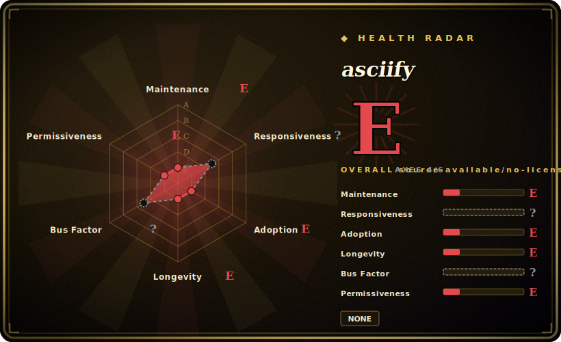

# asciify

A small Python script that converts an image into ASCII art — it downsamples the picture, maps pixel brightness to a ramp of characters, and prints/saves the result as text.

## When to use

You're hacking on a fun side project — a terminal greeting, a generated avatar, a "turn this logo into text" gag for a README — and you want the canonical *image-to-ASCII* recipe in Python: open an image with Pillow, resize it down, convert to greyscale, and map each pixel's luminance to a character from a density ramp. asciify is a single, short, readable `asciify.py` that does exactly that. It's useful as a copy-paste reference for the algorithm, or as a quick local CLI to asciify one picture, when you don't need anything robust or supported.

You'd pick it specifically because it's *minimal and legible* — you can read the whole thing in a minute and adapt the character ramp, resolution, or invert logic yourself. It's a learning/demo artifact more than a maintained product.

## When NOT to use

- **You need a license to use it legally.** The repo ships **no LICENSE file** — under default copyright, "no license" means all rights reserved: you have no granted permission to copy, modify, or redistribute it. Do not vendor it into a product. Re-implement the (trivial) algorithm or use a properly-licensed library instead. [未验证]
- **You need a maintained dependency.** Last pushed 2022-10, no releases/tags, single author — treat it as **abandoned**; don't take a runtime dependency on it.
- **You want features (colour ANSI, video, batch, web).** It's a minimal brightness-ramp converter; for colour/ANSI output, animation, or richer control use a maintained library (`ascii-magic`, `ascii_py`) or a CLI (`jp2a`, `chafa`).
- **You want text→ASCII banners, not image conversion.** That's the opposite direction — use [art](art.md) or `pyfiglet`; asciify only goes image→text.
- **You're on Windows/odd terminals and need guaranteed rendering.** Output fidelity depends on terminal width, font aspect ratio, and the chosen ramp; expect to tune it, with no support to fall back on.

## Comparison

| Alternative | In index | Our verdict | Tradeoff |
|---|---|---|---|
| ascii-magic | 未收录 | Use this page for its stated niche; choose ascii-magic when you need maintained Python library for image→ASCII with colour/HTML/terminal output. | Maintained Python library for image→ASCII with colour/HTML/terminal output; properly licensed and far more featureful — the practical replacement. |
| jp2a | 未收录 | Use this page for its stated niche; choose jp2a when you need fast C CLI converting JPEG/PNG to ASCII with colour. | Fast C CLI converting JPEG/PNG to ASCII with colour; a single binary, mature, but not a Python API. |
| chafa | 未收录 | Use this page for its stated niche; choose chafa when you need powerful terminal graphics/ASCII/Unicode image renderer (C). | Powerful terminal graphics/ASCII/Unicode image renderer (C); handles colour, animation and many terminals — heavier, far more capable. |
| [art](art.md) | ✅ | Use this page for its stated niche; choose art when you need generates ASCII art from *text* (figlet-style), not images. | Generates ASCII art from *text* (figlet-style), not images — opposite input; not a substitute. |
| Pillow + ~20 lines | 未收录 | Use this page for its stated niche; choose Pillow + ~20 lines when you need the DIY route asciify itself embodies. | The DIY route asciify itself embodies; with no license on asciify, rolling your own from Pillow is often the cleaner, legally-clear option. |

## Tech stack

- **Language:** Python — a single `asciify.py` script.
- **Imaging:** Pillow (PIL) for opening, resizing and reading pixel data; brightness is mapped to an ASCII character ramp. [未验证]
- **Interface:** run the script against an image path; output is ASCII text to terminal/file.
- **Scope:** one-file converter — no package, no releases, no plugin surface.

## Dependencies

- **Runtime:** Python plus Pillow (PIL); install Pillow via pip, then run the script. Exact import list is whatever `asciify.py` imports. [未验证]
- **Input:** a local image file (the repo includes a sample image).
- **No services, network, or datastore** — fully local, one-shot conversion.

## Ops difficulty

**Low (but unsupported).** Operationally trivial — it's one script with one dependency; nothing to deploy or run as a service. The real "difficulty" isn't ops, it's the **legal and maintenance** posture: no license and no maintenance mean you shouldn't depend on it in anything you ship; copying the algorithm into your own (licensed) code is the safer path.

## Health & viability

- **Maintenance (2026-06).** Last pushed 2022-10, no releases or tags, sparse history — effectively **unmaintained / abandoned**. Not formally archived, but inactive for years. [推断]
- **Governance / bus factor.** Single author on a personal account with a few drive-by contributors; no governance, no roadmap. Maximal bus-factor risk — but for a frozen demo script that matters less than the license gap. [推断]
- **Age & Lindy verdict.** ~8 years old (created 2018-08) but **inactive since 2022** ⇒ Lindy **does not apply** — age without ongoing activity is staleness, not durability. [推断]
- **Adoption.** ~1.2k stars, but those reflect its value as a *learning reference*, not production use; high stars on an unmaintained, unlicensed single-script repo are a **risk flag**, not social proof. [未验证]
- **Risk flags.** **No license (all-rights-reserved by default)** is the headline risk; plus abandonment and single-author. Avoid as a dependency. [未验证]

## Caveats (unverified)

- [未验证] No LICENSE file is present in the repo (GitHub reports the license as none, and no `LICENSE`/`COPYING` appears in the file listing); recorded as `NONE` = all-rights-reserved by default copyright. Confirm before any reuse.
- [未验证] ~1.2k stars and a 2022-10 last-push as of 2026-06; star counts and dates drift — indicative only.
- [未验证] Exact dependencies (assumed Pillow) and the precise conversion logic are whatever the current `asciify.py` contains; not re-verified line-by-line here.
- [推断] "Abandoned / unmaintained" is inferred from the 2022-10 last-push, absence of releases, and sparse history — not a maintainer statement.
- [推断] Lindy "does not apply" follows from age × inactivity (old but dormant), per the age-must-pair-with-still-active rule.
