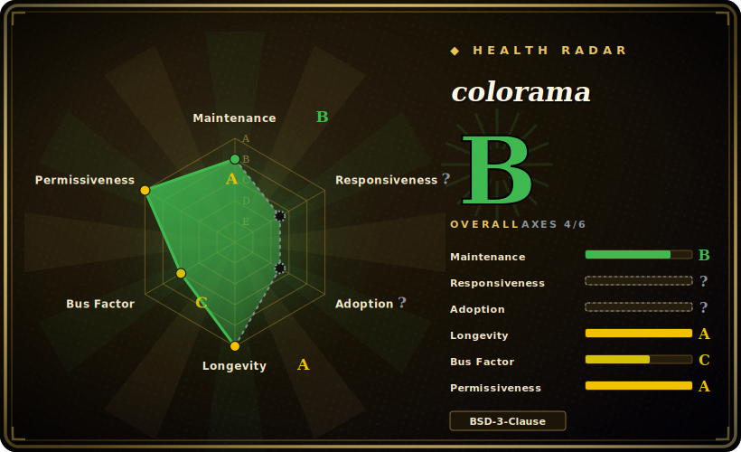

# colorama

A tiny pure-Python library that makes ANSI color/style escape codes work on Windows — call `colorama.init()` once and the same ANSI sequences that color your output on Linux/macOS now render correctly in legacy Windows terminals too.

## When to use

You're writing a Python CLI — a build tool, a test runner, a deploy script — and you want red errors, green successes, and dim secondary text. On Linux and macOS you just print ANSI escape codes (`\033[31m...`). But your users on older Windows (cmd.exe, pre-modern conhost) see literal garbage like `←[31m` instead of color, because those terminals didn't interpret ANSI. You add `from colorama import init, Fore, Style; init()` at startup, and colorama intercepts stdout/stderr on Windows and translates the ANSI codes into the Win32 console API calls that actually set colors — while doing nothing (passing ANSI straight through) on platforms that already support it. The result: one code path, colored output everywhere, no `if platform == 'windows'` branching. Its `Fore`, `Back`, and `Style` constants also give you readable names instead of raw escape numbers.

It's the de-facto compatibility shim under a huge slice of Python CLIs and is bundled with many higher-level color/UI libraries — reach for it when you need *cross-platform colored terminal text* with a near-zero dependency footprint, not a full TUI.

## When NOT to use

- **You only target Linux/macOS (or modern Windows Terminal).** On platforms that already honor ANSI — including Windows 10+ Terminal/conhost with VT processing — colorama is largely a no-op; you can print escape codes (or use a lighter helper) without it. Its core value is *legacy Windows*. [推断]
- **You want rich terminal UI — tables, layout, progress bars, markdown.** colorama only translates color/style codes. For styled tables, spinners, live layouts, syntax highlighting, reach for **Rich** (which is a far larger library) or **Textual** for full TUIs.
- **You want high-level styling ergonomics.** colorama gives you raw-ish `Fore.RED + text + Style.RESET_ALL`; libraries like **Rich** or **click.style** offer nicer APIs. colorama is the low-level shim, often *underneath* them.
- **Non-Python stacks.** It's Python-only; other ecosystems have their own (chalk for Node, etc.).
- **You need 24-bit truecolor guarantees everywhere.** colorama centers on the standard ANSI SGR codes and Windows console translation; truecolor support depends on the terminal, and colorama is not the layer that guarantees it. [未验证]

## Comparison

| Alternative | In index | Our verdict | Tradeoff |
|---|---|---|---|
| Rich (Textualize) | 未收录 | Use this page for its stated niche; choose Rich (Textualize) when you need full styled-output toolkit (color, tables, markdown, progress, traceback). | Full styled-output toolkit (color, tables, markdown, progress, traceback) — vastly more capable, but a large library; overkill if you only need cross-platform color. |
| termcolor / colored | 未收录 | Use this page for its stated niche; choose termcolor / colored when you need tiny ANSI color helpers with friendly APIs, but don't translate ANSI on legacy Windows. | Tiny ANSI color helpers with friendly APIs, but don't translate ANSI on legacy Windows — often paired *with* colorama for that. |
| click.style (Click) | 未收录 | Use this page for its stated niche; choose click.style (Click) when you need convenient styling within the Click CLI framework. | Convenient styling within the Click CLI framework; Click itself historically depended on colorama for the Windows shim. |
| blessed / blessings | 未收录 | Use this page for its stated niche; choose blessed / blessings when you need terminal capability + cursor/styling library (terminfo-based). | Terminal capability + cursor/styling library (terminfo-based) — richer terminal control, heavier, less focused on the Windows-ANSI gap. |
| raw ANSI escape codes | 未收录 | Use this page for its stated niche; choose raw ANSI escape codes when you need zero deps and works on every ANSI-capable terminal, but breaks on legacy Windows consoles. | Zero deps and works on every ANSI-capable terminal, but breaks on legacy Windows consoles — exactly the gap colorama fills. |

## Tech stack

- **Language:** pure Python, no compiled extensions.
- **Mechanism:** wraps `sys.stdout`/`sys.stderr` and, on Windows, parses ANSI SGR sequences and replays them via the **Win32 console API** (SetConsoleTextAttribute, etc.); a pass-through on other platforms.
- **API:** `init()`/`deinit()`/`just_fix_windows_console()`, plus `Fore`, `Back`, `Style` constant namespaces and `AnsiToWin32` internals.

## Dependencies

- **Runtime:** Python only — **no third-party runtime dependencies** (it uses ctypes/stdlib to call the Windows console API). That zero-dep footprint is a big reason it's so widely bundled. [推断]
- **External services:** none.
- **Install:** `pip install colorama`.

## Ops difficulty

**Trivial.** It's a `pip install` and one `init()` call (or `just_fix_windows_console()`); there's nothing to deploy, configure, or operate. The only practical care is calling `init()` early, remembering to `Style.RESET_ALL` so colors don't bleed, and being aware it's mainly a no-op on already-ANSI-capable terminals — so don't expect it to add capabilities (truecolor, TUI) it was never meant to provide.

## Health & viability

- **Maintenance (2026-06).** Repo last pushed 2026-05 — **active**, not archived; a stable, mature library that doesn't need frequent change but is kept current. (No GitHub tagged releases listed here; it ships via **PyPI**.) [未验证]
- **Governance / bus factor.** Owner type **User** (tartley / Jonathan Hartley) with multiple steady contributors (wiggin15, hugovk, njsmith, jdufresne) — better bus factor than a one-person script, though still individually owned rather than foundation-backed. [推断]
- **Age & Lindy verdict.** Created **2014**, ~12 years old and **still maintained** ⇒ a **strong Lindy** signal; it's a settled, ubiquitous dependency whose problem (legacy-Windows ANSI) is itself stable. [推断]
- **Adoption.** ~3.8k stars but the real signal is **transitive ubiquity** — it's a dependency of a vast number of Python CLIs and color/UI libraries (historically pip, Click, pytest tooling, etc. bundle or depend on it). [未验证]
- **Risk flags.** **BSD-3-Clause**, permissive, no relicense history found. As legacy Windows recedes (Windows Terminal supports ANSI natively), the library's *relevance* slowly narrows, but it remains the safe default for broad compatibility. [推断]

## Caveats (unverified)

- [未验证] ~3.8k stars / ~279 forks / ~137 open issues as of 2026-06 — date-sensitive, indicative only.
- [未验证] Ships via PyPI; the empty GitHub Releases list doesn't mean inactivity — verify the current version on PyPI/changelog.
- [推断] "Zero third-party runtime deps" is inferred from its design/footprint; confirm against the version's metadata if it matters.
- [推断] On modern ANSI-capable terminals colorama is largely a pass-through; the "no-op there" claim is an inference about behavior, not a guarantee for every terminal/version.
- [未验证] Truecolor (24-bit) behavior across terminals is outside colorama's guaranteed scope and not verified here.
