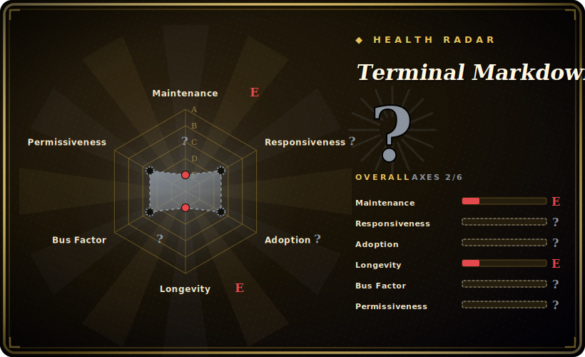

# Terminal Markdown Viewer (mdv)

A Python CLI (`mdv`) that renders Markdown into styled, colourised, terminal-friendly text — tables, code blocks with syntax highlighting, admonitions and themes — so you can read `.md` files in a plain terminal.

## When to use

You're working over SSH on a headless box, or living in a tmux pane, and you want to actually *read* a README or a docs `.md` file without it being a wall of raw `#`, `*` and backticks. You don't have (or don't want) a browser or a GUI Markdown app in the loop. You run `mdv README.md` and get the document rendered with headings, colour, indented/boxed code blocks, syntax-highlighted snippets, tables and lists, themed to your taste — all as ANSI in the terminal. It can also take Markdown on stdin, so you can pipe documentation or generated Markdown straight into it as a pager-style viewer.

You reach for it when the job is specifically *one-shot, read-only rendering of Markdown to a terminal*: previewing a file, glancing at a changelog, eyeballing generated docs in CI logs, or wiring it into a script as the "show this markdown nicely" step. It's a focused viewer/formatter, not an editor and not a TUI app.

## When NOT to use

- **You want an actively-maintained, fast-moving tool.** mdv is low-activity (last pushed 2024-05) and at a 0.x version; for a long-term dependency a more actively-maintained renderer (glow, `rich`'s Markdown, `bat`) may be the safer bet. [推断]
- **You want a scrollable pager / interactive browser.** mdv renders to a stream; if you want paging, search, and file navigation inside the terminal, glow's TUI mode or piping into `less -R` plus a renderer fits better.
- **You're already in a Python app and just need Markdown→ANSI.** `rich` renders Markdown as part of a broader styling library you may already depend on — one fewer standalone tool.
- **You need faithful, spec-strict CommonMark/GFM rendering.** Terminal renderers approximate; complex nested Markdown, HTML-in-Markdown, or exotic extensions may render imperfectly — verify against your actual documents. [未验证]
- **You need Windows-first support or zero Python.** It's a Python tool; a single-binary Go renderer (glow) avoids the Python runtime if that matters to your environment.

## Comparison

| Alternative | In index | Tradeoff |
|---|---|---|
| glow | 未收录 | Go single-binary Markdown renderer with a TUI browser/pager and themes (Charm); actively maintained, no Python runtime — generally the modern default for terminal Markdown reading. |
| bat | 未收录 | A `cat` clone with syntax highlighting and paging; shows Markdown *source* highlighted rather than rendering it, but ubiquitous and fast. |
| rich (Markdown) | 未收录 | Python library that renders Markdown to styled terminal output as part of a larger toolkit; library-first, not a standalone CLI. |
| mdcat | 未收录 | Rust CLI that renders Markdown to the terminal, including inline images on supporting terminals; single binary, active. |
| pandoc + pager | 未收录 | Converts Markdown to many formats (heavyweight, general-purpose); overkill for "just show this .md in my terminal". |

## Tech stack

- **Language:** Python (CLI entry point `mdv`); packaged via `setup.py`/`setup.cfg` and installable from PyPI.
- **Rendering:** parses Markdown and emits ANSI-styled text — headings, themed colours, boxed/indented code, syntax highlighting, tables, lists and admonitions.
- **Input:** file argument or stdin; theme selection and configuration options.
- **Packaging:** a `Dockerfile` is present for a containerised run path alongside pip install.

## Dependencies

- **Runtime:** Python plus a handful of pip dependencies (Markdown parsing, syntax highlighting such as Pygments, terminal styling); exact list is in the packaging metadata.
- **Terminal:** an ANSI-capable terminal for colour/styling output.
- **No external services or datastore** — it's a local CLI that reads files/stdin and writes to the terminal.

## Ops difficulty

**Low.** It's a single-purpose CLI: `pip install` (or run the Docker image) and invoke `mdv file.md`. Nothing to deploy, no service, no state. The only friction is environment-level — getting the Python version/dependencies right, and accepting that terminal rendering of complex Markdown is approximate, so you may tweak themes or fall back to source view for edge cases.

## Health & viability

- **Maintenance (2026-06).** Last pushed 2024-05; commit activity is sparse and the version line is 0.x. Reads as **low-activity / coasting** — usable but not actively developed. Not archived. [推断]
- **Governance / backing.** Owned by the Axiros organization (a company), with a small contributor tail. Org ownership is a mild positive over a personal account, but activity, not ownership, is the live signal here. [推断]
- **Age & Lindy verdict.** ~11 years old (created 2015-07); long-lived but with thin recent activity, so Lindy is **mixed** — old enough to be stable, but age alone doesn't offset the slow cadence (use age × still-active). [推断]
- **Adoption.** ~1.9k stars; a known older entry in the terminal-Markdown niche, now competing with newer Go/Rust renderers (glow, mdcat). [未验证]
- **Risk flags.** Low maintenance velocity is the main flag. License is BSD-3-Clause (read from the repo's LICENSE.txt; GitHub reports `NOASSERTION`). No relicense history found. [未验证]

## Caveats (unverified)

- [未验证] GitHub's API reports the license as `NOASSERTION`; the repo's `LICENSE.txt` is a BSD 3-clause license (Axiros GmbH). Recorded as BSD-3-Clause from reading the file, not from the API badge.
- [未验证] ~1.9k stars and a 2024-05 last-push as of 2026-06; star counts and activity dates drift — indicative only.
- [未验证] Exact Python version floor and the precise runtime dependency list are governed by the packaging metadata and change over time; not asserting specific values.
- [推断] "Low-activity / coasting" is inferred from the 2024-05 last-push and sparse commits, not a measured release-frequency figure.
- [未验证] Fidelity of complex/nested Markdown (HTML-in-Markdown, exotic extensions) is an inherent terminal-renderer limitation, not a measured defect list for this tool.
