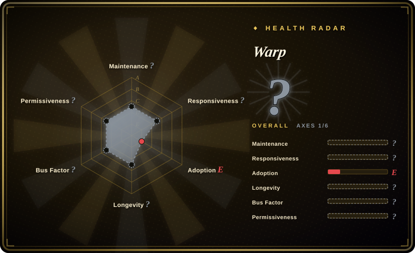

# Warp

A modern terminal built for coding with agents — **note: this GitHub repository is issues-only; the product itself is proprietary closed-source software.**

## When to use

You're a developer who spends most of your day in a terminal and wants a modern, fast, IDE-like experience for the command line. You pick Warp over Alacritty because you want features like command blocks (so you can navigate output like a document), AI-assisted command suggestions, and integrated coding agents — not just a plain terminal. You pick it over iTerm2 because you want a terminal that feels built in 2026, not 2006, with GPU acceleration and AI-native design across macOS and Linux. You pick it over Tabby because you want a polished, commercially supported product with weekly updates rather than an open-source project with community-only support. You install Warp, and it replaces your default terminal with a GPU-accelerated, Rust-powered shell that supports bash, zsh, and fish, with built-in AI agent "Oz" that can help write and debug commands, or you can run external CLI coding agents like Claude Code, Codex, or Gemini CLI inside it.

## When NOT to use

- If you require fully open-source software, use Alacritty or Tabby instead of Warp, because the GitHub repo is an issue tracker only; Warp's actual source code is proprietary and closed, and the AGPL-3.0 license on the repo applies to the minimal issue-tracker code, not the product. [推断]
- If you need a lightweight, minimal terminal, use Alacritty instead of Warp, because Warp is a feature-rich, Rust-based application with AI integrations, cloud features, and modern UI — not a 10MB terminal that starts in 50ms.
- If you are on Windows, use Windows Terminal or Alacritty instead of Warp, because as of mid-2026, Warp's primary support is macOS and Linux, and Windows support is limited or unavailable.
- If you don't want AI features or cloud connectivity, use Alacritty or iTerm2 instead of Warp, because Warp's value proposition is tightly coupled with AI assistance and cloud-backed features, and traditional terminals make zero network calls.
- If you need a terminal for remote/headless servers over SSH, use Tabby or Alacritty instead of Warp, because Warp's advanced features (blocks, AI, etc.) are designed for local interactive use and may not work well in a plain SSH session. [推断]
- If you object to proprietary telemetry or cloud accounts, use Alacritty instead of Warp, because Warp requires a login for some features and is a closed-source product whose data collection cannot be fully audited.

## Comparison

| Alternative | In index | Our verdict | Tradeoff |
|---|---|---|---|
| [Alacritty](alacritty.md) | ✅ | Use Warp for an AI-native, IDE-like terminal experience; choose Alacritty when you want a fast, cross-platform, OpenGL terminal emulator that is fully open source. | Fully open source and minimal, but no native AI features, no command blocks, and no built-in shell intelligence. |
| iTerm2 | 未收录 | Use Warp for an AI-native, modern terminal across macOS and Linux; choose iTerm2 when you want the most popular macOS terminal with deep macOS integration and no AI-centric design. | macOS-only, not open source, but mature and feature-rich without the AI-centric design of Warp. |
| Tabby | 未收录 | Use Warp for a polished, commercially supported AI terminal; choose Tabby when you want a modern, open-source terminal with SSH client and serial support. | Open source and cross-platform, with some modern UI features, but less AI-native than Warp. |
| [asciimatics](asciimatics.md) | ✅ | A Python TUI library for building terminal UIs, not a terminal emulator. | This is a library for building TUIs, not a standalone terminal app — different category. |

## Tech stack

- **Rust** — the core terminal and rendering engine.
- **WASM** — used for some internal components and extensions.
- **GPU acceleration** — modern rendering pipeline for smooth scrolling and blocks.
- **Proprietary codebase** — the actual source is not open; the GitHub repo is an issue tracker only.

## Dependencies

- **Operating system:** macOS or Linux (primary platforms).
- **The Warp application:** downloaded from the official website or package manager.
- **Shell:** bash, zsh, or fish.
- **Optional:** LLM API keys if you want to use external coding agents inside Warp.
- **Account:** some features require a Warp account (free tier available).

## Ops difficulty

**Low.** Warp is an end-user desktop application. You download it, install it, and use it. The operational complexity is the same as any other desktop app: keeping it updated, managing any account/login requirements, and understanding that it's a closed-source product that receives updates on Warp's schedule (weekly, typically Thursdays). There is no server to run, no database to manage, and no self-hosting burden.

## Health & viability
- **Maintenance**: Grade A — 10/13 active weeks in trailing 13; last commit 0 days ago.
- **Responsiveness**: Grade A — median first-response time 0.0 hours across 31 qualifying issues/PRs.
- **Adoption**: Grade E.
- **Longevity**: Grade A — 1,821 days old.
- **Governance**: Cannot be scored — unknown.
- **Risk / License**: Grade D — AGPL-3.0 license.
## Caveats (unverified)

- [未验证] Repo facts as of 2026-07-01 via GitHub API: created 2021-07-08, last push 2026-07-01, not archived, ~62.7k stars, ~5.1k forks, AGPL-3.0, language reported as Rust, owner type Organization.
- [推断] The GitHub repository is explicitly described as "issues-only" in the README; the actual product is proprietary closed-source software. The AGPL-3.0 license applies only to the issue-tracker code.
- [未验证] Platform support claims (macOS, Linux) and Windows limitations are from the README and website; verify current availability for your OS.
- [未验证] "Weekly releases, typically on Thursdays" and the feature list (AI agent Oz, command blocks, Warp Drive, etc.) are from the README; actual release cadence and feature stability are not independently verified.
- [推断] The requirement for a Warp account and any telemetry/cloud data practices are based on the closed-source nature of the product and common patterns for similar tools; the exact data handling cannot be audited without source access.
- [未验证] Star count on an issues-only repo may reflect product interest rather than code quality or community contribution, since no code contributions are accepted.
