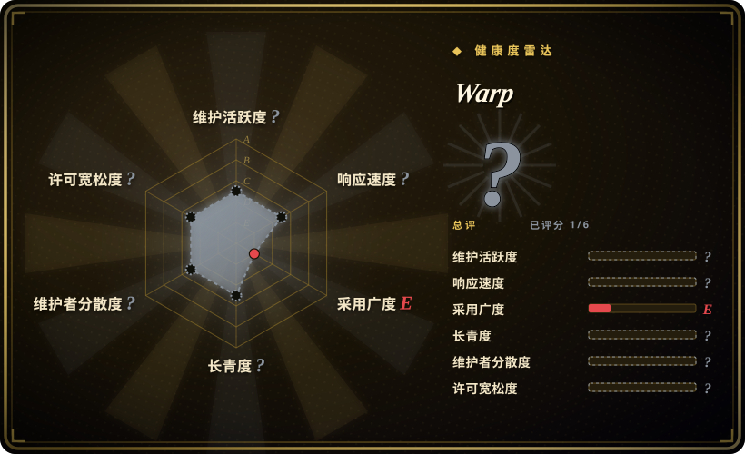

# Warp

一款为 agent 而生的现代终端——**注意：这个 GitHub 仓库仅用于提交 issue，产品本身是专有闭源软件。**

## 何时使用

你是一名开发者，大部分时间泡在终端里，想要一个现代、快速、IDE 般的命令行体验。你选 Warp 而不选 Alacritty，是因为你需要命令块（让你像浏览文档一样浏览输出）、AI 辅助命令建议以及集成编码 agent 等功能——而非仅仅一个朴素的终端。你选它而不选 iTerm2，是因为你想要一个感觉像 2026 年而非 2006 年的终端，在 macOS 和 Linux 上都有 GPU 加速和 AI 原生设计。你选它而不选 Tabby，是因为你想要一个 polished、商业支持、每周更新的产品，而非仅有社区支持的开源项目。你安装 Warp，它用基于 Rust 和 GPU 加速的 shell 取代你的默认终端，支持 bash、zsh 和 fish，内置 AI agent「Oz」可以帮你写命令和调试，或者你也可以在里面运行 Claude Code、Codex、Gemini CLI 等外部编码 agent。

## 何时不用

- 如果你需要完全开源的软件，请用 Alacritty 或 Tabby，而不用 Warp，因为这个 GitHub 仓库只是 issue 跟踪器；Warp 的实际源代码是专有闭源的，仓库上的 AGPL-3.0 许可证仅适用于极少的 issue 跟踪器代码，不覆盖产品。[推断]
- 如果你需要轻量、极简的终端，请用 Alacritty，而不用 Warp，因为 Warp 是一个功能丰富的应用（虽然基于 Rust），带有 AI 集成、云功能和现代 UI——不是 10MB、50ms 启动的终端。
- 你在使用 Windows，请用 Windows Terminal 或 Alacritty，而不用 Warp，因为截至 2026 年中，Warp 主要支持 macOS 和 Linux，Windows 支持有限或不可用。
- 如果你不想要 AI 功能或云连接，请用 Alacritty 或 iTerm2，而不用 Warp，因为 Warp 的价值主张与 AI 辅助和云支持功能（协作、Drive 等）紧密绑定，传统终端不会发起任何网络请求。
- 你需要通过 SSH 连接远程/无头服务器，请用 Tabby 或 Alacritty，而不用 Warp，因为 Warp 的高级功能（块、AI 等）面向本地交互使用设计，在纯 SSH 会话中可能无法正常工作。[推断]
- 你反对专有遥测或云端账户，请用 Alacritty，而不用 Warp，因为 Warp 的某些功能需要登录，且是闭源产品；你无法完全审计它收集了哪些数据。

## 横向对比

| 替代品 | 是否收录 | 我们的评价 | 取舍 |
|---|---|---|---|
| Alacritty | 未收录 | 需要 AI 原生、IDE 般终端体验时选 Warp；需要快速、跨平台、OpenGL 终端模拟器且完全开源时，再选 Alacritty。 | 完全开源且极简，但没有原生 AI 功能、没有命令块、没有内置 shell 智能。 |
| iTerm2 | 未收录 | 需要 AI 原生、跨 macOS 和 Linux 的现代终端时选 Warp；需要最受欢迎的 macOS 终端且深度集成 macOS、没有 AI 中心设计时，再选 iTerm2。 | 仅限 macOS，不是开源软件，但成熟且功能丰富，没有 Warp 那种 AI 中心设计。 |
| Tabby | 未收录 | 需要 polished、商业支持的 AI 终端时选 Warp；需要现代开源终端且带 SSH 客户端和串口支持时，再选 Tabby。 | 开源且跨平台，带一些现代 UI 功能，但不如 Warp 那么原生面向 AI。 |
| [asciimatics](asciimatics.zh.md) | ✅ | 用于构建终端 UI 的 Python TUI 库，不是终端模拟器。 | 这是构建 TUI 的库，不是独立终端应用——不同类别。 |

## 技术栈

- **Rust** —— 核心终端和渲染引擎。
- **WASM** —— 用于某些内部组件和扩展。
- **GPU 加速** —— 现代渲染管线，实现平滑滚动和块。
- **专有代码库** —— 实际源码不开放；GitHub 仓库仅为 issue 跟踪器。

## 依赖

- **操作系统：** macOS 或 Linux（主要平台）。
- **Warp 应用：** 从官方网站或包管理器下载。
- **Shell：** bash、zsh 或 fish。
- **可选：** 如果你想在里面使用外部编码 agent，需要 LLM API 密钥。
- **账户：** 某些功能需要 Warp 账户（有免费层）。

## 运维难度

**低。** Warp 是终端用户桌面应用。下载、安装、使用即可。运维复杂度和任何其他桌面应用一样：保持更新、管理账户/登录需求，并理解它是闭源产品，按 Warp 自己的节奏更新（通常每周四）。无需运行服务器、管理数据库或自托管。

## 健康度与可持续性
- **维护活跃度**：Grade A——最近 13 周中 10 周有提交；最后提交距今 0 天。
- **响应速度**：Grade A——中位首次响应时间 0.0 小时，基于 35 个 qualifying issues/PRs。
- **采用广度**：Grade E。
- **长青度**：Grade A——仓库已创建 1820 天。
- **治理集中度**：无法计算——unknown。
- **许可风险**：Grade D——AGPL-3.0 许可证。
## 存疑（未验证）

- [未验证] 仓库事实，截至 2026-07-01 经 GitHub API：2021-07-08 创建、最后推送 2026-07-01、未归档、约 62.7k star、约 5.1k fork、AGPL-3.0、语言报告为 Rust、owner 类型为 Organization。
- [推断] GitHub 仓库在 README 中明确说明是「仅 issue」；实际产品是专有闭源软件。AGPL-3.0 许可证仅适用于 issue 跟踪器代码。
- [未验证] 平台支持声明（macOS、Linux）和 Windows 限制来自 README 和官网；请为你的操作系统验证当前可用性。
- [未验证] 「每周发布，通常周四」及功能列表（AI agent Oz、命令块、Warp Drive 等）来自 README；实际发布节奏和功能稳定性未经独立验证。
- [推断] 需要 Warp 账户及任何遥测/云数据实践，基于产品的闭源性质和同类工具的常见模式；没有源码访问就无法审计确切的数据处理方式。
- [未验证] 仅 issue 仓库的 star 数可能反映产品兴趣而非代码质量或社区贡献，因为不接受代码贡献。
