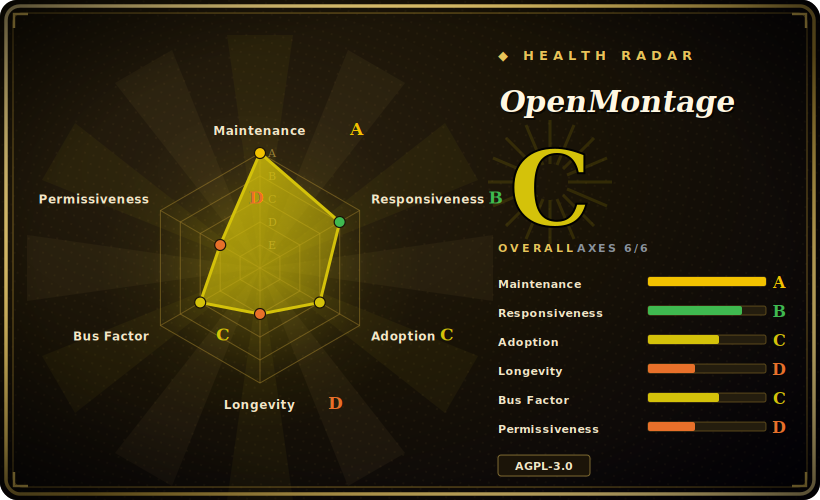

# OpenMontage

World's first open-source, agentic video production system. 12 pipelines, 52 tools, 500+ agent skills. Turn your AI coding assistant into a full video production studio.

## When to use

You're a content creator, educator, or solo developer who needs to produce short-form videos — explainers, social clips, product teasers, documentary montages, or animated stories — but you don't have a video production team or After Effects skills. You do have an AI coding assistant (Claude Code, Cursor, Copilot, Windsurf, or Codex) and a modest budget for API calls. OpenMontage lets you describe the video in plain language — "Make a 60-second animated explainer about neural networks" — and the agent orchestrates the entire production pipeline: it researches your topic with live web search, writes a script, generates or sources visuals (AI images, stock footage, archival clips), narrates with TTS, finds royalty-free music, burns in word-level subtitles, and renders the final video through Remotion or HyperFrames. You stay in control at every creative decision point, with cost estimates and approval gates before the agent spends on APIs.

## When NOT to use

- You need professional film post-production with frame-level manual control — use DaVinci Resolve or Premiere Pro instead. OpenMontage is agent-orchestrated, not a traditional NLE.
- You want a one-click web UI or SaaS without touching code or a coding agent — OpenMontage is a repo-first system that runs inside your AI coding assistant. [未验证]
- The AGPL-3.0 strong copyleft is a deal-breaker for embedding into a closed-source product or service.
- You need a stable, battle-tested toolchain with a multi-year track record — this project is ~3 months old and pre-1.0; APIs, pipelines, and skills may change rapidly. [推断]
- Your primary need is simple image-to-video or text-to-video generation without a full production pipeline (scripting, research, music, subtitles) — a standalone video model API or ComfyUI may be simpler and cheaper.
- Windows is your primary dev environment and you can't tolerate occasional Node.js toolchain quirks (`npx --yes npm install` may be needed as a fallback). [未验证]

## Comparison

| Alternative | In index | Our verdict | Tradeoff |
|---|---|---|---|
| [Open Design](../ai-design-generation/open-design.md) | ✅ | Lighter, local-first HTML→MP4 | Open Design is a desktop studio for quick prototypes; OpenMontage is a full pipeline system with research, scripting, and 12 production pipelines. |
| Remotion | 未收录 | Render engine only, no agent orchestration | OpenMontage embeds Remotion as one of two render backends; use Remotion directly if you only need programmatic React video composition. |
| HeyGen / Runway / Pika | 未收录 | Closed-source SaaS, one-click generation | Faster for a single clip, but no pipeline customization, no agent approval gates, no open-source extensibility, and ongoing subscription costs. |
| [FFmpeg](../media-processing/ffmpeg.md) | ✅ | Universal media CLI | OpenMontage depends on FFmpeg for encoding and post-production; FFmpeg is the right tool when you need low-level media manipulation, not an end-to-end production pipeline. |
| ComfyUI | 未收录 | Node-based image/video gen workflow | More flexible for bespoke diffusion pipelines and local GPU inference, but lacks agentic orchestration, research, scripting, and budget governance. |

## Tech stack

- **Python 3.10+** — tool implementations, provider abstractions, cost tracking, pipeline loading, and checkpoint/state management.
- **Node.js 18+** — Remotion composition engine (React-based programmatic video) and HyperFrames (HTML/CSS/GSAP motion-graphics rendering).
- **FFmpeg** — system binary for encoding, muxing, subtitle burn-in, audio mixing, and color grading.
- **React / Remotion** — default render engine for data-driven explainers, stat reveals, TikTok-style word-level captions, and scene transitions.
- **HTML/CSS/GSAP (HyperFrames)** — alternative render engine for kinetic typography, product promos, launch reels, and rigged SVG character animation.
- **YAML** — pipeline manifests (`pipeline_defs/`) that declare stages, tools, review criteria, and success gates.
- **Markdown** — agent skills and stage director instructions (`skills/`) that teach the agent how to execute each production stage.
- **Pydantic** — configuration model validation and runtime config loading.

## Dependencies

- Python virtual environment with `pip` (installs via `requirements.txt`).
- Node.js runtime with `npm` (installs inside `remotion-composer/` and for HyperFrames via `npx`).
- FFmpeg installed system-wide (macOS: `brew install ffmpeg`; Linux: `sudo apt install ffmpeg`).
- Optional but recommended: Apple Silicon Mac or NVIDIA GPU for local video generation (WAN 2.1, Hunyuan, CogVideo, LTX-Video).
- Optional API keys for cloud providers: FAL (FLUX + video), Pexels/Pixabay/Unsplash (stock), Suno/ElevenLabs (music/voice), OpenAI/xAI/Google (images/TTS).
- An AI coding assistant (Claude Code, Cursor, Copilot, Windsurf, or Codex) — the agent is the orchestrator; there is no standalone GUI or web UI.

## Ops difficulty

**Medium.** Installation is `make setup` (or manual `pip install` + `npm install` + `pip install piper-tts`). You must maintain a dual Python/Node.js runtime and a system FFmpeg binary. The zero-API-key path works for basic narrated explainers with free stock footage, but unlocking full capability (AI-generated video clips, premium TTS, custom music) means managing 5–10 API keys and their budgets. Every production run is a local project folder (`projects/<name>/`) with checkpoints, decision logs, and renders — no hosted service, so you manage disk space and output files yourself. The built-in quality gates and self-review catch many failures before you see them, but understanding which pipeline to choose and which provider to configure requires reading the agent guide first. [推断]

## Health & viability

- **Maintenance**: Very active — daily commits, GitHub Trending recognition, rapid feature shipping since March 2026. The project is clearly in a high-velocity build phase.
- **Governance / bus factor**: Single visible maintainer (`calesthio`) with a solo-dev model ("built nights and weekends"). While 28.8K stars and 3.2K forks suggest a large audience, the contribution distribution is likely heavily skewed toward one author. [推断]
- **Backing & longevity**: ~3 months old (created March 2026) — extremely young on the Lindy scale. A viral star count does not equal proven survival. The project is pre-1.0 and the API surface (pipelines, tools, skill contracts) may shift significantly. [推断]
- **Adoption**: 28.8K stars and 3.2K forks in 3 months is viral-level attention. Actual production usage beyond demos and single videos is unverified — most users may be "trying it out" rather than running it as a regular studio. [未验证]
- **Risk flags**: AGPL-3.0 license — strong copyleft that triggers network/SaaS viral obligations. This is a real adoption constraint for anyone wanting to embed or build a service on top. No relicense history yet (too young). No observed open-core gating or CLA requirements. [推断]

## Caveats (unverified)

- [推断] 28.8K stars in ~3 months may include significant hype-driven traffic; long-term retention and production-grade adoption are unproven.
- [未验证] Windows installation path has known `npm install` quirks requiring `npx --yes npm install` as a fallback; full Windows compatibility is not battle-tested.
- [未验证] Provider pricing and availability (FAL, Suno, ElevenLabs, etc.) can change independently; the built-in cost estimator may drift from actual provider rates.
- [推断] The skill-pack and pipeline contract formats are pre-1.0; custom pipelines or tools you build today may need rewriting on the next breaking update.