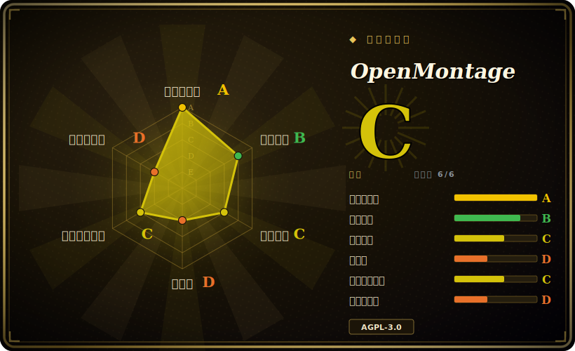

# OpenMontage

世界上第一个开源的 Agentic 视频制作系统。12 条生产管线，52 个工具，500+ Agent 技能。把你的 AI 编程助手变成一间完整的视频制作工作室。

## 何时使用

你是一名内容创作者、教育工作者或独立开发者，需要制作短视频——解说视频、社交切片、产品预告、纪录片蒙太奇或动画故事——但你没有视频制作团队，也不会用 After Effects。你手头有一台 AI 编程助手（Claude Code、Cursor、Copilot、Windsurf 或 Codex），并且愿意为 API 调用支付少量费用。OpenMontage 让你用自然语言描述想要的视频——“做一个 60 秒关于神经网络工作原理的动画解说”——Agent 便会自动编排整条生产管线：先用实时网页搜索研究主题，再撰写脚本，生成或检索视觉素材（AI 图像、库存 footage、档案素材），用 TTS 配音，自动寻找免版税音乐，烧录逐词字幕，最后通过 Remotion 或 HyperFrames 渲染成片。你在每一个创意决策点都保持控制权，Agent 在调用付费 API 之前会先给出成本估算并等待你的批准。 [推断]

## 何时不用

- 你需要专业电影级后期制作和逐帧手动控制——请用 DaVinci Resolve 或 Premiere Pro。OpenMontage 是 Agent 编排的，不是传统 NLE。 [未验证]
- 你想要一键即用的 Web UI 或 SaaS，不想接触代码或编程助手——OpenMontage 是 repo-first 的系统，运行在你的 AI 编程助手内部。 [未验证]
- AGPL-3.0 强 copyleft 对你来说是 deal-breaker，你需要将其嵌入闭源产品或服务中。
- 你需要稳定、经过多年验证的工具链——本项目仅约 3 个月大且 pre-1.0，API、管线、技能契约都可能快速变化。 [推断]
- 你的需求只是简单的图生视频或文生视频，不需要完整的生产管线（脚本、研究、音乐、字幕）——独立视频模型 API 或 ComfyUI 可能更简单、更便宜。 [推断]
- Windows 是你的主力开发环境，且你无法容忍 Node.js 工具链偶尔出现的异常（可能需要 `npx --yes npm install` 作为回退）。 [未验证]

## 横向对比

| 替代品 | 是否收录 | 我们的评价 | 取舍 |
|---|---|---|---|
| [Open Design](../ai-design-generation/open-design.md) | ✅ | 更轻量，local-first HTML→MP4 | Open Design 是桌面 studio，适合快速原型；OpenMontage 是完整管线系统，含研究、脚本和 12 条生产管线。 |
| Remotion | 未收录 | 仅渲染引擎，无 Agent 编排 | OpenMontage 将 Remotion 内嵌为两个渲染后端之一；若只需要程序化 React 视频合成，可直接用 Remotion。 |
| HeyGen / Runway / Pika | 未收录 | 闭源 SaaS，一键生成 | 单片段生成更快，但无管线定制、无 Agent 审批门、无开源扩展性，且需持续订阅费用。 |
| [FFmpeg](../media-processing/ffmpeg.md) | ✅ | 通用媒体处理 CLI | OpenMontage 依赖 FFmpeg 做编码与后期；FFmpeg 适合需要底层媒体操作而非端到端生产管线的场景。 |
| ComfyUI | 未收录 | 节点式图像/视频生成工作流 | 在自定义扩散管线与本地 GPU 推理上更灵活，但缺乏 Agent 编排、研究、脚本撰写和预算治理。 [推断] |

## 技术栈

- **Python 3.10+** — 工具实现、供应商抽象、成本追踪、管线加载、检查点与状态管理。
- **Node.js 18+** — Remotion 合成引擎（基于 React 的程序化视频）和 HyperFrames（HTML/CSS/GSAP 动态图形渲染）。
- **FFmpeg** — 系统二进制，用于编码、封装、字幕烧录、音频混音与调色。
- **React / Remotion** — 默认渲染引擎，用于数据驱动解说、统计揭示、TikTok 风格逐词字幕和场景过渡。
- **HTML/CSS/GSAP（HyperFrames）** — 替代渲染引擎，用于动态排版、产品推广、发布 reel 和绑定 SVG 角色动画。
- **YAML** — 管线清单（`pipeline_defs/`），声明阶段、工具、评审标准与成功门。
- **Markdown** — Agent 技能与阶段导演指令（`skills/`），教 Agent 如何执行每个生产阶段。
- **Pydantic** — 配置模型验证与运行时配置加载。

## 依赖

- 带 `pip` 的 Python 虚拟环境（通过 `requirements.txt` 安装）。
- 带 `npm` 的 Node.js 运行时（在 `remotion-composer/` 内安装，以及 HyperFrames 通过 `npx` 安装）。
- 系统级安装的 FFmpeg（macOS: `brew install ffmpeg`；Linux: `sudo apt install ffmpeg`）。
- 可选但推荐：Apple Silicon Mac 或 NVIDIA GPU，用于本地视频生成（WAN 2.1、Hunyuan、CogVideo、LTX-Video）。
- 可选的云供应商 API key：FAL（FLUX + 视频）、Pexels/Pixabay/Unsplash（库存素材）、Suno/ElevenLabs（音乐/语音）、OpenAI/xAI/Google（图像/TTS）。
- 一个 AI 编程助手（Claude Code、Cursor、Copilot、Windsurf 或 Codex）——Agent 本身就是编排器；没有独立 GUI 或 Web UI。 [推断]

## 运维难度

**中等。** 安装方式是 `make setup`（或手动 `pip install` + `npm install` + `pip install piper-tts`）。你需要同时维护 Python 与 Node.js 双运行时，以及系统 FFmpeg 二进制。零 API key 路径可以运行基础解说视频和免费库存 footage，但解锁完整能力（AI 生成视频片段、高级 TTS、定制音乐）意味着管理 5–10 个 API key 及其预算。每次生产运行都是一个本地项目文件夹（`projects/<name>/`），内含检查点、决策日志和渲染输出——没有托管服务，因此你需要自行管理磁盘空间和输出文件。内置的质量门与自审会在你见到成品前拦截许多失败，但理解该选哪条管线、该配置哪个供应商，需要先阅读 Agent Guide。 [推断]

## 健康度与可持续性

- **维护活跃度**：非常活跃——每日提交、上过 GitHub Trending、自 2026 年 3 月以来快速迭代功能。项目明显处于高速建设期。
- **维护者分散度**：可见的核心维护者只有 `calesthio` 一人，采用个人开发者模式（"nights and weekends" 构建）。虽然 28.8K stars 和 3.2K forks 说明受众庞大，但贡献分布很可能高度集中于单一作者。 [推断]
- **长青度与可持续性**：约 3 个月大（2026 年 3 月创建）——在 Lindy 尺度上极度年轻。病毒式星标不等于已验证的长期生存能力。项目处于 pre-1.0，管线接口、工具契约、技能格式都可能大幅变动。 [推断]
- **采用广度**：3 个月内 28.8K stars 和 3.2K forks 属于病毒级关注度。超出演示和单个视频的实际生产级使用尚未验证——大多数用户可能处于“尝鲜”阶段，而非作为常规工作室运行。 [未验证]
- **风险标志**：AGPL-3.0 许可证——强 copyleft，触发网络/SaaS 级病毒义务。对于希望嵌入或在其上构建服务的人来说，这是真实的采用约束。目前尚无重新授权历史（项目太年轻）。未观察到 open-core 功能限制或 CLA 要求。 [推断]

## 存疑（未验证）

- [推断] 约 3 个月内获得 28.8K stars，可能包含大量 hype 驱动的流量；长期留存率和生产级采用尚未得到验证。
- [未验证] Windows 安装路径存在已知的 `npm install` 异常，需要 `npx --yes npm install` 作为回退；完整的 Windows 兼容性未经充分验证。
- [未验证] 供应商定价与可用性（FAL、Suno、ElevenLabs 等）可能独立变化；内置成本估算器可能与实际供应商价格产生偏差。
- [推断] 技能包与管线契约格式处于 pre-1.0；今天构建的自定义管线或工具可能需要在下一次破坏性更新时重写。