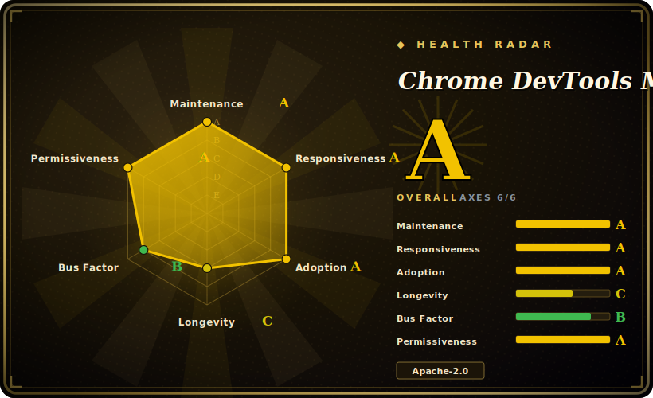

# Chrome DevTools MCP

An MCP server from the Chrome DevTools team that gives a coding agent a real Chrome instance to drive and inspect — built on Puppeteer over the Chrome DevTools Protocol (CDP), exposing 45+ tools spanning input automation, navigation, performance traces, network, console, screenshots, and heap profiling.

## When to use

You're a coding agent (or the engineer wiring one up) tasked with fixing a "the page feels slow and something's leaking memory" bug. Reading the source only gets you so far: you need to actually load the page in Chrome, record a performance trace, see the Core Web Vitals (LCP/INP/CLS), inspect which network requests blocked render, and read console errors with source-mapped stacks — the things a human would open DevTools for. Pure DOM-text automation can't measure any of that.

You add `chrome-devtools-mcp` to your MCP client config (`npx chrome-devtools-mcp@latest`), and now the agent can launch or attach to Chrome, navigate, click and fill forms, take a screenshot, run a Lighthouse audit, record a trace and get back actionable performance insights, and even take a heap snapshot to chase a leak — all through one MCP server that 25+ clients (Claude Code, Cursor, VS Code/Copilot, Gemini CLI, Cline, Windsurf, and more) already speak. Because it rides Puppeteer + CDP against real Chrome, it's a strong fit when your task is **debugging and measuring** a web app, not just clicking through it: front-end performance work, network/console triage, automated reproduction of UI bugs, and verifying a fix in an actual browser.

## When NOT to use

- **You only need to fill forms / click through a UI in natural language.** A full DevTools/CDP server is heavy for that; an in-page DOM agent like [page-agent](page-agent.md) drops into the user's existing browser session with no separate Chrome process or backend.
- **You're not on Chrome.** It officially supports only Google Chrome and Chrome for Testing; other Chromium browsers "may have unexpected behaviour", and Firefox/WebKit are out of scope. For cross-browser automation use Playwright instead.
- **You can't run a real browser.** It needs a local (or remotely-debuggable) Chrome plus Node.js — not viable in a locked-down sandbox, a pure-serverless function, or anywhere you can't launch/attach to Chrome.
- **OS-level / multi-app desktop control.** It drives a browser, not the whole machine. For "operate a full computer/VM" use a computer-use agent or a sandbox like [Cua](cua.md).
- **Untrusted pages with sensitive data.** The README warns it exposes all browser content (cookies, logged-in sessions, page contents) to the MCP client — and to the model. Don't point it at sites holding secrets you wouldn't paste into the agent.
- **You want zero telemetry by default.** Usage statistics are collected by Google unless you pass `--no-usage-statistics`, and performance flows may call the CrUX API unless disabled (`--no-performance-crux`).
- **Maturity.** It's pre-1.x-stable in spirit — v1.x but young, with a large flag/tool surface still moving release-to-release; pin a version for reproducibility.

## Comparison

| Alternative | In index | Tradeoff |
|---|---|---|
| [page-agent](page-agent.md) | ✅ | In-page JS GUI agent (DOM-as-text, no headless browser, no backend); great for NL form/workflow automation but **can't** record traces, inspect network at the CDP level, or take heap snapshots. |
| [Agent Browser](agent-browser.md) | ✅ | Vercel-labs browser-automation for agents; overlapping "drive a browser for an agent" goal — different stack/ergonomics, less of a full DevTools-protocol surface. |
| [Cua](cua.md) | ✅ | Computer-use / sandboxed-VM agent that drives a whole desktop, not just Chrome; broader (any app, pixel UIs) but heavier and not DevTools-grade for web perf/network. |
| Playwright (+ MCP) | 未收录 | Cross-browser (Chromium/Firefox/WebKit), deterministic, code-or-MCP driven, headless-capable; the go-to for portable automation/CI. Chrome DevTools MCP trades breadth for Chrome-native DevTools depth (traces, Lighthouse, heap, CrUX). |
| Puppeteer | 未收录 | The lower-level Chrome/CDP automation library this server is built on; you write the script, no MCP/agent layer or curated performance-insight tools. |
| browser-use | 未收录 | Python, vision-capable autonomous browser agent; more "agent decides what to do" than "give the agent precise DevTools tools", and not DevTools-protocol-grade for perf/network inspection. |

## Tech stack

- **Language:** TypeScript; distributed as an npm package run via `npx chrome-devtools-mcp@latest`.
- **Browser control:** Puppeteer driving Google Chrome over the Chrome DevTools Protocol (CDP).
- **Protocol:** Model Context Protocol (MCP) server — stdio transport into MCP-capable clients.
- **Tool surface (45+):** input automation, navigation, emulation (device/viewport/network/color-scheme), performance tracing + insights, network inspection, debugging (screenshots, console, `evaluate_script`, Lighthouse), memory/heap-snapshot analysis (dominators/retainers/paths), Chrome-extension management, and experimental third-party/WebMCP tool execution.
- **Connection modes:** auto-launch/connect (Chrome 144+), manual WebSocket with custom headers, or remote debugging-port forwarding.

## Dependencies

- **Node.js** (current LTS) + npm.
- **Google Chrome** (current stable or newer) or **Chrome for Testing** — must be installable/launchable, or a Chrome reachable on a remote debugging port.
- **An MCP client** to host it (Claude Code, Cursor, VS Code/Copilot, Gemini CLI, Cline, Windsurf, etc.).
- No database/service backend; state is the browser session it manages.

## Ops difficulty

**Low-to-medium.** The happy path is one JSON block in your MCP client config and `npx chrome-devtools-mcp@latest` pulling the package on first run — no infra to host. Cost rises with: getting a real Chrome available in headless/CI/container environments (the classic "Chrome won't launch in Docker" sandbox/`--no-sandbox` friction), the 30+ config flags and connection modes, and the security/telemetry posture you must consciously set (sandboxing untrusted pages, `--no-usage-statistics`, `--no-performance-crux`). Because each MCP client launches its own server process, there's no shared service to operate — but also no central place to govern access.

## Health & viability

- **Maintenance — active, official.** Last pushed 2026-06, not archived; latest v1.4.0 (2026-06-23). Released under the **ChromeDevTools (Google)** org, so maintenance is institutional rather than hobbyist — the strongest backing signal among the web-automation peers here. `[未验证]`
- **Governance / backing — Google / Chrome DevTools team.** **Organization**-owned (`ChromeDevTools/chrome-devtools-mcp`), ~44.5k stars [未验证]. Bus factor is low (a team inside Google, not one maintainer) — but note Google's mixed track record of sunsetting side projects, so "official" reduces, not eliminates, abandonment risk. `[推断]`
- **Age & Lindy — young (created 2025-09, ~9 months as of 2026-06).** Too new for a Lindy prior on its own; v1.x but the flag/tool surface still moves release-to-release, so pin a version for reproducibility. The Lindy strength comes less from this repo's age than from the durability of its foundation (Chrome + CDP + Puppeteer).
- **Risk flags — telemetry-on-by-default + browser-content exposure.** Apache-2.0, no relicense observed. Google collects usage stats unless `--no-usage-statistics`; performance flows may call the CrUX API unless `--no-performance-crux`; the README warns it exposes all browser content (cookies/sessions/page contents) to the client and model — set the security/telemetry posture consciously. `[未验证]`

## Caveats (unverified)

- [未验证] Star count ~44.5k as of 2026-06-26 (gh snapshot); GitHub stars are unreliable and date-sensitive — treat as indicative only.
- [未验证] "45+ tools", "25+ supported clients", and the per-category tool counts come from the project's own README/tool-reference and shift release-to-release; verify against the current docs before relying on a specific tool.
- [未验证] Exact runtime version floors (Node LTS, "Chrome current stable or newer", Chrome 144+ for auto-connect) are as stated in the README on 2026-06-26 and may change.
- [推断] Positioning vs Agent Browser / Cua / browser-use is inferred from each project's framing, not a head-to-head benchmark; the relative tradeoffs (DevTools depth vs breadth) are judgment, not measured.
- [推断] The security warning ("exposes all browser content") is the README's own caution; the concrete blast radius depends on which client and model you connect and what session Chrome holds.
