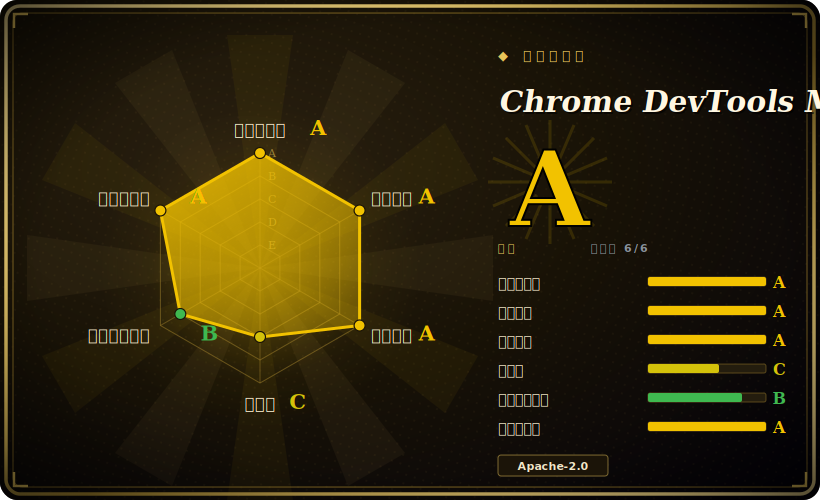

# Chrome DevTools MCP

来自 Chrome DevTools 团队的 MCP 服务器：把一个真实的 Chrome 实例交给 coding agent 去驱动和检查。底层基于 Puppeteer + Chrome DevTools Protocol(CDP)，对外暴露 45+ 个工具，覆盖输入自动化、页面导航、性能 trace、网络、控制台、截图与堆内存分析。

## 何时使用

你是一个 coding agent（或正在给它接线的工程师），接到的任务是排查“页面感觉很慢，还像是有内存泄漏”。光读源码到不了底：你得真把页面在 Chrome 里加载起来，录一段性能 trace，看 Core Web Vitals(LCP/INP/CLS)，查清是哪些网络请求阻塞了渲染，再读带 source map 的控制台报错——这些都是人会打开 DevTools 去做的事。纯 DOM 文本自动化测不出其中任何一项。

你把 `chrome-devtools-mcp` 加进 MCP 客户端配置（`npx chrome-devtools-mcp@latest`），于是 agent 就能启动或附着到 Chrome、导航、点击和填表、截图、跑 Lighthouse 审计、录 trace 拿到可执行的性能洞察，甚至抓堆快照去追泄漏——全部通过这一个 MCP 服务器完成，而 25+ 个客户端（Claude Code、Cursor、VS Code/Copilot、Gemini CLI、Cline、Windsurf 等）已经能和它对话。因为它跑在 Puppeteer + CDP 之上、对接真实 Chrome，所以当你的任务是**调试和度量**一个 Web 应用、而不只是点点点时，它特别合适：前端性能工作、网络/控制台分诊、自动复现 UI bug，以及在真实浏览器里验证修复。

## 何时不用

- **你只是想用自然语言填表/点 UI。** 一整套 DevTools/CDP 服务器干这个太重；像 [page-agent](page-agent.zh.md) 这样的页内 DOM agent 直接嵌进用户已登录的浏览器会话，不需要单独的 Chrome 进程，也不需要后端。
- **你不在 Chrome 上。** 它官方只支持 Google Chrome 和 Chrome for Testing，其他 Chromium 浏览器“可能出现非预期行为”,Firefox/WebKit 不在范围内。要跨浏览器自动化请改用 Playwright。
- **你跑不起真实浏览器。** 它需要一个本地（或可远程调试的）Chrome 外加 Node.js——在受限沙箱、纯 serverless 函数，或任何无法启动/附着 Chrome 的地方都不可行。
- **要做 OS 级 / 多应用的桌面控制。** 它驱动的是浏览器，不是整台机器。要“操作整台电脑/VM”请用 computer-use agent 或像 [Cua](cua.zh.md) 这样的沙箱。
- **不可信页面 + 敏感数据。** README 警告它会把全部浏览器内容（cookie、登录会话、页面内容）暴露给 MCP 客户端——以及模型。别让它指向那些装着你不愿粘进 agent 的机密的站点。
- **你想要默认零遥测。** 除非传 `--no-usage-statistics`，否则 Google 会默认收集使用统计；性能流程还可能调用 CrUX API，除非用 `--no-performance-crux` 关掉。
- **成熟度。** 它精神上还在 1.x-稳定之前——版本是 1.x 但仍年轻，庞大的 flag/工具面随版本变动；要可复现请锁版本。

## 横向对比

| 替代品 | 是否收录 | 我们的评价 | 取舍 |
|---|---|---|---|
| [page-agent](page-agent.zh.md) | ✅ | 当前页用于它的主场景；如果更看重“页内 JS GUI agent（DOM 即文本，无 headless 浏览器、无后端）”，再选 page-agent。 | 页内 JS GUI agent（DOM 即文本，无 headless 浏览器、无后端）；做 NL 表单/流程自动化很强，但**无法**录 trace、在 CDP 层检查网络、或抓堆快照。 |
| [Agent Browser](agent-browser.zh.md) | ✅ | 当前页用于它的主场景；如果更看重“Vercel-labs 的面向 agent 的浏览器自动化”，再选 Agent Browser。 | Vercel-labs 的面向 agent 的浏览器自动化；“为 agent 驱动浏览器”这一目标重叠——栈/手感不同，DevTools 协议面没这么全。 |
| [Cua](cua.zh.md) | ✅ | 当前页用于它的主场景；如果更看重“computer-use / 沙箱 VM agent，驱动整个桌面而非仅 Chrome”，再选 Cua。 | computer-use / 沙箱 VM agent，驱动整个桌面而非仅 Chrome；更广（任意应用、像素 UI）但更重，且在 Web 性能/网络上不是 DevTools 级。 |
| Playwright(+ MCP) | 未收录 | 当前页用于它的主场景；如果更看重“跨浏览器（Chromium/Firefox/WebKit）、确定性、可代码或 MCP 驱动、支持 headless”，再选 Playwright(+ MCP)。 | 跨浏览器（Chromium/Firefox/WebKit）、确定性、可代码或 MCP 驱动、支持 headless；做可移植自动化/CI 的首选。Chrome DevTools MCP 是用广度换 Chrome 原生 DevTools 深度（trace、Lighthouse、堆、CrUX）。 |
| Puppeteer | 未收录 | 当前页用于它的主场景；如果更看重“这台服务器所基于的更底层 Chrome/CDP 自动化库”，再选 Puppeteer。 | 这台服务器所基于的更底层 Chrome/CDP 自动化库；脚本你自己写，没有 MCP/agent 层，也没有打磨过的性能洞察工具。 |
| browser-use | 未收录 | 当前页用于它的主场景；如果更看重“Python、具视觉能力的自主浏览器 agent”，再选 browser-use。 | Python、具视觉能力的自主浏览器 agent；更偏“agent 自己决定做什么”而非“给 agent 精确的 DevTools 工具”，且在性能/网络检查上不是 DevTools 协议级。 |

## 技术栈

- **语言：** TypeScript；以 npm 包分发，通过 `npx chrome-devtools-mcp@latest` 运行。
- **浏览器控制：** Puppeteer 经 Chrome DevTools Protocol（CDP）驱动 Google Chrome。
- **协议：** Model Context Protocol（MCP）服务器——以 stdio 传输接入支持 MCP 的客户端。
- **工具面（45+）:** 输入自动化、导航、模拟（设备/视口/网络/配色）、性能 trace + 洞察、网络检查、调试（截图、控制台、`evaluate_script`、Lighthouse）、内存/堆快照分析（dominators/retainers/paths）、Chrome 扩展管理，以及实验性的 third-party/WebMCP 工具执行。
- **连接方式：** 自动启动/连接（Chrome 144+）、带自定义 header 的手动 WebSocket、或远程调试端口转发。

## 依赖

- **Node.js**（当前 LTS）+ npm。
- **Google Chrome**（当前 stable 或更新）或 **Chrome for Testing**——必须可安装/启动，或有一个能在远程调试端口上访问的 Chrome。
- **一个 MCP 客户端**来托管它（Claude Code、Cursor、VS Code/Copilot、Gemini CLI、Cline、Windsurf 等）。
- 无数据库/服务后端；状态就是它管理的浏览器会话。

## 运维难度

**低到中。** 顺利路径是在 MCP 客户端配置里写一段 JSON,`npx chrome-devtools-mcp@latest` 首次运行时拉包——没有要托管的基础设施。成本上升来自：在 headless/CI/容器环境里搞到一个可用的真实 Chrome（经典的“Chrome 在 Docker 里启不起来”沙箱/`--no-sandbox` 摩擦）、30+ 个配置 flag 与多种连接方式，以及你必须有意识设定的安全/遥测姿态（给不可信页面加沙箱、`--no-usage-statistics`、`--no-performance-crux`）。因为每个 MCP 客户端各自启动一个服务器进程，所以没有共享服务要运维——但也没有集中治理访问的地方。

## 健康度与可持续性

- **维护——活跃、官方。** 最后一次 push 在 2026-06，未归档；最新 v1.4.0（2026-06-23）。发布在 **ChromeDevTools（Google）** 组织名下，所以维护是机构级而非业余——是本处 web-automation 同类里最强的背书信号。`[未验证]`
- **治理 / 背书——Google / Chrome DevTools 团队。** 仓库为 **Organization** 所有（`ChromeDevTools/chrome-devtools-mcp`），约 44.5k star[未验证]。bus factor 很低（是 Google 内部一个团队，而非单个维护者）——但要注意 Google 砍掉副项目的履历参差，所以“官方”是降低而非消除弃坑风险。`[推断]`
- **年龄与 Lindy——年轻（创建于 2025-09，截至 2026-06 约 9 个月）。** 单看自身太新，拿不到 Lindy 先验；版本是 1.x 但 flag/工具面仍随版本变动，要可复现请 pin 版本。它的 Lindy 强度，更多来自其底座（Chrome + CDP + Puppeteer）的耐久性，而非这个仓库自身的年龄。
- **风险标志——默认开启遥测 + 浏览器内容暴露。** Apache-2.0，未观察到 relicense。除非传 `--no-usage-statistics`，否则 Google 会收集使用统计；性能流程可能调用 CrUX API，除非传 `--no-performance-crux`；README 警告它会把全部浏览器内容（cookie/会话/页面内容）暴露给客户端和模型——请有意识地设定安全/遥测姿态。`[未验证]`

## 存疑（未验证）

- [未验证] Star 数约 44.5k（2026-06-26 的 gh 快照）;GitHub star 不可靠且对日期敏感——仅作参考。
- [未验证] “45+ 工具”“25+ 支持的客户端”以及各类别工具计数来自项目自己的 README/tool-reference，随版本变动；依赖某个具体工具前请对照当前文档核对。
- [未验证] 准确的运行时版本下限（Node LTS、“Chrome 当前 stable 或更新”、自动连接需 Chrome 144+）是 2026-06-26 README 所述，可能变化。
- [推断] 对 Agent Browser / Cua / browser-use 的定位是从各项目自己的表述推断，并非正面 benchmark；相对取舍（DevTools 深度 vs 广度）是判断而非实测。
- [推断] 安全警告（“暴露全部浏览器内容”）是 README 自己的提醒；实际影响半径取决于你接的是哪个客户端和模型，以及 Chrome 持有的会话。
