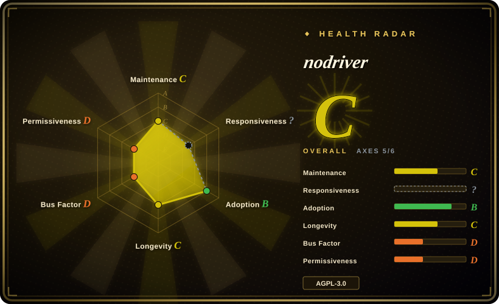

# nodriver

An asynchronous Python library that controls Chromium browsers directly through the Chrome DevTools Protocol, without Selenium, WebDriver, or a chromedriver binary.

## When to use

You're a Python developer prototyping browser automation or authorized web data collection against a Chromium-based site, and WebDriver startup, driver-version management, or Selenium's abstraction is getting in the way. You want an async API that launches or attaches to Chrome, manages temporary profiles and cookies, queries elements by text, CSS, or XPath, traverses frames, listens to CDP events, and still exposes the full generated CDP surface when the convenience methods are not enough.

You choose nodriver over Playwright when direct Chromium/CDP control and Python-first async experimentation matter more than cross-browser coverage, a full test runner, traces, and a large vendor-backed maintenance team. Its anti-detection defaults are a best-effort property, not an access authorization or a stable bypass contract.

## When NOT to use

- **You need Chromium, Firefox, and WebKit from one API.** Use Playwright; nodriver supports Chromium-family browsers rather than a cross-browser matrix.
- **You already depend on WebDriver, Selenium Grid, or multi-language clients.** Use Selenium; migrating to nodriver replaces the automation model rather than just the driver binary.
- **You need a mature end-to-end test framework with assertions, retries, traces, fixtures, and CI reporting.** Use Playwright; nodriver is a browser-control library, not a complete testing product.
- **Your application stack is Node.js and Puppeteer plugins are already established.** Use Puppeteer or puppeteer-extra; nodriver's primary value is its Python async interface.
- **You need to solve CAPTCHAs rather than automate permitted browser interactions.** Use provider test keys for CI or Buster for human accessibility assistance; nodriver's `cf_verify()` helper is not a general CAPTCHA solver and has no independently verified success level.
- **AGPL-3.0 is incompatible with your distribution or network-use model.** Use Apache-2.0 Playwright, Puppeteer, or Selenium after confirming their browser and API tradeoffs.

## Comparison

| Alternative | In index | Our verdict | Tradeoff |
|---|---|---|---|
| [Playwright](playwright.md) | ✅ | Choose Playwright for cross-browser testing, fixtures, traces, and team-scale CI; choose nodriver for lightweight Python control of Chromium through direct CDP. | Playwright is broader and better governed, while nodriver exposes a smaller, more anti-detection-oriented abstraction. |
| [Selenium](selenium.md) | ✅ | Choose Selenium when WebDriver standards, Grid, language diversity, and legacy suite compatibility matter more than direct CDP control. | Selenium has a much larger ecosystem but carries driver and protocol abstractions that nodriver deliberately removes. |
| [Puppeteer](puppeteer.md) | ✅ | Choose Puppeteer for a Node.js and Chrome-first codebase; choose nodriver when Python async ergonomics are the deciding factor. | Both expose Chromium automation, but their language ecosystems and helper surfaces differ. |
| undetected-chromedriver | not indexed | Choose undetected-chromedriver only when an existing Selenium codebase cannot migrate; choose nodriver for the maintainer's newer direct-CDP design. | The predecessor preserves Selenium compatibility, while nodriver removes WebDriver and requires API migration. |
| SeleniumBase | not indexed | Choose SeleniumBase when you need a batteries-included Python testing framework with assertions and several browser modes; choose nodriver for a smaller low-level async library. | SeleniumBase adds test-runner structure and more dependencies; nodriver gives closer CDP access with less framework. |

## Tech stack

- **Runtime:** Python `>=3.9` with an asynchronous API built on `asyncio` and WebSocket CDP connections.
- **Protocol layer:** generated Python bindings for Chrome DevTools Protocol domains, methods, events, and types.
- **Core abstractions:** browser, tab, connection, element, profile, cookie, network, and event-handler helpers.
- **Documentation:** Sphinx sources and generated HTML/Markdown API documentation committed to the repository.
- **Packaging:** PEP 517 setuptools build with typed package markers and a PyPI package named `nodriver`.

## Dependencies

- Python `>=3.9` and the Python packages `mss`, `websockets>=14`, and `deprecated`.
- Chrome, Chromium, Edge, Brave, or another compatible Chromium browser installed on the host.
- A display server for headed Linux execution; Xvfb is recommended on machines without a display, while headless mode is also available.
- `opencv-python` is an extra undeclared dependency for the `tab.cf_verify()` convenience helper.

## Ops difficulty

**Low for a local script, medium for sustained automation.** Installation is a pip package plus a browser, and nodriver handles temporary profiles by default. Long-running or fleet use still needs browser-version pinning, profile and cookie policy, process cleanup, display or headless infrastructure, concurrency limits, proxy and network controls, target authorization, and regression checks after browser or site changes. Direct CDP reduces one compatibility layer but does not make browser automation stable by itself.

## Health & viability

- **Maintenance (2026-07):** the repository is not archived and received several bug-correction commits in 2026-05. The package manifest reports v0.50.3, but the project publishes no GitHub releases.
- **Governance:** the repository is User-owned and contributions are strongly concentrated in `ultrafunkamsterdam`; two other visible contributors have only a few commits each.
- **Age and Lindy:** created in 2024 and active about two years later, nodriver has an early positive signal but remains classified as Alpha and lacks a long compatibility history.
- **Adoption:** roughly 4.5k stars and its position as the stated successor to undetected-chromedriver show interest, not verified production stability or anti-detection performance.
- **Risk flags:** AGPL-3.0, single-maintainer governance, no active test workflow found, no tagged release history, and an adversarial anti-bot domain where claims decay quickly.

## Caveats (unverified)

- [未验证] Anti-detection, WAF resistance, performance gains, and CAPTCHA-checkbox behavior were not independently benchmarked, so no stable outcome should be assumed.
- [未验证] The repository's GitHub workflow deploys generated documentation; the available `tox.ini` has test, lint, and package-check commands commented out, so no active automated test gate was confirmed.
- [未验证] Compatibility with each Chrome, Chromium, Edge, and Brave version must be tested against the exact browser build used in deployment.
- [未验证] The README mentions `opencv-python` for `cf_verify()`, but it is not listed in the package's declared dependencies.
- [推断] Direct CDP can reduce WebDriver-specific fingerprints, but site behavior, IP reputation, browser configuration, and traffic patterns remain independent detection signals.
- [推断] Examples involving account creation or challenge interaction do not establish permission to automate any third-party site.
