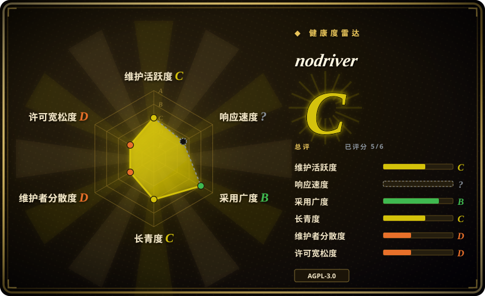

# nodriver

一个通过 Chrome DevTools Protocol 直接控制 Chromium 浏览器的异步 Python 库，不依赖 Selenium、WebDriver 或 chromedriver 二进制。

## 何时使用

你是 Python 开发者，正在为 Chromium 站点快速搭建浏览器自动化或已授权的 Web 数据采集。WebDriver 启动、driver 版本管理或 Selenium 抽象已经妨碍开发。你想要一套 async API，用来启动或连接 Chrome、管理临时 profile 和 cookie、按文本、CSS 或 XPath 查元素、遍历 frame、监听 CDP event；便捷方法不够时，还能直接使用完整生成的 CDP 接口。

当直接控制 Chromium/CDP 和 Python-first 的异步试验，比跨浏览器覆盖、完整 test runner、trace 和大型厂商维护团队更重要时，选 nodriver 而不是 Playwright。它的反检测默认值只是尽力而为，不代表访问授权，也不是稳定的绕过契约。

## 何时不用

- **你需要一套 API 同时覆盖 Chromium、Firefox 和 WebKit。** 用 Playwright；nodriver 面向 Chromium 系浏览器，不提供跨浏览器矩阵。
- **你已经依赖 WebDriver、Selenium Grid 或多语言客户端。** 用 Selenium；迁移到 nodriver 是替换自动化模型，不只是换 driver 二进制。
- **你需要带断言、重试、trace、fixture 和 CI 报告的成熟端到端测试框架。** 用 Playwright；nodriver 是浏览器控制库，不是完整测试产品。
- **应用技术栈是 Node.js，并且已经使用 Puppeteer plugin。** 用 Puppeteer 或 puppeteer-extra；nodriver 的主要价值是 Python async 接口。
- **你需要的是解验证码，而不是执行获准的浏览器交互。** CI 用提供方测试密钥，真人无障碍辅助用 Buster；nodriver 的 `cf_verify()` helper 不是通用验证码 solver，也不保证成功。
- **AGPL-3.0 与你的分发或网络使用模式冲突。** 在确认浏览器与 API 取舍后，改用 Apache-2.0 的 Playwright、Puppeteer 或 Selenium。

## 横向对比

| 替代品 | 是否收录 | 我们的评价 | 取舍 |
|---|---|---|---|
| [Playwright](playwright.zh.md) | 已收录 | 需要跨浏览器测试、fixture、trace 和团队级 CI 时选 Playwright；需要 Python 通过直接 CDP 轻量控制 Chromium 时，选 nodriver。 | Playwright 更全面、治理更强；nodriver 的抽象更小，也更偏反检测场景。 |
| [Selenium](selenium.zh.md) | 已收录 | WebDriver 标准、Grid、多语言和旧测试套件兼容，比直接 CDP 控制更重要时，选 Selenium。 | Selenium 生态大得多，但保留了 nodriver 刻意移除的 driver 与协议抽象层。 |
| [Puppeteer](puppeteer.zh.md) | 已收录 | Node.js 加 Chrome-first 的代码库选 Puppeteer；Python async 易用性是决定因素时，选 nodriver。 | 两者都能自动化 Chromium，但语言生态和 helper surface 不同。 |
| undetected-chromedriver | 未收录 | 只有既有 Selenium 代码无法迁移时，才选 undetected-chromedriver；要使用维护者更新的直接 CDP 设计，选 nodriver。 | 前代项目保留 Selenium 兼容性；nodriver 移除 WebDriver，因此必须迁移 API。 |
| SeleniumBase | 未收录 | 需要带断言和多种浏览器模式的完整 Python 测试框架时，选 SeleniumBase；需要更小、更底层的异步库时，选 nodriver。 | SeleniumBase 增加 test runner 结构和依赖；nodriver 用更少框架换取更直接的 CDP 访问。 |

## 技术栈

- **运行时：** Python `>=3.9`，基于 `asyncio` 和 WebSocket CDP 连接提供异步 API。
- **协议层：** 为 Chrome DevTools Protocol domain、method、event 和 type 生成的 Python binding。
- **核心抽象：** browser、tab、connection、element、profile、cookie、network 和 event-handler helper。
- **文档：** Sphinx 源文件，以及提交在仓库中的 HTML、Markdown API 文档。
- **打包：** 基于 PEP 517 setuptools，包含 typed package marker，PyPI 包名为 `nodriver`。

## 依赖

- Python `>=3.9`，以及 `mss`、`websockets>=14`、`deprecated` 三个 Python 包。
- 主机安装 Chrome、Chromium、Edge、Brave 或其他兼容 Chromium 浏览器。
- Linux 有头运行需要 display server；无显示机器推荐 Xvfb，也可以使用 headless mode。
- `tab.cf_verify()` 便捷 helper 还需要未声明在 package dependency 中的 `opencv-python`。

## 运维难度

**本地脚本低，持续自动化中等。** 安装只需要 pip 包和浏览器，nodriver 默认会处理临时 profile。长时间运行或多机器部署仍要管理浏览器版本、profile 和 cookie 策略、进程清理、显示环境或 headless 基础设施、并发限制、proxy 与网络控制、目标授权，以及浏览器或站点变化后的回归检查。直接 CDP 少了一层兼容抽象，但不会让浏览器自动化天然稳定。

## 健康度与可持续性

- **维护情况（2026-07）：** 仓库未归档，2026-05 收到多次 bug fix。package manifest 报告 v0.50.3，但项目没有 GitHub release。
- **治理：** 仓库属于个人账号，贡献高度集中在 `ultrafunkamsterdam`；另外两个可见贡献者都只有少量 commit。
- **年龄与 Lindy：** 项目创建于 2024 年，约两年后仍活跃，形成早期正向信号；但它仍标记为 Alpha，也缺少长期兼容记录。
- **采用信号：** 约 4.5k star，并被声明为 undetected-chromedriver 的继任者，说明它有人关注；这不能证明生产稳定性或反检测效果。
- **风险标记：** AGPL-3.0、单维护者治理、未发现活跃测试 workflow、无 tag release 历史，以及反 bot 对抗环境会让能力描述快速过期。

## 存疑（未验证）

- [未验证] 没有独立基准验证反检测、WAF 抵抗、性能提升和验证码 checkbox 行为，项目也不保证这些效果。
- [未验证] 仓库 GitHub workflow 只部署生成文档；现有 `tox.ini` 中测试、lint 和 package check command 都被注释，因此未确认活跃自动测试 gate。
- [未验证] 每个 Chrome、Chromium、Edge 和 Brave 版本的兼容性，都要针对部署时使用的确切浏览器 build 验证。
- [未验证] README 说明 `cf_verify()` 需要 `opencv-python`，但 package 声明依赖中没有它。
- [推断] 直接 CDP 可能减少 WebDriver 特有指纹，但站点行为、IP 信誉、浏览器配置和流量模式仍是独立检测信号。
- [推断] 仓库中的账号创建或挑战交互示例，不代表获得任何第三方站点的自动化许可。
