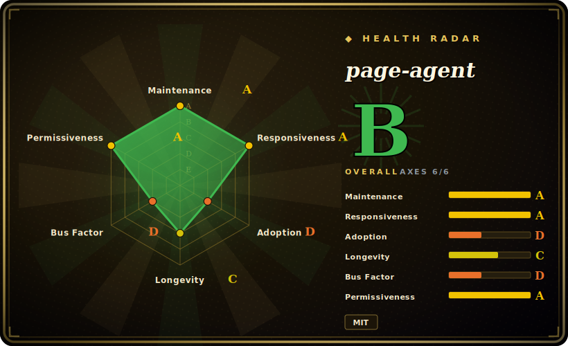

# page-agent

A JavaScript **in-page GUI agent** from Alibaba: control a web interface with natural-language commands by reading and manipulating the DOM directly inside the user's existing browser session — no screenshots, no headless browser, no backend rewrite.

## When to use

You're a frontend engineer maintaining a sprawling internal order-management ERP at a logistics company. Warehouse staff hate it: creating a single shipment means clicking through five tabs, filling a dozen fields, and remembering which dropdown comes first — and your team gets a steady trickle of "where do I click?" tickets. Your manager wants an assistant where someone can just type "create a shipment for order 88231 to the Shenzhen depot" and have the form filled and submitted, but the backend is a legacy monolith nobody wants to touch, and rebuilding the UI is off the table.

You drop in **page-agent** — a few lines of JavaScript via npm or CDN, no backend changes. It runs inside the same page the warehouse worker is already logged into, so it reuses their session and operates the real UI: reading the DOM as text, filling the fields, and clicking through the multi-step flow exactly as a person would. Because it works from the visible page rather than hardcoded selectors, an instruction like "click the submit-order button" is meant to keep working after your team refactors the markup. You point it at your own OpenAI-compatible model (it's LLM-agnostic), and the same snippet doubles as a natural-language / voice accessibility layer over the app — a fit for in-product copilots and complex form/workflow automation.

## When NOT to use

- **No vision / multimodal** — it reads the DOM as text only. Canvas/WebGL/image-heavy UIs, pixel-precise interactions, or anything not expressed in the DOM won't work. `[推断]` shadow DOM and cross-origin iframes are likely weak spots.
- **Not server-side automation** — it lives in the browser. For headless/batch crawling, scraping, or CI automation use Playwright or browser-use instead.
- **Not for high concurrency** — client-side and bound by browser limits; it is not a fleet-of-agents backend.
- **No closed-loop visual verification** — it cannot "see" whether an action visually succeeded; verification must come from the DOM.
- **External-LLM dependency & data egress** — you bring your own LLM, so quality/cost/latency are inherited, and page DOM text is sent to that model — a privacy/compliance review is warranted for sensitive apps.
- **Maturity** — active and at v1.x, but long-term API stability and real-world coverage across arbitrary sites are unproven; the "survives HTML changes" robustness is the project's own claim, not independently benchmarked.

## Comparison

| Alternative | In index | Tradeoff |
|---|---|---|
| browser-use | 未收录 | Python, server-side, vision-capable (screenshots) browser agent — heavier infra (a real/headless browser), but works beyond DOM text and off the client; page-agent cites it as inspiration. |
| Playwright / Puppeteer | 未收录 | Lower-level, code-driven, headless-capable automation — deterministic and powerful, but you write selectors/scripts (not natural language), and it breaks when the DOM changes. |
| Selenium | 未收录 | Mature, ubiquitous cross-browser automation — but DIY, verbose, selector-based, no NL layer. |
| UiPath / Automation Anywhere (RPA) | 未收录 | Enterprise desktop+web RPA with governance — but proprietary, costly, vendor lock-in, heavyweight vs a JS snippet. |
| Computer-use agents (Anthropic computer use / OpenAI Operator) | 未收录 | Vision-based agents that drive a real screen/browser — handle any pixel UI, but slower, costlier, and need a controlled browser/VM, not an in-page snippet. |

## Tech stack

- TypeScript / browser JavaScript — runs in-page; no Node.js / Python / headless browser required
- LLM-agnostic — bring your own model via an OpenAI-compatible API (examples: Qwen / Dashscope)
- Optional Chrome extension — multi-tab / cross-page tasks
- Optional MCP server — external control / orchestration
- Distribution — npm package + CDN (jsDelivr, npmmirror)

## Dependencies

- A modern **browser** (it runs client-side, inside the page)
- An **LLM endpoint you provide** (OpenAI-compatible API + key)
- **Optional** — the Chrome extension (multi-tab); an MCP server (external orchestration)

## Ops difficulty

**Low.** Drop-in browser library (npm/CDN, a few lines), no backend, no headless browser, no separate infra to operate. The real operational cost is the **BYO LLM endpoint** — API-key management, per-call cost and latency — plus the **data-governance** question of sending page DOM text to that model. `[推断]` token cost scales with DOM size, so large/complex pages can get expensive per action.

## Health & viability

- **Maintenance (2026-06)** — last pushed 2026-06, not archived; ~33 releases through v1.10.0 and active commit flow point to a maintained project, not a coasting one. `[推断]`
- **Governance & backing** — an Alibaba-owned (`Organization`) repo, so it's **vendor-backed** rather than a single hobbyist: that's a bus-factor cushion, but the roadmap follows Alibaba's interest in it, and a big vendor can deprioritize a side project. `[推断]`
- **Age & Lindy** — created ~2025-09, so ~1 year old (2026-06): **young and unproven** on the Lindy axis. Vendor backing offsets some of the abandonment risk, but it has no long track record and the "survives HTML changes" robustness claim is unbenchmarked. `[推断]`
- **Risk flags** — MIT-licensed (no relicense/open-core flag seen). The structural risk is **external-LLM dependency + DOM-text egress**, not licensing — treat sensitive-app use as a compliance question. `[未验证]`

## Caveats (unverified)

- **Stars** — ~19.9k from a single snapshot (~2026-06-15), not cross-checked against the API. `[未验证]`
- **Substitute list** — browser-use as the cited "foundation", plus RPA and computer-use agents, is partly inferred from the repo page + secondary articles, not all confirmed. `[未验证]`
- **Positioning claims** — "survives HTML structure changes" and "no backend needed" are the project's own framing; real-world robustness across arbitrary sites is not independently verified. `[未验证]`
- **Qwen/Dashscope** — whether these are merely examples vs recommended defaults is inferred. `[推断]`
