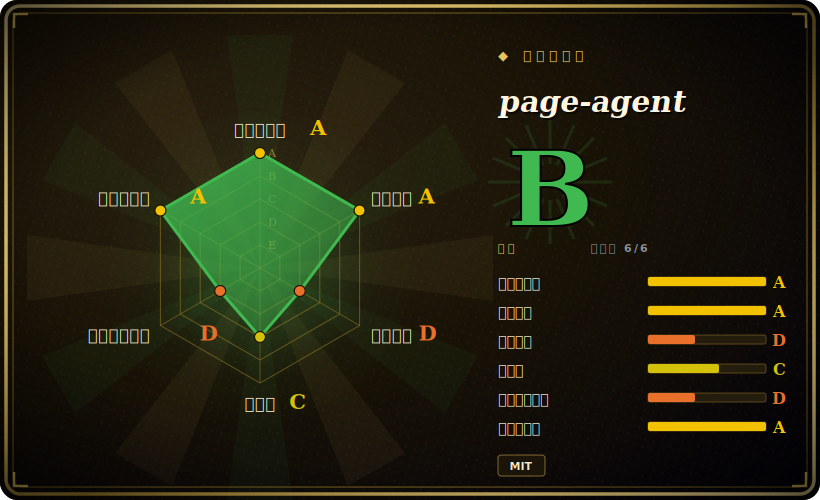

# page-agent

page-agent 是阿里开源的「页内 GUI agent」JS 库：把 AI agent 直接塞进网页，用自然语言命令读取并操作 DOM，复用浏览器已有登录态，无需后端改造、无需 headless 浏览器或截图。

## 何时使用

你是一家物流公司里维护那套庞大内部订单管理 ERP 的前端工程师。仓库同事很讨厌它：新建一张运单要点过五个标签页、填十几个字段，还得记住哪个下拉框要先选——于是你们团队隔三岔五就收到「这个该点哪里」的工单。你的主管想要一个助手，让人直接打一句「给订单 88231 建一张发往深圳仓的运单」，就把表单填好并提交；可后端是没人敢碰的祖传单体应用，重做 UI 也不在选项里。

你引入了 **page-agent**——通过 npm 或 CDN 加几行 JavaScript，后端零改动。它就跑在仓库同事已经登录的那个页面里，复用他们的会话、操作真实 UI：把 DOM 当文本读取、填好字段、像人一样点击走完多步流程。因为它是从可见页面出发、而不是依赖写死的选择器，所以像「点击提交订单按钮」这样的指令意图是在你们团队重构标记后依然有效。你把它接到自己的 OpenAI 兼容模型上（它 LLM 无关），同一段片段还顺带成了这个应用之上的一层自然语言 / 语音无障碍能力——很适合做产品内置 copilot 和复杂表单/工作流自动化。

## 何时不用

- **没有视觉 / 多模态** —— 它只把 DOM 当作文本读取。canvas/WebGL/图像密集型 UI、像素级精确交互，或任何不在 DOM 里表达的内容都无法工作。`[推断]` shadow DOM 和跨域 iframe 很可能是薄弱环节。
- **不是服务端自动化** —— 它活在浏览器里。headless/批量爬取、抓取或 CI 自动化请改用 Playwright 或 browser-use。
- **不适合高并发** —— 客户端运行，受浏览器限制；它不是「一群 agent」式的后端。
- **没有闭环视觉验证** —— 它无法「看到」某个操作在视觉上是否成功；验证必须来自 DOM。
- **外部 LLM 依赖与数据外发** —— 你自带 LLM，所以质量/成本/延迟都继承自该模型，并且页面 DOM 文本会被发送给该模型——对敏感应用来说有必要做一次隐私/合规评审。
- **成熟度** —— 活跃且处于 v1.x，但其长期 API 稳定性以及在各类网站上的真实覆盖情况尚未得到验证；「能在 HTML 变化后依然有效」这一健壮性是项目自己的说法，未经独立基准验证。

## 横向对比

| 替代品 | 是否收录 | 我们的评价 | 取舍 |
|---|---|---|---|
| browser-use | 未收录 | 当前页用于它的主场景；如果更看重“Python、服务端、具备视觉能力（截图）的浏览器 agent”，再选 browser-use。 | Python、服务端、具备视觉能力（截图）的浏览器 agent —— 基础设施更重（需要真实/headless 浏览器），但能超越 DOM 文本工作、且不依赖客户端；page-agent 称其为灵感来源。 |
| Playwright / Puppeteer | 未收录 | 当前页用于它的主场景；如果更看重“更底层、代码驱动、支持 headless 的自动化”，再选 Playwright / Puppeteer。 | 更底层、代码驱动、支持 headless 的自动化 —— 确定性强且强大，但你要自己写选择器/脚本（不是自然语言），且在 DOM 变化时会失效。 |
| Selenium | 未收录 | 当前页用于它的主场景；如果更看重“成熟、普及的跨浏览器自动化”，再选 Selenium。 | 成熟、普及的跨浏览器自动化 —— 但纯手工、冗长、基于选择器，没有自然语言层。 |
| UiPath / Automation Anywhere (RPA) | 未收录 | 当前页用于它的主场景；如果更看重“带治理能力的企业级桌面+Web RPA”，再选 UiPath / Automation Anywhere (RPA)。 | 带治理能力的企业级桌面+Web RPA —— 但闭源、昂贵、有厂商锁定，相比一段 JS 片段过于笨重。 |
| Computer-use agents (Anthropic computer use / OpenAI Operator) | 未收录 | 当前页用于它的主场景；如果更看重“基于视觉、驱动真实屏幕/浏览器的 agent”，再选 Computer-use agents (Anthropic computer use / OpenAI Operator)。 | 基于视觉、驱动真实屏幕/浏览器的 agent —— 能处理任意像素 UI，但更慢、更贵，且需要一个受控的浏览器/VM，而非页内片段。 |

## 技术栈

- TypeScript / 浏览器 JavaScript —— 在页内运行；无需 Node.js / Python / headless 浏览器
- LLM 无关 —— 通过 OpenAI 兼容 API 自带模型（示例：Qwen / Dashscope）
- 可选的 Chrome 扩展 —— 多标签页 / 跨页面任务
- 可选的 MCP server —— 外部控制 / 编排
- 分发方式 —— npm 包 + CDN（jsDelivr、npmmirror）

## 依赖

- 一个现代**浏览器**（它在客户端、页面内部运行）
- 一个**你自己提供的 LLM 端点**（OpenAI 兼容 API + key）
- **可选** —— Chrome 扩展（多标签页）；MCP server（外部编排）

## 运维难度

**低。** 即插即用的浏览器库（npm/CDN，几行代码），无后端、无 headless 浏览器、无需单独运维的基础设施。真正的运维成本在于**自带的 LLM 端点** —— API-key 管理、每次调用的成本与延迟 —— 以及把页面 DOM 文本发送给该模型的**数据治理**问题。`[推断]` token 成本随 DOM 大小增长，所以大型/复杂页面在单次操作上可能变得昂贵。

## 健康度与可持续性

- **维护（2026-06）** —— 最近推送在 2026-06，未归档；到 v1.10.0 约 33 个 release 加上持续提交，说明这是一个在维护的项目，而非停滞滑行。`[推断]`
- **治理与背书** —— 阿里所有的（`Organization`）仓库，因此是**厂商背书**而非单个业余爱好者：这给了 bus-factor 一层缓冲，但路线图随阿里对它的兴趣走，大厂可能给一个边缘项目降优先级。`[推断]`
- **年龄与 Lindy** —— 约 2025-09 创建，到 2026-06 约 1 岁：在 Lindy 维度上**年轻且未经验证**。厂商背书抵消了一部分弃坑风险，但它没有长期记录，「HTML 变化后仍有效」的健壮性说法也未经基准验证。`[推断]`
- **风险标记** —— MIT 许可（未见到 relicense / open-core 信号）。结构性风险在于**外部 LLM 依赖 + DOM 文本外发**，而非许可证——敏感应用请按合规问题对待。`[未验证]`

## 存疑（未验证）

- **Star 数** —— 来自单一快照（约 2026-06-15）的约 19.9k，未与 API 交叉核对。`[未验证]`
- **替代清单** —— 把 browser-use 列为所引用的「基础」，外加 RPA 和 computer-use agents，部分是从仓库页面 + 二手文章推断而来，并非全部经过确认。`[未验证]`
- **定位说法** —— 「能在 HTML 结构变化后依然有效」和「无需后端」是项目自己的表述；在各类网站上的真实健壮性未经独立验证。`[未验证]`
- **Qwen/Dashscope** —— 它们究竟只是示例还是推荐默认项，属于推断。`[推断]`
