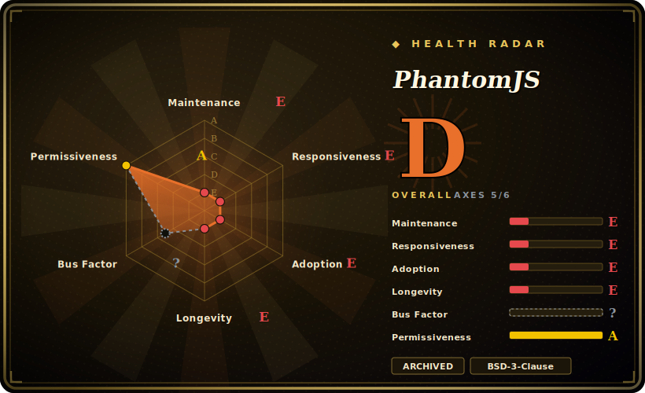

# PhantomJS

A scriptable **headless WebKit** browser — historically the way to run a real browser engine without a display for testing, scraping, and screenshots **before** headless Chrome existed. **It is archived and abandoned: active development was suspended in 2018 and the repository is archived.** For anything new, do not start here.

## When to use

You're an engineer inheriting a legacy CI pipeline or an old scraping/screenshot service that was built around PhantomJS years ago — a `phantomjs script.js` invocation wired into test runners (Karma, old Jasmine setups), a render-to-PNG/PDF job, or a `page.evaluate` scraper that some long-departed colleague wrote. Replacing it is on the backlog but not funded this quarter, and your job right now is just to keep the existing thing running long enough to plan a migration. In that narrow maintenance context you reach for PhantomJS only because it's already pinned in the system: you keep the existing binary/version frozen, isolate it (a container, a locked-down host), and avoid feeding it anything untrusted.

That is the *only* realistic reason to touch it in 2026. For any new testing, scraping, or screenshot work — even on an existing project — you should be reaching for headless Chrome/Chromium driven by Puppeteer or Playwright, or [Selenium](selenium.md), not PhantomJS. Treat every encounter with it as a migration trigger, not a tool choice.

## When NOT to use

- **For anything new — full stop.** PhantomJS is **abandoned and the repo is archived**; development was **suspended in 2018**. It receives no fixes, no security patches, and no compatibility updates. Starting a new project on it is choosing dead software on purpose.
- **You need a modern, accurate browser engine.** It bundles an **outdated, frozen fork of WebKit** that predates years of JavaScript (ES2017+) and CSS evolution; modern sites, SPAs, and many web platform features simply don't render or execute correctly.
- **You care about security.** An unmaintained browser engine processing web content is a standing **security risk** — known engine CVEs go unpatched forever. Never point it at untrusted URLs.
- **You want headless rendering in general.** Use **headless Chrome/Chromium** instead — drive it with **Puppeteer** or **Playwright** for a maintained, accurate, well-documented stack, or use [Selenium](selenium.md) for cross-browser WebDriver automation. The original maintainer himself stepped back specifically *because* headless Chrome made PhantomJS redundant.

## Comparison

| Alternative | In index | Our verdict | Tradeoff |
|---|---|---|---|
| Headless Chrome/Chromium + Puppeteer | 未收录 | Use this page for its stated niche; choose Headless Chrome/Chromium + Puppeteer when you need the standard replacement: a maintained, modern Chromium engine driven by a Node. | The standard replacement: a maintained, modern Chromium engine driven by a Node.js library over CDP — accurate rendering, active security patching, huge ecosystem; single-engine (Chromium) and Node-centric, but that's the right default for new work. |
| Playwright | 未收录 | Use this page for its stated niche; choose Playwright when you need modern cross-engine automation (Chromium/Firefox/WebKit) with auto-wait, network interception, traci. | Modern cross-engine automation (Chromium/Firefox/WebKit) with auto-wait, network interception, tracing, multi-language bindings; everything PhantomJS did and far more, actively maintained — the recommended modern choice. |
| [Selenium](selenium.md) | ✅ | Use this page for its stated niche; choose Selenium when you need W3C-WebDriver cross-browser framework driving *real* browsers (incl. | W3C-WebDriver cross-browser framework driving *real* browsers (incl. headless Chrome) across many languages; heavier and lower-level, but the standards-based, still-active option where cross-browser breadth matters. |
| [Chrome DevTools MCP](chrome-devtools-mcp.md) | ✅ | Use this page for its stated niche; choose Chrome DevTools MCP when you need MCP server exposing Chrome DevTools (traces, network, heap) to agents on a live Chromium. | MCP server exposing Chrome DevTools (traces, network, heap) to agents on a live Chromium; a maintained, agent-oriented Chrome tool — different (debugging/measuring) job, but built on the modern engine PhantomJS lacks. |

## Tech stack

- **Engine:** a bundled, frozen fork of **WebKit** (the project shipped its own old WebKit build, not the system browser) — this is the load-bearing liability: it never advanced past its 2010s-era state.
- **Implementation language:** **C++** for the core (the WebKit integration and the headless runtime), exposing a **JavaScript** scripting API (`page`, `webpage` module, `page.evaluate`, `page.render`).
- **Scripting model:** you write a `.js` file run by the `phantomjs` binary; it controls page load, DOM access, network, and rendering to PNG/PDF — all without a display.
- **Build:** a heavyweight C++/WebKit build (notoriously slow and large to compile from source), which is part of why nobody picked it back up after the maintainer left. `[推断]`

## Dependencies

- **The single `phantomjs` binary.** Historically distributed as prebuilt static binaries per OS; once installed it needs no separate browser or display server (it *is* the browser).
- **No language runtime for scripts** beyond what's embedded — scripts are JavaScript executed by PhantomJS itself; many users wrapped it via Node (`phantomjs-prebuilt`) or test runners, but those are integration layers, not requirements of the engine.
- **Build-from-source dependencies** are heavy (a full C++/WebKit toolchain), which is why almost everyone consumed prebuilt binaries. Those prebuilt artifacts are themselves frozen and aging. `[未验证]`

## Ops difficulty

**Low to run, high to own.** Running it is trivial — drop the binary, run `phantomjs script.js`. The real difficulty is **stewardship of dead software**: no upstream fixes means any bug, crash, memory leak (PhantomJS was known for leaks in long-running processes), or engine incompatibility is *yours* to work around forever. You cannot upgrade your way out of a problem. Responsible operation means freezing the version, sandboxing/containerizing it, never exposing it to untrusted content, and — crucially — treating its continued presence as **technical debt with a migration plan**, not a stable dependency. `[推断]`

## Health & viability

- **Maintenance (2026-06) — DEAD.** The repository is **archived** (last pushed 2022-11) and active development was **suspended in 2018** (the maintainer announced he was stepping down). No releases, no fixes, no security patches — this is the dominant fact about the project. `[未验证]`
- **Age × still-active ⇒ FAILS Lindy.** Created **2010-12** (~15 years old), so age alone *looks* long-lived — but Lindy requires **age × still-active**, and PhantomJS is long-*abandoned*. An old, dead project is a **negative** signal, not a safe bet: the correct read is "ancient and unmaintained," the worst quadrant. `[推断]`
- **Governance / bus factor — gone.** Owned by a **single user** (ariya), the original author, who publicly stepped away; there is no team, no foundation, and no successor maintainer that picked up the official repo. Bus factor effectively zero. `[未验证]`
- **Security & compatibility rot.** An unmaintained browser engine accumulates unpatched CVEs and drifts ever further from the modern web platform every year — the risk strictly *increases* with time. `[推断]`
- **Why it still persists — inertia only.** The ~29.5k stars and any remaining usage reflect **historical** importance and legacy systems still pinned to it, **not** current viability. The reason to keep it is that something old already depends on it; that is the only reason. `[推断]`

## Caveats (unverified)

- [未验证] ~29.5k GitHub stars and "last pushed 2022-11" as of 2026-06; star counts and timestamps are date-sensitive and drift — re-verify against the repo (note: an archived repo's "pushed" date can change without new development).
- [未验证] "Archived repository" and "development suspended in 2018" come from the project's public history / GitHub state; confirm the archived flag and the suspension announcement directly on the repo before relying on them.
- [推断] The bundled WebKit being a frozen old fork that predates ES2017+/modern CSS is inferred from the project's dormancy and well-known community accounts, not a feature-by-feature audit here.
- [推断] Memory-leak reputation and the difficulty/slowness of building WebKit from source are widely-reported community characterizations, not measured in this page.
- [未验证] Comparison substitutes (Puppeteer, Playwright) reflect general positioning of the modern headless-Chrome stack, not a head-to-head benchmark against PhantomJS.
