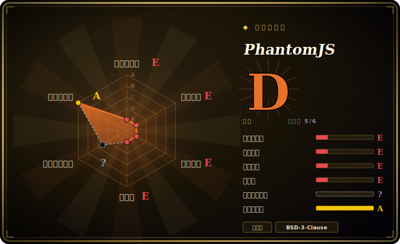

# PhantomJS

一个可脚本化的**无头 WebKit** 浏览器——在 headless Chrome 出现**之前**，它历史上就是「不开显示器也能跑一个真实浏览器引擎」来做测试、抓取、截图的那条路。**它已归档、已废弃：活跃开发在 2018 年被中止，仓库也已归档。** 任何新东西，都不要从这里起步。

## 何时使用

你是一名工程师，接手了一条多年前围绕 PhantomJS 搭起来的老 CI 流水线，或一个老旧的抓取/截图服务——某个 `phantomjs script.js` 调用被接进了测试运行器（Karma、老式 Jasmine 配置），一个渲染成 PNG/PDF 的任务，或某个早已离职的同事写的 `page.evaluate` 抓取脚本。替换它在 backlog 里，但这个季度没排上预算，你眼下的活儿只是让现有这套撑住，撑到能规划迁移为止。在这种狭窄的维护场景里，你之所以还碰 PhantomJS，唯一原因是它已经钉死在系统里：你把现有二进制/版本冻住，把它隔离（一个容器、一台锁死的主机），并且绝不喂它任何不可信的东西。

这是 2026 年还去碰它的*唯一*现实理由。对任何新的测试、抓取或截图工作——哪怕是在一个现有项目里——你都该转向由 Puppeteer 或 Playwright 驱动的 headless Chrome/Chromium，或者 [Selenium](selenium.zh.md)，而不是 PhantomJS。把每一次遇到它，都当成迁移的触发信号，而不是一次工具选型。

## 何时不用

- **任何新东西——到此为止。** PhantomJS **已废弃且仓库已归档**；开发在 **2018 年被中止**。它收不到任何修复、任何安全补丁、任何兼容性更新。在它之上起新项目，等于故意选了一个死掉的软件。
- **你需要一个现代、准确的浏览器引擎。** 它捆绑的是一个**过时、冻结的 WebKit 分叉**，落后于多年的 JavaScript（ES2017+）与 CSS 演进；现代站点、SPA 以及许多 Web 平台特性，根本无法正确渲染或执行。
- **你在乎安全。** 一个无人维护、却还在处理 Web 内容的浏览器引擎，本身就是一个长期**安全风险**——已知的引擎 CVE 永远不会被修。绝不要让它去访问不可信的 URL。
- **你想要无头渲染（泛指）。** 改用 **headless Chrome/Chromium**——用 **Puppeteer** 或 **Playwright** 驱动它，得到一套有人维护、渲染准确、文档完备的栈；或用 [Selenium](selenium.zh.md) 做跨浏览器的 WebDriver 自动化。当年的原维护者本人正是*因为* headless Chrome 让 PhantomJS 变得多余，才退出的。

## 横向对比

| 替代品 | 是否收录 | 我们的评价 | 取舍 |
|---|---|---|---|
| Headless Chrome/Chromium + Puppeteer | 未收录 | 当前页用于它的主场景；如果更看重“标准替代方案：一个有人维护的现代 Chromium 引擎，由 Node”，再选 Headless Chrome/Chromium + Puppeteer。 | 标准替代方案：一个有人维护的现代 Chromium 引擎，由 Node.js 库通过 CDP 驱动——渲染准确、安全持续打补丁、生态庞大；单引擎（Chromium）且偏 Node，但这正是新工作的合理默认。 |
| Playwright | 未收录 | 当前页用于它的主场景；如果更看重“现代跨引擎自动化（Chromium/Firefox/WebKit），带自动等待、网络拦截、tracing、多语言绑定”，再选 Playwright。 | 现代跨引擎自动化（Chromium/Firefox/WebKit），带自动等待、网络拦截、tracing、多语言绑定；PhantomJS 做的它都做，还多得多，且在积极维护——推荐的现代选择。 |
| [Selenium](selenium.zh.md) | ✅ | 当前页用于它的主场景；如果更看重“W3C WebDriver 跨浏览器框架，驱动*真实*浏览器（含 headless Chrome），支持多语言”，再选 Selenium。 | W3C WebDriver 跨浏览器框架，驱动*真实*浏览器（含 headless Chrome），支持多语言；更重、更底层，但在需要跨浏览器广度时，它是基于标准、仍然活跃的那个选项。 |
| [Chrome DevTools MCP](chrome-devtools-mcp.zh.md) | ✅ | 当前页用于它的主场景；如果更看重“把 Chrome DevTools（trace、网络、堆）通过 MCP 暴露给 agent，作用在一个活的 Chromium 上”，再选 Chrome DevTools MCP。 | 把 Chrome DevTools（trace、网络、堆）通过 MCP 暴露给 agent，作用在一个活的 Chromium 上；一个有人维护、面向 agent 的 Chrome 工具——活儿不同（调试/测量），但建立在 PhantomJS 所缺的现代引擎之上。 |

## 技术栈

- **引擎：** 一个捆绑的、冻结的 **WebKit** 分叉（项目自带了一份自己的老 WebKit 构建，而非系统浏览器）——这是承重的负债：它从未越过其 2010 年代的状态。
- **实现语言：** 核心用 **C++**（WebKit 集成与无头运行时），对外暴露一套 **JavaScript** 脚本 API（`page`、`webpage` 模块、`page.evaluate`、`page.render`）。
- **脚本模型：** 你写一个 `.js` 文件，由 `phantomjs` 二进制运行；它控制页面加载、DOM 访问、网络，以及渲染成 PNG/PDF——全程不需要显示器。
- **构建：** 一个重量级的 C++/WebKit 构建（从源码编译出了名地慢且大），这也是维护者离开后没人接手的原因之一。`[推断]`

## 依赖

- **单个 `phantomjs` 二进制。** 历史上按各 OS 分发预编译静态二进制；装好后无需另外的浏览器或显示服务器（它*本身*就是浏览器）。
- **脚本无需额外语言运行时**（除了内嵌的那套）——脚本就是由 PhantomJS 自己执行的 JavaScript；很多用户通过 Node（`phantomjs-prebuilt`）或测试运行器去包装它，但那些是集成层，不是引擎的依赖。
- **从源码构建的依赖**很重（一整套 C++/WebKit 工具链），这正是几乎所有人都直接用预编译二进制的原因。而那些预编译产物本身也是冻结且老化的。`[未验证]`

## 运维难度

**跑起来很低，养着很高。** 跑它很简单——放下二进制，`phantomjs script.js` 一跑就行。真正的难点是**给一个死掉的软件做托管**：上游没有任何修复，意味着任何 bug、崩溃、内存泄漏（PhantomJS 以长跑进程里的泄漏闻名）或引擎不兼容，都得*你自己*永远绕过去。你没法靠升级走出问题。负责任地运营它，意味着冻住版本、做沙箱/容器化、绝不让它接触不可信内容，而且——关键——把它的继续存在当成**带迁移计划的技术债**，而不是一个稳定依赖。`[推断]`

## 健康度与可持续性

- **维护（2026-06）——已死。** 仓库**已归档**（最近一次 push 在 2022-11），活跃开发在 **2018 年被中止**（维护者宣布退出）。没有发版、没有修复、没有安全补丁——这是关于这个项目最主导的事实。`[未验证]`
- **年龄 × 仍活跃 ⇒ Lindy 不成立。** 创建于 **2010-12**（约 15 岁），单看年龄*显得*长寿——但 Lindy 要的是**年龄 × 仍活跃**，而 PhantomJS 是长期*废弃*的。一个又老又死的项目是**负面**信号，而非稳妥下注：正确读法是「古老且无人维护」，最差的那个象限。`[推断]`
- **治理 / bus factor——没了。** 由**单个用户**（ariya，原作者）所有，他已公开退出；没有团队、没有基金会，也没有任何接手官方仓库的继任维护者。bus factor 实质为零。`[未验证]`
- **安全与兼容性腐烂。** 一个无人维护的浏览器引擎，每年都在积累未打补丁的 CVE，并离现代 Web 平台越来越远——风险随时间严格*递增*。`[推断]`
- **它为何还在——只剩惯性。** 那约 29.5k star 和任何残留使用，反映的是**历史**重要性以及仍钉在它上面的遗留系统，**而非**当下的可持续性。留着它的理由，是某个老东西已经依赖它；这就是唯一的理由。`[推断]`

## 存疑（未验证）

- [未验证] 截至 2026-06，约 29.5k GitHub star、「最近 push 在 2022-11」；star 数与时间戳对时间敏感且会漂移——请对照仓库重核（注意：归档仓库的「pushed」日期可能在没有新开发的情况下变动）。
- [未验证]「仓库已归档」与「2018 年中止开发」来自项目的公开历史 / GitHub 状态；依赖之前请直接在仓库上确认归档标记与那则中止公告。
- [推断] 捆绑的 WebKit 是一个早于 ES2017+/现代 CSS 的冻结老分叉，这一点是从项目的休眠状态与广为人知的社区说法推断而来，并非本页逐特性审计的结论。
- [推断] 内存泄漏的名声、以及从源码构建 WebKit 的难度/缓慢，是社区广泛报告的描述，而非本页的实测。
- [未验证] 对比里的替代品（Puppeteer、Playwright）反映的是现代 headless Chrome 栈的大致定位，而非与 PhantomJS 的头对头基准。
