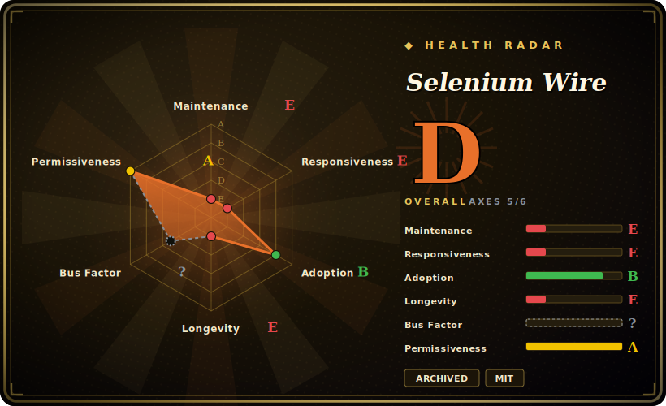

# Selenium Wire

Extends Selenium's Python bindings so you can inspect and modify the browser's underlying HTTP/HTTPS traffic — by routing the browser through an internal MITM proxy. **The project is archived and explicitly no longer maintained.**

## When to use

You're maintaining a legacy Python scraping or test suite built on Selenium, and you need to read the *responses* the page fetches in the background — an API call that returns a JSON payload, an auth token in a request header, a redirect chain — not just the rendered DOM. Plain Selenium drives the browser but hands you no view of its network layer. You add `from seleniumwire import webdriver`, keep all your existing Selenium code, and now every request/response is captured: you can read `driver.requests`, assert on headers and bodies, modify requests on the fly, block or mock responses, inject basic-auth, and export a HAR. Under the hood it stands up its own man-in-the-middle proxy and a generated CA cert to decrypt HTTPS.

For an *existing* project already pinned to it, that's still a working pattern. For anything new, see the next section first — this library is frozen.

## When NOT to use

- **It's archived and abandoned — do not start new projects on it.** The README states plainly: "Selenium Wire is no longer being maintained." Last shipped tag is 5.1.0 (2022-10); the repo went read-only after the final commit (2024-01). 171 open issues will never be addressed.
- **Selenium 4 already gives you native network access.** Selenium 4.x ships native Chrome DevTools Protocol access (`execute_cdp_cmd`, Network domain) and the emerging WebDriver BiDi network interception — request/response inspection and modification for Chromium-family browsers without a bundled MITM proxy. That's the maintained path. [推断 — CDP/BiDi 提供网络拦截是已知能力；对本库具体场景的逐项 API 覆盖度未核验]
- **MITM-proxy friction and rot.** It funnels all traffic through an internal proxy and installs a generated CA cert. That adds TLS-handshake overhead, cert-trust setup, HTTP/2 edge cases, and breakage against modern anti-bot / cert-pinning — none of which will be fixed now.
- **Stale dependency floor.** Pinned to the `selenium>=4.0.0` / `pyOpenSSL>=22.0.0` era with classifiers capping at Python 3.10; running on current Python/Selenium/OpenSSL may require overrides and is unsupported.
- **You need a general-purpose proxy/MITM tool.** If you genuinely need proxy-level capture beyond a Selenium session, use a maintained tool (mitmproxy) directly rather than a frozen wrapper.

## Comparison

| Alternative | In index | Tradeoff |
|---|---|---|
| [Selenium](selenium.md) (4.x native CDP/BiDi) | ✅ | The base library this wraps; Selenium 4 now offers native CDP/BiDi network interception — the maintained way to get most of what selenium-wire added, no MITM proxy. [推断] |
| Playwright | 未收录 | Modern, actively maintained browser automation with first-class request/response interception (`page.route`, response bodies) built in; the strongest "new project" replacement. |
| mitmproxy | 未收录 | A maintained standalone MITM proxy with a full scripting API; heavier and not Selenium-coupled, but the right tool when you need real proxy-level capture. |
| Browser MITM Proxy / BrowserMob Proxy | 未收录 | Older proxy-based HAR capture for Selenium (BrowserMob is Java); similar approach, similarly aging. |

## Tech stack

- **Language:** Python (`python_requires>=3.6`; README advertises 3.7+, classifiers cap at 3.10).
- **Selenium coupling:** requires `selenium>=4.0.0`; integrates via a drop-in `webdriver` import plus `blinker` signals.
- **Bundled MITM proxy:** ships its own MITM implementation rather than depending on mitmproxy at runtime, built on `h2` / `hyperframe` / `wsproto` (HTTP/2 + websockets), `pyOpenSSL` / `certifi` / `pyasn1` (TLS/cert), `brotli` / `zstandard` (decompression), `pysocks` (SOCKS), and `pydivert` on Windows. [推断 — setup.py 中 mitmproxy 仅出现在 dev/test extras]

## Dependencies

- **Runtime:** Python 3.7+, a Selenium 4 install, and a real browser + matching driver (Chrome/Firefox/Edge or Remote WebDriver).
- **CA cert:** to decrypt HTTPS it generates and uses its own root CA — you may need to trust it for some flows.
- **No external service:** the proxy runs in-process; no separate datastore or daemon.

## Ops difficulty

**Low-to-medium for a library, but with a frozen-software tax.** As code it's `pip install selenium-wire` and an import swap — no infrastructure. The friction is operational rot: pinning a working combination of Python + Selenium + pyOpenSSL that the unmaintained library tolerates, dealing with CA-cert trust, and accepting that any breakage against new browser/TLS behavior is yours to patch in a fork. There's no datastore or service to run — the burden is purely keeping a dead dependency alive.

## Health & viability

- **Maintenance (2026-06).** Archived and explicitly abandoned — README announces it is no longer maintained; last tag 5.1.0 (2022-10), repo read-only since ~2024-01. **Dead.** This is a hard stop on any "is it maintained" criterion.
- **Governance / bus factor.** Bus factor **1**: `wkeeling` authored ~886 commits, the next contributor has 5, and that maintainer has publicly stepped away. Watchers count of 1 reinforces it. Single-User project, no org continuity.
- **Age × Lindy.** ~6 years active (2018→2024), ~2.0k stars — historically popular and proven. But Lindy cuts the other way once abandoned: against a fast-moving Selenium/CDP/TLS landscape, an unmaintained MITM wrapper rots, so age here is not a safety signal. [推断]
- **Adoption.** Genuinely widely used in its day (notable PyPI footprint), which is why a frozen archive still matters — but adoption is legacy, not growth.
- **Risk flags.** Archived + maintainer-departed + 171 unaddressed issues + aging TLS/MITM internals = migration risk. Existing pins can be frozen for legacy use; new work should go to Selenium 4 native interception or Playwright. [推断]

## Caveats (unverified)

- [未验证] Last PyPI publish date is inferred (~2022-10) from tag 5.1.0; PyPI was not queried directly.
- [未验证] Exact archive date — only the last commit (2024-01-03) is known; the repo was archived sometime after that.
- [推断] The bundled MITM proxy is selenium-wire's own implementation and mitmproxy is dev/test-only, inferred from its placement in setup.py's extras, not from reading the proxy source.
- [推断] Selenium 4 CDP/BiDi feature parity for interception versus selenium-wire was reasoned, not benchmarked.
- [未验证] ~2.0k stars as of 2026-06; star counts are date-sensitive and indicative only.
