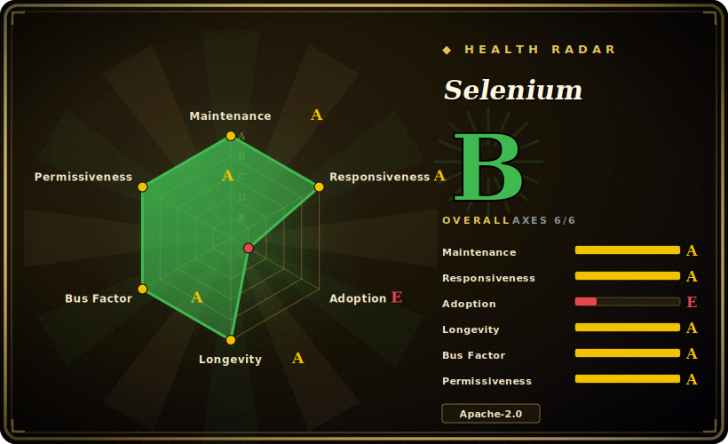

# Selenium

The long-standing umbrella project for cross-browser automation via the **W3C WebDriver** protocol: a language-neutral coding interface (Java/Python/JS/C#/Ruby and more) plus **Grid** for distributed execution and **Selenium IDE** for record-and-playback.

## When to use

You're a QA or SDET engineer at an enterprise that ships a web app its customers open in Chrome, Firefox, Edge, and Safari — and "works in Chrome" is not an acceptable definition of done. You need an end-to-end UI regression suite that drives the *same* test logic against every browser in that support matrix, runs in your CI on every merge, and fans out across a pool of machines so the full suite finishes in minutes rather than an hour. Your team already writes in Java (and a couple of services use Python), so you want one automation API that both can call without learning a new language-specific tool.

You reach for **Selenium WebDriver**. You write the test once against the WebDriver API, and the same code talks to ChromeDriver, GeckoDriver, EdgeDriver, or SafariDriver because they all implement the W3C WebDriver spec — real browsers, real rendering, the closest thing to a real user. For scale you stand up **Selenium Grid**: a hub/node (or distributed) topology that schedules your tests across many browser instances and OS combinations in parallel, including Dockerized nodes. For the non-coders on the team, **Selenium IDE** records a flow in the browser and exports it to one of the language bindings as a starting point. Because the WebDriver protocol is a W3C standard with a vast ecosystem (cloud grids like BrowserStack/Sauce Labs, every CI integration, mountains of Stack Overflow answers), Selenium is the safe, ubiquitous default when *cross-browser breadth* and *language choice* are the hard requirements.

## When NOT to use

- **You target one (Chromium) browser and want modern DX.** For a single-browser project, auto-waiting, network interception, and a nicer debugging story out of the box, Playwright or Cypress are simply more pleasant — Selenium feels lower-level and more verbose by comparison.
- **You expect tests to "just work" without waits.** Selenium does not auto-wait on elements/network the way Playwright/Cypress do; suites are notoriously **flaky** unless you discipline explicit/expected-condition waits everywhere. This is the single biggest day-to-day cost.
- **You want AI/agent-driven, natural-language automation.** Selenium is selector-and-code driven, not an LLM operating the page from intent. For NL/agent control use an in-page GUI agent like [page-agent](page-agent.md) or a CLI/daemon agent browser like [Agent Browser](agent-browser.md).
- **You want a lightweight CDP debugging/measuring tool.** For Chrome-native performance traces, network/console inspection, and heap snapshots driven by an agent, a CDP tool like [Chrome DevTools MCP](chrome-devtools-mcp.md) is far lighter than standing up WebDriver + Grid.
- **You don't want to run infra.** Grid at scale is real ops — a hub/distributor, nodes, browser+driver version matching, queueing, and node health to operate (or you pay a cloud grid).

## Comparison

| Alternative | In index | Our verdict | Tradeoff |
|---|---|---|---|
| Playwright | 未收录 | Use this page for its stated niche; choose Playwright when you need modern cross-browser (Chromium/Firefox/WebKit) automation with auto-wait, network interception, trac. | Modern cross-browser (Chromium/Firefox/WebKit) automation with auto-wait, network interception, tracing, and ergonomic APIs; far better single-codebase DX, but a newer/narrower ecosystem and not the W3C-WebDriver standard Selenium anchors. |
| Cypress | 未收录 | Use this page for its stated niche; choose Cypress when you need developer-friendly in-browser E2E with time-travel debugging and auto-retry. | Developer-friendly in-browser E2E with time-travel debugging and auto-retry; excellent DX for web apps, but historically Chromium-centric, runs inside the browser's event loop (architectural limits on multi-tab/cross-origin), JS/TS only. |
| Puppeteer | 未收录 | Use this page for its stated niche; choose Puppeteer when you need lower-level Chrome/CDP automation library (Node. | Lower-level Chrome/CDP automation library (Node.js); great for Chrome scripting/scraping, but single-engine and not a cross-browser, multi-language WebDriver framework. |
| [Agent Browser](agent-browser.md) | ✅ | Use this page for its stated niche; choose Agent Browser when you need rust CLI/daemon that drives Chrome over CDP for AI agents with stable a11y-tree refs. | Rust CLI/daemon that drives Chrome over CDP for AI agents with stable a11y-tree refs; an agent primitive, not a cross-browser test framework — different job. |
| [Chrome DevTools MCP](chrome-devtools-mcp.md) | ✅ | Use this page for its stated niche; choose Chrome DevTools MCP when you need MCP server exposing Chrome DevTools (traces, network, heap) to agents. | MCP server exposing Chrome DevTools (traces, network, heap) to agents; debugging/measuring depth on Chrome only, not portable cross-browser test automation. |

## Tech stack

- **Core protocol:** W3C WebDriver — a language- and browser-neutral wire protocol; Selenium provides both the client bindings and (historically) reference server pieces.
- **Implementation languages:** the project itself spans Java, Python, Ruby, C#, JavaScript, plus Rust/C++ in the repo; the WebDriver client **bindings** target Java/Python/JS/C#/Ruby (and community ports).
- **Components:** Selenium WebDriver (the API), Selenium Grid (distributed/parallel execution — standalone, hub-node, or fully distributed roles), Selenium IDE (browser record-and-playback extension).
- **Browser drivers:** delegates to per-browser driver executables — ChromeDriver, GeckoDriver (Firefox), msedgedriver (Edge), SafariDriver — each implementing the WebDriver spec; Selenium Manager resolves/downloads matching drivers.

## Dependencies

- **A real browser + its WebDriver driver** for each target (Chrome+ChromeDriver, Firefox+GeckoDriver, Edge+msedgedriver, Safari+SafariDriver). Selenium Manager can auto-provision drivers.
- **A language runtime** for your chosen binding (JDK for Java, Python, Node.js, .NET, or Ruby) plus a test runner (JUnit/TestNG, pytest, Mocha, etc.).
- **Optional Selenium Grid** if you need distributed/parallel runs — its own process(es) to deploy (often via the official Docker images), or a hosted cloud grid (BrowserStack/Sauce Labs/LambdaTest).
- No datastore of its own; state is the browser session(s) it controls.

## Ops difficulty

**Medium.** A single local WebDriver test is easy: add the binding dependency, let Selenium Manager fetch the driver, run. Cost climbs with everything that makes Selenium valuable: keeping **browser and driver versions in lockstep** (a frequent breakage source on browser auto-updates), writing and maintaining explicit waits to fight flakiness, and — above all — **operating Grid** at scale: distributor/router/session-map roles, node pools, Docker/Kubernetes deployment, queue tuning, and health monitoring. Many teams sidestep the Grid ops burden by renting a cloud grid, trading infra for per-minute cost.

## Health & viability

- **Maintenance (2026-06)** — last pushed 2026-06, not archived, shipping the v4.x line (v4.45.0); a continuously released project tracking evolving browser/WebDriver targets, i.e. **active**, not coasting. `[推断]`
- **Governance & bus factor** — lives under the **SeleniumHQ** org (`Organization`-owned), a long-standing community/multi-contributor project rather than one person or a single vendor's product; the W3C-standard WebDriver protocol it anchors further de-risks any single-owner dependency. `[推断]`
- **Age & Lindy** — created ~2013-01, so ~13 years old (2026-06) and still actively shipping: a textbook **strong-Lindy** bet — long-lived *and* still-active, with deep ecosystem inertia (cloud grids, CI integrations, years of Q&A) that makes it the safe default. `[推断]`
- **Adoption & ecosystem** — the de-facto cross-browser automation standard: official driver implementations track it, hosted grids (BrowserStack/Sauce Labs/LambdaTest) build on it, and ~34k stars reflect entrenched adoption rather than hype. `[未验证]`
- **Risk flags** — Apache-2.0, no relicense/open-core history seen; the practical risk is **flakiness without disciplined waits** and **Grid ops burden**, not project viability. `[未验证]`

## Caveats (unverified)

- [未验证] ~34.2k GitHub stars and v4.45.0 (released ~2026-06-16) as of 2026-06; star counts and version numbers are date-sensitive and drift — treat as indicative and re-verify against the repo.
- [未验证] The exact set of officially-maintained language bindings (Java/Python/JS/C#/Ruby) vs community ports, and which repo languages (Rust/C++) are shipped components vs internal, comes from the README/repo framing and shifts release-to-release.
- [推断] "Flaky without explicit waits" and the DX gap vs Playwright/Cypress are widely-held community judgments and architectural inferences, not a measured benchmark in this page.
- [推断] Selenium Grid role/topology details (standalone / hub-node / distributed) are summarized from the project's own docs framing; verify the current Grid architecture before designing a deployment.
- [未验证] Comparison substitutes (Playwright, Cypress, Puppeteer) reflect general positioning, not a head-to-head test run; relative tradeoffs are judgment.
