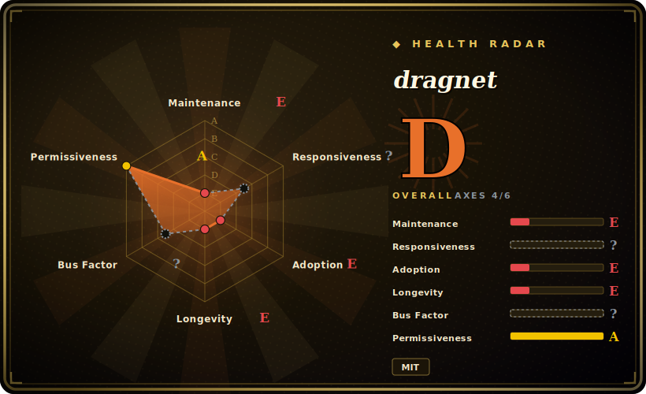

# dragnet

A machine-learning approach to web content extraction — trained models pull the main article (and optionally user comments) out of a page's HTML, using diverse text/markup features rather than hand-tuned heuristics.

## When to use

You're building a content-extraction pipeline in Python and pure heuristic extractors keep mis-segmenting your pages — over-trimming the body, or leaving comment threads and boilerplate in. You want something trained on labeled examples that can also distinguish the *article* from *user-generated comments*. You reach for dragnet: `extract_content(html)` gives you just the main article, `extract_content_and_comments(html)` gives you article + comments, and you can load pre-trained models (e.g. the bundled `kohlschuetter_readability_weninger` content model) or, because it exposes a scikit-learn-style extractor with `fit`/`predict`, **train your own** on your domain's labeled pages. Its lineage is academic — the WWW 2013 "Content Extraction Using Diverse Feature Sets" paper — so the appeal is a model-based extractor that can be tuned to your data instead of a fixed heuristic.

You reach for it specifically when you have (or can label) training data and want extraction quality you can improve by retraining, rather than accepting a one-size-fits-all heuristic. It's the ML option in the Python content-extraction space.

## When NOT to use

- **You want a maintained, easy-to-install dependency today.** This is the biggest caveat: dragnet is **low-activity** (last pushed 2025-07, last release 2.0.4 in 2019) and pins **aging, narrow dependency ranges** — notably `scikit-learn>=0.15.2,<0.21.0` and `ftfy<5.0.0` — which conflict with modern Python/scientific stacks and can make installation painful. [推断]
- **You don't want a numpy/scipy/Cython build.** It's built on the numerical stack with Cython extensions; installing/compiling it is heavier than a pure-Python heuristic extractor.
- **You only need decent article extraction with zero training.** A heuristic library ([Readability.js](readability-js.md), [python-readability](python-readability.md), or trafilatura) is far lighter and good enough for many pipelines; dragnet's edge is ML/comments, which you may not need.
- **You need modern metadata or crawl support.** It returns content (and comments) strings; it's not a full metadata/crawl framework like trafilatura.
- **You need a future-proof, actively patched extractor.** Given the cadence and dependency pins, treat it as effectively in maintenance-coast — don't build a long-lived critical pipeline on it without owning the fork. [推断]

## Comparison

| Alternative | In index | Our verdict | Tradeoff |
|---|---|---|---|
| [python-readability](python-readability.md) | ✅ | Use this page for its stated niche; choose python-readability when you need lxml heuristic extractor. | lxml heuristic extractor; far lighter and easier to install, no ML training — but no learned/comment separation. |
| [Readability.js](readability-js.md) | ✅ | Use this page for its stated niche; choose Readability.js when you need mozilla's JS reader-view engine. | Mozilla's JS reader-view engine; different language, heuristic not ML, no comment extraction. |
| [boilerpipe](boilerpipe.md) | ✅ | Use this page for its stated niche; choose boilerpipe when you need java boilerplate-removal algorithms (one of dragnet's inspirations). | Java boilerplate-removal algorithms (one of dragnet's inspirations); classic but the repo is effectively abandoned. |
| trafilatura | 未收录 | Use this page for its stated niche; choose trafilatura when you need modern, actively maintained Python extractor with strong benchmarks, metadata, and crawl support. | Modern, actively maintained Python extractor with strong benchmarks, metadata, and crawl support; usually the better default now — heuristic + rules rather than a trainable ML model. |
| Mozilla fathom / custom ML | 未收录 | Use this page for its stated niche; choose Mozilla fathom / custom ML when you need roll-your-own learned extraction. | Roll-your-own learned extraction; more control, far more work than adopting dragnet's models. |

## Tech stack

- **Language:** Python (developed for 2.7 with later Python 3 support added — itself a signal of age).
- **ML / numerics:** scikit-learn, numpy, scipy, **Cython** extensions, lxml for parsing, ftfy for text fixing.
- **Models:** ships pre-trained pickled models (content and content+comments extractors); a sklearn-style `Extractor` with `fit`/`predict` lets you train your own.
- **Approach:** feature-based ML extraction (Kohlschütter/Weninger/Readability-derived features) per the WWW 2013 paper.

## Dependencies

- **Runtime:** Python + numpy, scipy, scikit-learn (**pinned `<0.21.0`**), Cython, lxml, ftfy (**`<5.0.0`**). The narrow/old pins are the practical pain point on modern systems. [推断]
- **Build:** Cython compilation is involved; a working C/Cython toolchain may be needed if no compatible wheel exists.
- **Models:** pre-trained pickles ship with the package (loaded via `load_pickled_model`); training your own needs labeled data.
- **No services:** pure library, no network or datastore; you supply the HTML.

## Ops difficulty

**Medium — front-loaded on installation, not runtime.** The runtime is a stateless library: feed HTML, get content. The difficulty is getting it *installed* into a modern environment given the old scikit-learn/ftfy pins and the Cython build — you may need an isolated/older virtualenv or to patch the pins yourself, then validate the pickled models still load under your scientific-stack versions. Once installed, operating it is trivial (CPU-bound, parallelizable). Training a custom model adds a labeling + ML workflow on top.

## Health & viability

- **Maintenance (2026-06).** Last pushed 2025-07; latest release 2.0.4 dates to **2019**. This is **low-activity / coasting** — touched occasionally but not actively developed. Not formally archived, but cadence is near-dormant. [推断]
- **Governance / bus factor.** Owned by an **Organization** (`dragnet-org`) with several historical contributors, but activity has thinned — effective bus factor is low given the dormant cadence. [推断]
- **Age × Lindy (2026-06).** Created 2012-06 — ~14 years old, but **age without current activity is not a Lindy pass**: a long-lived *coasting* project is durable in code, fragile in support. Use age × still-active, and the "still-active" half is weak here. [推断]
- **Adoption & ecosystem.** ~1.3k stars and an academic pedigree (WWW 2013) gave it real historical adoption; today the Python community has largely moved toward maintained alternatives like trafilatura. [未验证]
- **Risk flags.** Aging, narrow dependency pins (scikit-learn `<0.21`, ftfy `<5`) and a near-dormant cadence are the main risks — install friction and no guarantee of upstream fixes. MIT licensed, no relicense history found. [推断]

## Caveats (unverified)

- [未验证] ~1.3k stars as of 2026-06; latest release 2.0.4 (2019), last push 2025-07 — numbers are date-sensitive and the release/push gap signals coasting.
- [推断] The `scikit-learn>=0.15.2,<0.21.0` and `ftfy<5.0.0` pins are read from the repo's requirements/setup; their incompatibility with modern stacks is inferred, and the *current* installability on a given Python version was not test-installed here.
- [推断] "Low-activity / coasting" and "effective bus factor is low" are inferred from cadence (2019 release, 2025-07 push), not from a maintainer statement.
- [未验证] Whether the bundled pickled models still load cleanly under current numpy/scikit-learn was not verified; pickle compatibility across sklearn versions is a known fragility.
- [未验证] Comparative accuracy vs trafilatura/heuristic extractors reflects general positioning, not a measured benchmark.
