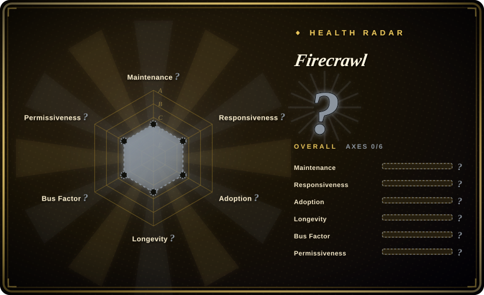

# Firecrawl

The API to search, scrape, and interact with the web at scale — turning raw web pages into clean Markdown or structured data your agents can ship with.

## When to use

You're building an AI agent or data pipeline that needs to ingest web content at scale, and you want clean, structured output rather than raw HTML. You need to search the web, scrape specific pages, and even interact with dynamic content (click, navigate) programmatically. You prefer an API-first approach where you can call a service rather than building and maintaining your own crawler infrastructure. You value the AGPL-3.0 open-source option alongside a hosted service for quick starts.

## When NOT to use

- **Simple one-off scraping** — For a single page or occasional curl, Firecrawl is overkill; use `curl` + `pandoc` or `trafilatura` instead.
- **Strict closed-source compliance** — AGPL-3.0 requires sharing source if you modify and distribute; verify compatibility with your product's licensing strategy. [未验证]
- **Budget-constrained at scale** — The hosted service pricing may become significant for high-volume scraping; self-hosting requires infrastructure.
- **Deep web / authenticated sites** — While it supports interaction, complex login flows and session management across many sites may still require custom Playwright scripts.

## Comparison

| Alternative | In index | Our verdict | Tradeoff |
| --- | --- | --- | --- |
| [Scrapyd](scrapyd.md) | ✅ | Self-hosted Scrapy spider scheduler. | Scrapyd is for running Scrapy spiders you write; Firecrawl is an API that handles crawling and extraction for you. |
| [newspaper](newspaper.md) | ✅ | Article text extraction from news URLs. | newspaper is Python-only and article-focused; Firecrawl is a full-service API with search, scrape, and interaction. |
| [Readability.js](readability-js.md) | ✅ | Firefox Reader View article extraction. | Readability.js is a browser library for article extraction; Firecrawl is a scalable API with search and interaction. |
| [PRAW](praw.md) | ✅ | Reddit-specific API wrapper. | PRAW is Reddit-only; Firecrawl is general-purpose web scraping. |
| Scrapy / Playwright | 未收录 | Lower-level scraping frameworks. | Scrapy and Playwright give full control but require building and maintaining crawler infrastructure. |

## Tech stack

- **TypeScript** — primary implementation language
- **Node.js** — API server runtime
- **Docker** — containerized deployment option
- **Playwright** — underlying browser automation for JS-rendered pages

## Dependencies

- For hosted API: API key and internet connectivity
- For self-hosted: Docker, Node.js runtime, and a server with sufficient bandwidth
- Optional: Redis for caching and queue management
- Browser dependencies (Chromium via Playwright) for dynamic content

## Ops difficulty

**Low (hosted) / Medium (self-hosted)**. The hosted API is a simple HTTP integration. Self-hosting requires managing a Node.js service, Playwright browser instances, and queue/caching infrastructure. Browser automation is resource-intensive and can consume significant memory.

## Health & viability

- **Maintenance**: Very active — daily pushes as of 2026-07, with a responsive team (376 open issues). [推断]
- **Governance**: Owned by the Firecrawl organization; appears to be a dedicated company/org behind the project with reasonable bus factor.
- **Backing**: Firecrawl appears to be a venture-backed company offering both open-source and hosted services; the dual model provides sustainability but may shift roadmap toward paid features. [未验证]
- **Adoption**: High star count (142k) for a project created in 2024; the ~2-year track record is short but the active development cadence is positive. [推断]
- **Risk flags**: AGPL-3.0 copyleft license may limit commercial use without open-sourcing derivatives. The hosted service pricing and open-source feature parity are important to monitor. The project is young (created 2024-04) with no long-term Lindy track record. [未验证]

## Caveats (unverified)

- [未验证] The AGPL-3.0 license may require source disclosure for derivative works in a SaaS context; verify with legal counsel for your specific use case.
- [未验证] The exact feature parity between the open-source self-hosted version and the paid hosted API is not confirmed.
- [推断] The 142k star count on a ~2-year-old repo suggests significant hype; verify organic production adoption beyond the GitHub star metric.
