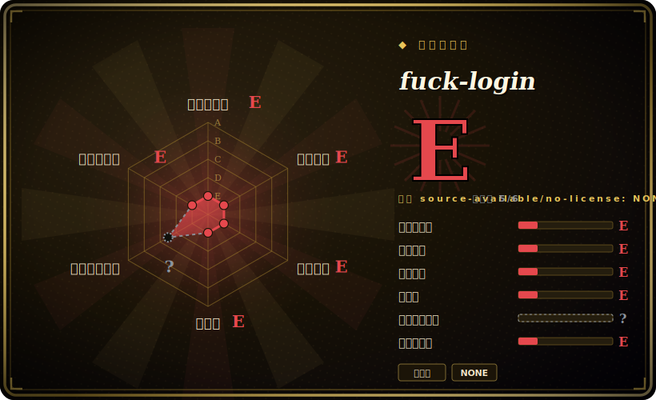

# fuck-login

一批约 20 个 Python 脚本，逐个复刻知名网站（多为中文站：知乎、微博、百度、京东、B 站、GitHub、豆瓣）的登录流程，让你把拿到的会话 cookie 带进爬虫。这是一个 2016 年的教学仓库，作者已明确**不再维护**。

## 何时使用

你是 Python 新手，想搞清楚网站登录在底层到底怎么运作——CSRF token、RSA 加密的密码、验证码图片、cookie 与 header 的来回——你想要具体、可读的例子，而不是抽象理论。你翻到这个仓库，打开 `zhihu/`，读到一个自包含脚本：用 `requests` 拉登录页，用 `pillow` 把验证码显示出来，用 `rsa` 像站点 JavaScript 那样加密密码，最后访问一个登录态接口来证明成功。作为一份*历史学习材料*——“2016–2018 年人们大致是这样自动化登录的”——它读起来不错。

实事求是讲，今天也就只剩这一种安全用法。这些脚本针对的登录流程在最后一次提交（2018-06）之后已多次改版，所以请把任一脚本当作示意性伪代码，而非可用工具。[推断]

## 何时不用

- **你指望它今天真能登录。** 仓库已废弃（最后 push 在 2018-06），针对的是 2016–2018 年的登录流程；这里的主流站点早已改了鉴权、加了验证码/风控、换了端点，大多数脚本预计已失效。[推断]
- **任何生产或规模化场景。** 没有 package、没有测试、没有 release、没有 API——它是一堆 demo 脚本，不是你能 import 的库。
- **你想要真正的验证码方案。** 它只是把验证码图片显示给人看，并不能破解现代的行为/滑块/JS 验证码。
- **你在意授权。** 仓库里**没有 LICENSE 文件**，按默认版权即“保留所有权利”，你没有任何合法的复用授权。[未验证]
- **你对 ToS / 法律敏感。** 自动化登录去爬取常常违反站点服务条款，在某些司法辖区还触及反规避或未授权访问法律；这是用来学习的，不是用来绕过站点管控的。
- **你需要有人维护的爬虫基础设施。** 用有维护的框架（Scrapy、Playwright）自己处理鉴权；这个仓库不会再打补丁。

## 横向对比

| 替代品 | 是否收录 | 取舍 |
|---|---|---|
| Playwright / Selenium | 未收录 | 驱动真实浏览器登录（能处理 JS、现代鉴权），而非重放裸 HTTP；更重，但在今天的站点上真能用。 |
| Scrapy | 未收录 | 有维护的爬取框架，自带登录 middleware 范式；鉴权要自己写，但周边一切都是生产级。 |
| [requests-html](requests-html.zh.md) | ✅ | requests + JS 渲染的爬取库，是真正的构件；而 fuck-login 只是示例脚本。 |
| [newspaper](newspaper.zh.md) | ✅ | 做正文抽取，不是登录自动化——活儿不同；列在这里展示本分类里有维护的成员。 |
| DrissionPage | 未收录 | 现代中文生态的浏览器自动化/爬取库；针对“登录某 CN 站再爬取”这同一目标的一个仍在世的替代品。 |

## 技术栈

- **语言：** Python 2/3 时代的脚本（README 要求 PR 兼容 Py2/Py3，可见它早于 Py3-only 的年代）。
- **核心库：** `requests`（HTTP + 会话/cookie）、`pillow`（把验证码图片显示给用户）、`rsa`（复刻站点对密码的加密）。
- **形态：** 每个目标站一个目录，各自近乎独立脚本；没有共享库层，没有打包。

## 依赖

- **运行时：** 一个 Python 解释器，加上 `requests`、`pillow`、`rsa`；部分脚本可能还需各站特有的额外库。没有集中的清单来锁版本，需要临时各装各的。
- **外部：** 能访问目标站的网络——更关键的是，目标站还得像它 2016–2018 年那样运作，而它通常已经不是了。
- **无服务/数据库：** 没什么要搭的；它把 cookie 读写在本地。

## 运维难度

**作为基础设施不适用**——没有可部署或运维的东西。唯一的“运维”是让某个脚本跑起来，而今天这通常意味着排查为什么某站改版后的登录不再匹配脚本，然后自己重写请求流程。作为一个有维护的依赖，难度实际上是*无穷大*：它不会更新，每一次坏掉都得你自己扛。

## 健康度与可持续性

- **维护（2026-06）。** **已废弃。** README 直说“本项目不在继续维护了”；最后 push 在 2018-06-08，已停滞约 8 年。已在 GitHub 归档（且实质上已废弃）。
- **治理 / bus factor。** 单一维护者（`xchaoinfo`）的个人/教学仓库，挂在 `User` 账号下却有 5.8k star——废弃的单作者仓库上的高 star 是**风险标记**，不是社会证明：这些 star 反映的是 2016 年的热度，而非当前健康度。
- **年龄与 Lindy 判断。** 2016-02 创建，约 10 岁，但**已不再活跃**⇒ Lindy **不成立**：这里年龄缺了持续活动就是负面信号，而非正面。长期废弃的仓库正是 Lindy 先验*不*适用的教科书案例。
- **背书。** 无——个人项目，最初配套一套视频教程（“Python 模拟登录那些事儿”）和一个微信公众号。没有组织，没有资金。
- **风险标记。** 无 license（法律复用风险）；已废弃；目标站已改版；题材本身（为爬取做登录自动化）带 ToS/法律暴露。[推断]

## 存疑（未验证）

- 已在 GitHub 归档（截至 2026-06-28 经 GitHub API 确认 `archived: true`），且自 2018 年起已废弃；仓库为只读，不会再有新提交。
- [未验证] 截至 2026-06 仓库内没有 LICENSE 文件；默认版权意味着没有复用授权。视为未授权；`license` 字段填 `NONE` 以如实反映。
- [推断] “今天大多数脚本已失效”是从 2018 年冻结加上目标站已知的鉴权/验证码改版推断而来，并非逐个跑过。
- [未验证] 截至 2026-06 约 5.8k star / 1.97k fork；star 数对时间敏感，这里反映的是历史相关性而非当前。
- [未验证] 约 20 个站点脚本的确切集合与当前可用状态会变；依赖任一具体脚本前请对照活站核实。
- [推断] 依赖版本没有集中锁定；上面的安装集合是从 README 点名的库推断的。
