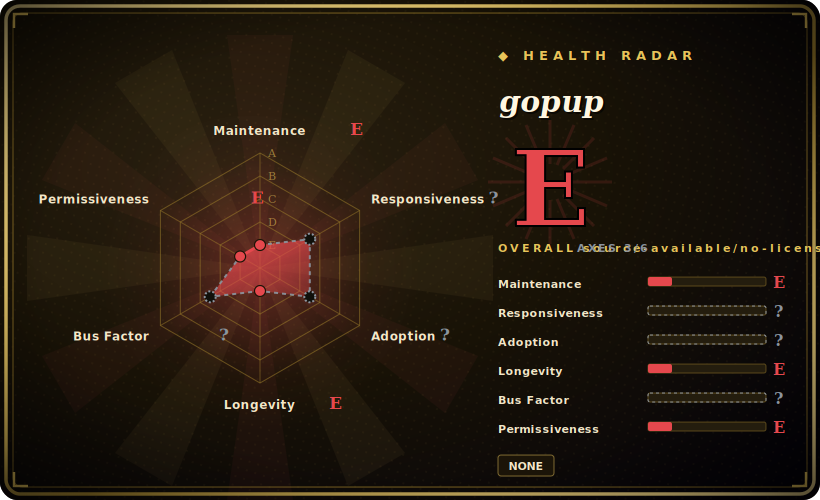

# gopup

A Python library that wraps a grab-bag of (mostly Chinese) public data sources behind one-line calls returning pandas DataFrames — Baidu/Weibo/Google search indices, Chinese macro indicators (CPI/PPI/PMI, money supply, FX rates), Shibor/LPR rates, unicorn-company lists, box-office and epidemic data, and more.

## When to use

You're a quant researcher or data analyst in China doing exploratory work, and you need a quick pull of some public dataset — say the Weibo search index for a keyword, the latest CPI, or Shibor rates — to drop straight into a notebook. You don't want to find the source site, reverse its API, and parse the response yourself. You `pip install gopup`, write `gp.weibo_index(word="疫情", time_type="1hour")`, and get a DataFrame back, then move on to the actual analysis. The value is the *catalog*: dozens of heterogeneous Chinese sources behind one consistent DataFrame-returning interface, so you stay in pandas instead of writing a fresh scraper per source.

It fits academic/research use specifically — the README is explicit that the data is for academic research and that some interfaces (e.g. Baidu/Toutiao index) need a TOKEN you register for on the project's site (gopup.cn).

## When NOT to use

- **Production or anything you must rely on.** These are scrapers over third-party public sites; when a source changes its page/API, the corresponding `gopup` function breaks until someone patches it — and maintenance has slowed (last commit 2023-09). [推断]
- **You need data outside China.** The catalog is overwhelmingly Chinese sources (Baidu/Weibo/Toutiao indices, Chinese macro/rates); for global market or alt-data you want a different tool.
- **Stable, licensed data feeds.** For anything commercial or compliance-sensitive, use an official/licensed data vendor — scraped public data carries ToS, accuracy, and continuity risk.
- **You can't tolerate a TOKEN dependency on a third-party site.** Some interfaces route through the author's gopup.cn and require a registered TOKEN; that's an external dependency and a single point of failure. [未验证]
- **You care about license clarity.** There is **no LICENSE file** in the repo — default copyright, no reuse grant. [未验证]
- **Long-term reproducibility.** A research pipeline pinned to a coasting scraper of mutable public sites will rot; snapshot the data you pull.

## Comparison

| Alternative | In index | Tradeoff |
|---|---|---|
| AKShare | 未收录 | The dominant, actively maintained Chinese open financial/economic data library; far broader catalog and a much larger community — generally the better-maintained choice for the same job. |
| Tushare | 未收录 | Long-standing Chinese financial-data library (much of it token/points-gated now); strong on markets data, more commercial gating than gopup. |
| baostock | 未收录 | Free Chinese stock/market history data; narrower (markets-only) but stable interface. |
| pandas-datareader | 未收录 | Maintained generic reader for (mostly Western) economic/market sources into DataFrames; same DataFrame ergonomics, different (global) source set. |
| [requests-html](requests-html.md) | ✅ | Generic scraping building block — you'd reimplement each source yourself; gopup is the pre-built catalog over many sources. |

## Tech stack

- **Language:** Python 3.7+ (per README).
- **Core:** pandas (every interface returns a DataFrame); HTTP scraping under the hood against the upstream public sources.
- **Shape:** a flat function catalog grouped by domain (index data, macro, rates, new-economy companies, KOL/Weibo data, news, etc.), distributed as a `pip`-installable package.

## Dependencies

- **Runtime:** Python 3.7+, pandas, and an HTTP stack (requests or similar); installed via `pip install gopup`.
- **External services:** network access to the many upstream Chinese sites it scrapes; **some interfaces require a TOKEN** registered at gopup.cn — an external account dependency.
- **No DB/infra to run:** it's a client library; you bring your own notebook/script environment.

## Ops difficulty

**Low to operate, but fragile over time.** As a library there is nothing to deploy — `pip install` and call functions. The real cost is *maintenance fragility*: each function depends on an upstream site's current shape, so breakage is expected over months/years, and with the project coasting (last commit 2023-09) you may be the one fixing it. Plan for retries, caching, and snapshotting the data you depend on; don't put it on a critical, unattended path.

## Health & viability

- **Maintenance (2026-06).** **Coasting / near-dormant.** Last commit 2023-09 (~2.5 years stale); not archived, but no recent activity. For a scraper-over-public-sites library, staleness directly means broken interfaces accumulate. [推断]
- **Governance / bus factor.** Single-maintainer (`justinzm`) `User` repo — the contributor list is essentially one person. 2.5k stars on a one-author, stalling scraper is a mild **bus-factor flag**.
- **Age & Lindy verdict.** Created 2020-03, ~6 years old but only *intermittently* active; weak Lindy — young-ish and now coasting, so age gives little assurance here. [推断]
- **Backing.** None institutional; tied to the author and the gopup.cn site, which also gates some TOKENs — a continuity risk if that site/author steps back. [未验证]
- **Risk flags.** No LICENSE (legal reuse risk); scraping-ToS exposure on upstream sites; TOKEN dependency on a third-party site; data-accuracy/continuity risk inherent to scraped public data. [推断]

## Caveats (unverified)

- [未验证] No LICENSE file present in the repo as of 2026-06; default copyright means no reuse grant — `license` is set to `NONE`.
- [未验证] ~2.5k stars / 384 forks as of 2026-06; star counts are date-sensitive and not a maintenance signal.
- [未验证] The exact dependency set, Python-version floor, and which interfaces require a gopup.cn TOKEN are taken from README/inference, not a re-read of the manifest — verify before relying.
- [推断] "Interfaces break as sources change" and "coasting" are inferred from the scraper architecture plus the 2023-09 last-commit date, not from testing each function.
- [未验证] Comparison rivals (AKShare/Tushare/baostock breadth and gating) are characterized from general ecosystem knowledge, not re-verified this pass.
