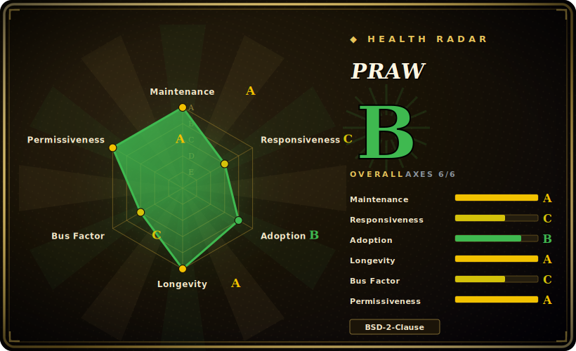

# PRAW

The "Python Reddit API Wrapper" — a Python package that gives you typed, Pythonic objects (Submission, Comment, Subreddit, Redditor) over Reddit's official OAuth API, and handles rate-limit compliance so you don't have to sprinkle `sleep` calls in your code.

## When to use

You're building something that reads or writes Reddit — a research dataset of posts from a few subreddits, a moderation bot that removes spam, a tool that monitors mentions of your product. You could hit Reddit's REST endpoints directly, but then you own OAuth token refresh, pagination, and (the painful part) staying under Reddit's rate limits without getting your app throttled or banned. You `pip install praw`, give it your client credentials and a descriptive user agent, and work with objects instead of JSON: `reddit.subreddit("python").hot(limit=25)` yields `Submission` objects you iterate; `submission.comments.replace_more()` flattens the comment forest. PRAW follows Reddit's API rules internally and paces requests for you, so the code reads like domain logic rather than HTTP plumbing.

It's the default building block when your data source *is* Reddit specifically and you want the official, OAuth-compliant path rather than scraping HTML. For streaming new items there's `subreddit.stream`, and an async sibling (`asyncpraw`) exists for concurrent workloads. [未验证]

## When NOT to use

- **You're not targeting Reddit.** It is Reddit-specific by definition; for any other site this is the wrong tool.
- **You need to bypass Reddit's API terms or rate/quota limits.** PRAW *complies* with the API — it won't get you data the API won't serve, and Reddit's API access terms and pricing/quotas (which have changed) bound what you can do, not the library. [未验证]
- **You want HTML scraping of Reddit's web pages.** PRAW uses the official JSON API; if the API doesn't expose a field, PRAW won't either — a different (scraping) approach would be needed, with its own ToS risk.
- **High-concurrency / async-first pipelines.** Synchronous PRAW can bottleneck; use `asyncpraw` (separate package) for heavy concurrent fetching rather than threading sync PRAW. [未验证]
- **You need Pushshift-style historical bulk archives.** PRAW reads the live API (with listing caps); large historical backfills are a different data-source problem.

## Comparison

| Alternative | In index | Our verdict | Tradeoff |
|---|---|---|---|
| Async PRAW (asyncpraw) | 未收录 | Use this page for its stated niche; choose Async PRAW (asyncpraw) when you need the same project's asyncio variant. | The same project's asyncio variant; better for concurrent/streaming workloads, at the cost of async code. Same maintainers. |
| Raw Reddit REST + requests | 未收录 | Use this page for its stated niche; choose Raw Reddit REST + requests when you need maximum control and zero abstraction, but you reimplement OAuth refresh, pagination, and rate-limit. | Maximum control and zero abstraction, but you reimplement OAuth refresh, pagination, and rate-limit compliance yourself. |
| PSAW / Pushshift clients | 未收录 | Use this page for its stated niche; choose PSAW / Pushshift clients when you need historical bulk Reddit data (when Pushshift access is available). | Historical bulk Reddit data (when Pushshift access is available); complements rather than replaces the live-API wrapper. |
| JRAW / snoowrap | 未收录 | Use this page for its stated niche; choose JRAW / snoowrap when you need reddit API wrappers for other languages (Java / JS). | Reddit API wrappers for other languages (Java / JS); same niche, different runtime. |
| [requests-html](requests-html.md) | ✅ | Use this page for its stated niche; choose requests-html when you need generic scraping lib. | Generic scraping lib — you'd parse Reddit HTML yourself and carry ToS risk; PRAW uses the sanctioned API instead. |

## Tech stack

- **Language:** Python 3.10+ (per README); pure-Python package.
- **Transport:** Reddit's OAuth2 REST API via the `prawcore` HTTP/session layer (the lower-level companion library handling auth, requests, and rate limiting).
- **Model:** lazy object model — `Submission`/`Comment`/`Subreddit`/`Redditor` objects that fetch attributes on access and paginate listings transparently.
- **Tooling signals:** README shows Ruff, pre-commit, GitHub Actions CI, and an OpenSSF Scorecard badge — a well-tooled modern Python project.

## Dependencies

- **Runtime:** Python 3.10+, the `prawcore`/`requests` stack pulled in by pip; install with `uv add praw` or `pip install praw`.
- **External:** Reddit API credentials (a registered app: client id/secret) and a descriptive user agent — and an active Reddit API account subject to Reddit's current access terms/quotas.
- **No DB/services of its own:** it's a client library; you supply your own storage if you persist results.

## Ops difficulty

**Low.** As a pure client library there's nothing to deploy — pip install, set credentials, run. The real operational considerations are *external*: registering a Reddit app, keeping credentials safe, and living within Reddit's rate limits and API terms (PRAW handles pacing, but quotas/pricing are Reddit's lever, not yours). For long-running bots you'll add your own process supervision, error handling, and persistence, but PRAW itself is undemanding.

## Health & viability

- **Maintenance (2026-06).** **Active.** v8.0.x released in June 2026 (v8.0.0 on 2026-06-14, with v8.0.1/8.0.2 days later), last push 2026-06-24 — current and shipping, with a major-version bump indicating ongoing work. Not archived.
- **Governance / bus factor.** Lives under the `praw-dev` GitHub **organization** (not a personal account) with a multi-contributor history (`bboe`, `LilSpazJoekp`, and others) — better bus factor than a single-maintainer lib, though still a small core team. [推断]
- **Age & Lindy verdict.** Created 2010-08, ~16 years old and **still actively shipping** ⇒ **strong Lindy**: one of the longest-lived, most-proven Reddit API wrappers in Python.
- **Adoption & ecosystem.** Widely used as *the* canonical Reddit Python wrapper; mature docs on Read the Docs, async sibling, and modern CI/linting/Scorecard tooling signal a healthy, disciplined project. [推断]
- **Risk flags.** The dominant external risk isn't the library but **Reddit's API policy** — access terms, quotas, and pricing have changed industry-wide and can constrain or cost what your app does, independent of PRAW's quality. [未验证]

## Caveats (unverified)

- [未验证] ~4.2k stars / 498 forks as of 2026-06; star counts are date-sensitive and not a maintenance signal.
- [未验证] Python-version floor (3.10+), the `prawcore` dependency, and `asyncpraw`'s exact relationship/feature parity are taken from README/general knowledge, not a manifest re-read this pass.
- [未验证] Reddit API access terms, rate limits, and pricing/quotas are set by Reddit and have changed over time; verify current terms before building — they bound usage more than the library does.
- [推断] "Strong Lindy / canonical wrapper" is judgment from age + activity + org governance, not a measured market-share claim.
- [未验证] Streaming (`subreddit.stream`) and listing caps behavior are described from the API's general design; verify limits for your specific workload.
