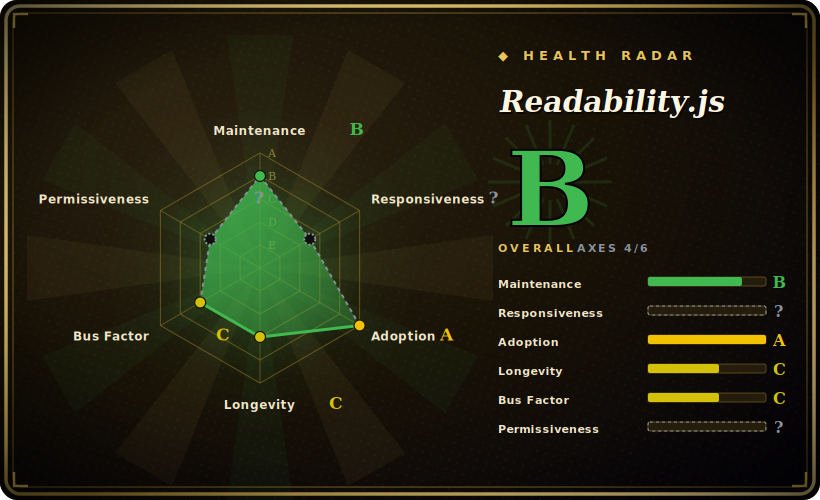

# Readability.js

The standalone version of the readability library behind Firefox Reader View — give it a DOM document, get back the article's title, byline, and cleaned main content with the navigation, ads, and boilerplate stripped out.

## When to use

You're building a read-it-later app, an RSS/newsletter pipeline, or an LLM ingestion step, and you keep getting whole web pages when you only want the article. The raw HTML is 90% chrome — nav bars, cookie banners, sidebars, comment widgets, ad slots — and you need just the title, author, and the body text a human would actually read. You reach for Readability.js: you parse the page into a DOM (in the browser you already have `document`; in Node you wrap the HTML with JSDOM or linkedom), construct `new Readability(documentClone).parse()`, and get back a structured object — `title`, `content` (cleaned HTML), `textContent`, `excerpt`, `byline`, `siteName`, `lang`, `publishedTime`. It's the same battle-tested heuristic engine Firefox ships in Reader View, so it handles the messy real web reasonably well without you writing per-site scrapers.

You also reach for it when you want a cheap pre-check: `isProbablyReaderable(document)` quickly guesses whether a page is even article-like, so a time-sensitive pipeline can skip pages that aren't worth parsing. Because it's a single, dependency-light JS module operating on a DOM you supply, it drops into both browser extensions and Node services with the same API.

## When NOT to use

- **You need to fetch and render the page, not just parse it.** Readability.js takes a DOM; it does **not** fetch URLs or run JavaScript. For JS-heavy SPAs you must render first (a headless browser / Playwright) and feed it the resulting DOM — the library won't do that for you.
- **You're in Node and don't want a DOM dependency.** Core parsing needs a DOM; in Node that means JSDOM (heavy) or linkedom — a real dependency and cost the browser case avoids.
- **You need structured field extraction beyond "the article."** It returns main content + a few metadata fields, not arbitrary structured data (price, product specs, tables) — that's a scraping/extraction job, not a reader-view job.
- **You need guaranteed precision on every site.** It's heuristic; `isProbablyReaderable` explicitly admits false positives/negatives, and content extraction can miss or over-trim on unusual layouts. Verify on your target sites. [推断]
- **You need a Python/Java pipeline.** This is JavaScript; for those stacks the language ports (python-readability, others) are the fit, with their own behavior differences.

## Comparison

| Alternative | In index | Our verdict | Tradeoff |
|---|---|---|---|
| [python-readability](python-readability.md) | ✅ | Use this page for its stated niche; choose python-readability when you need lxml-based Python port of the same arc90 lineage. | lxml-based Python port of the same arc90 lineage; choose by language (Python pipeline) — heuristics and output differ from the JS engine. |
| [dragnet](dragnet.md) | ✅ | Use this page for its stated niche; choose dragnet when you need ML-model content extraction (Python). | ML-model content extraction (Python); can outperform on some pages but is heavier, has aging dependencies, and is less maintained. |
| [boilerpipe](boilerpipe.md) | ✅ | Use this page for its stated niche; choose boilerpipe when you need classic Java boilerplate-removal algorithms. | Classic Java boilerplate-removal algorithms; mature ideas but the repo is effectively abandoned (last pushed 2018). |
| trafilatura | 未收录 | Use this page for its stated niche; choose trafilatura when you need python extraction library with strong benchmark results, metadata, and crawl support. | Python extraction library with strong benchmark results, metadata, and crawl support; often the modern Python default — different language, broader scope. |
| Mercury / Postlight Parser | 未收录 | Use this page for its stated niche; choose Mercury / Postlight Parser when you need node article parser that also fetched pages. | Node article parser that also fetched pages; historically popular but maintenance has been uneven. |

## Tech stack

- **Language:** JavaScript (works in browsers and Node).
- **Core:** a self-contained heuristic scoring engine (`Readability.js`) plus a lightweight `JSDOMParser`; the public surface is `new Readability(doc, options).parse()` and `isProbablyReaderable(doc, options)`.
- **Options:** `charThreshold`, `nbTopCandidates`, `keepClasses`/`classesToPreserve`, `disableJSONLD`, a configurable `serializer`, `allowedVideoRegex`, `linkDensityModifier`, `maxElemsToParse`.
- **Metadata:** prefers Schema.org JSON-LD fields when present (can be disabled).

## Dependencies

- **Runtime:** a DOM `document`. In the **browser** that's built in — effectively **zero runtime dependencies**. In **Node** you must supply a DOM implementation yourself (JSDOM or linkedom); these are *your* dependencies, not bundled by Readability.
- **Node engine:** `package.json` declares `engines.node >=14.0.0`. [未验证]
- **Install:** `npm install @mozilla/readability`, or load `Readability.js` directly in a web page.
- **No services:** no network, no datastore — it operates purely on the DOM you give it.

## Ops difficulty

**Low.** It's a library, not a service — nothing to deploy or operate. In the browser it's a script with no dependencies. The only real operational consideration is the Node case: you must run a DOM (JSDOM is heavy and can be a memory/CPU cost at scale), and if your inputs are JS-rendered pages you need a separate fetch/render stage in front of it. Beyond that, "ops" is just keeping the npm dependency current and validating extraction quality on the sites you care about.

## Health & viability

- **Maintenance (2026-06).** Last pushed 2026-01 — within the last several months, so **maintained but low-cadence**. v0.6.0 is the published version; this is a slow-moving, stable library rather than a fast-churning one. Not archived. [推断]
- **Governance / backing.** Owned by **Mozilla** and used in Firefox Reader View — a strong institutional backer with a real product dependency on it, which is a meaningful longevity signal beyond a hobby project. [推断]
- **Age × Lindy (2026-06).** Created 2015-02 — ~11 years old and **still maintained** ⇒ a **strong Lindy** signal; this is a long-proven, widely embedded extractor, not a newcomer. [推断]
- **Adoption & ecosystem.** Embedded in Firefox and reused across countless reader/scraper/LLM-ingestion pipelines; ~11.3k stars and broad downstream use indicate healthy adoption. The ~309 open issues reflect a large, heuristic surface (extraction edge cases), not abandonment. [未验证]
- **Risk flags.** None major. Apache-2.0; main caveats are heuristic accuracy (not deterministic) and that it parses but does not fetch/render. [推断]

## Caveats (unverified)

- [未验证] GitHub's API reports the license as `NOASSERTION`, but `LICENSE.md` is the Apache License 2.0 (Arc90 copyright header, 2010) and `package.json` declares `"license": "Apache-2.0"` — so the page records **Apache-2.0**; the NOASSERTION is an API artifact of the header format, not a different license.
- [未验证] ~11.3k stars and v0.6.0 as of 2026-06 — star/version numbers are date-sensitive; treat as indicative only.
- [未验证] `engines.node >=14.0.0` is from `package.json`; the practically supported Node range may differ in current dev.
- [推断] "Maintained, low cadence" is inferred from the 2026-01 push date and the absence of frequent tagged releases; exact release cadence was not enumerated.
- [推断] Extraction accuracy and `isProbablyReaderable` reliability are heuristic and site-dependent; "verify on your sites" is general guidance, not a measured failure rate.
