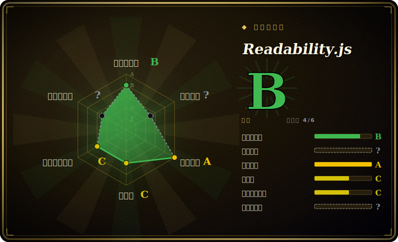

# Readability.js

Firefox Reader View 背后那个 readability 库的独立版本——给它一个 DOM document，拿回文章的标题、作者署名和清理过的正文，导航、广告和样板内容都被剥掉。

## 何时使用

你在做一个稍后读应用、一条 RSS/newsletter 管线，或一个 LLM 摄取步骤，却老是拿到整张网页，而你只想要文章。原始 HTML 有 90% 是壳——导航栏、cookie 横幅、侧边栏、评论组件、广告位——你只需要标题、作者和人真正会读的正文。于是你转向 Readability.js：把页面解析成 DOM（浏览器里你已经有 `document`；Node 里你用 JSDOM 或 linkedom 包一下 HTML），构造 `new Readability(documentClone).parse()`，拿回一个结构化对象——`title`、`content`（清理过的 HTML）、`textContent`、`excerpt`、`byline`、`siteName`、`lang`、`publishedTime`。这正是 Firefox 在 Reader View 里发布的、久经考验的同一套启发式引擎，所以它能相当好地应付杂乱的真实网页，而不用你为每个站点手写爬虫。

当你想要一次廉价预检时，你也会选它：`isProbablyReaderable(document)` 快速猜测一个页面是否像文章，让时间敏感的管线跳过不值得解析的页面。因为它是一个单一、依赖很轻的 JS 模块，作用在你提供的 DOM 上，所以它能以同一套 API 嵌进浏览器扩展和 Node 服务。

## 何时不用

- **你需要抓取并渲染页面，而不只是解析。** Readability.js 接收 DOM；它**不**抓取 URL、也不跑 JavaScript。对重 JS 的 SPA，你必须先渲染（headless 浏览器/Playwright）再把得到的 DOM 喂给它——这库不会替你做。
- **你在 Node 里又不想要 DOM 依赖。** 核心解析需要 DOM；在 Node 里那意味着 JSDOM（重）或 linkedom——一个真实依赖和成本，而浏览器场景能避开它。
- **你需要超出“这篇文章”之外的结构化字段抽取。** 它返回正文 + 几个元数据字段，而非任意结构化数据（价格、产品规格、表格）——那是抓取/抽取的活，不是 reader-view 的活。
- **你需要在每个站点上都有保证的精度。** 它是启发式的；`isProbablyReaderable` 明确承认会有假阳/假阴，正文抽取在异常布局上可能漏取或过裁。请在你的目标站点上验证。[推断]
- **你需要 Python/Java 管线。** 这是 JavaScript；那些栈应选语言移植版（python-readability 等），各有自己的行为差异。

## 横向对比

| 替代品 | 是否收录 | 我们的评价 | 取舍 |
|---|---|---|---|
| [python-readability](python-readability.zh.md) | ✅ | 当前页用于它的主场景；如果更看重“基于 lxml 的同一 arc90 血统 Python 移植”，再选 python-readability。 | 基于 lxml 的同一 arc90 血统 Python 移植；按语言选（Python 管线）——启发式与输出和 JS 引擎有别。 |
| [dragnet](dragnet.zh.md) | ✅ | 当前页用于它的主场景；如果更看重“ML 模型做正文抽取（Python）”，再选 dragnet。 | ML 模型做正文抽取（Python）；在某些页面上可胜出，但更重、依赖老化、维护较少。 |
| [boilerpipe](boilerpipe.zh.md) | ✅ | 当前页用于它的主场景；如果更看重“经典 Java 样板移除算法”，再选 boilerpipe。 | 经典 Java 样板移除算法；思想成熟，但仓库实际已废弃（最后 push 2018）。 |
| trafilatura | 未收录 | 当前页用于它的主场景；如果更看重“Python 抽取库，基准结果强、带元数据和爬取支持”，再选 trafilatura。 | Python 抽取库，基准结果强、带元数据和爬取支持；常是现代 Python 默认——语言不同、范围更广。 |
| Mercury / Postlight Parser | 未收录 | 当前页用于它的主场景；如果更看重“Node 文章解析器，也会抓页面”，再选 Mercury / Postlight Parser。 | Node 文章解析器，也会抓页面；历史上流行但维护起伏不定。 |

## 技术栈

- **语言：** JavaScript（浏览器和 Node 都可用）。
- **核心：** 一个自包含的启发式打分引擎（`Readability.js`）外加一个轻量 `JSDOMParser`；公开面是 `new Readability(doc, options).parse()` 和 `isProbablyReaderable(doc, options)`。
- **选项：** `charThreshold`、`nbTopCandidates`、`keepClasses`/`classesToPreserve`、`disableJSONLD`、可配置的 `serializer`、`allowedVideoRegex`、`linkDensityModifier`、`maxElemsToParse`。
- **元数据：** 存在时优先用 Schema.org JSON-LD 字段（可禁用）。

## 依赖

- **运行时：** 一个 DOM `document`。在**浏览器**里这是内置的——实际上**零运行时依赖**。在 **Node** 里你必须自己提供 DOM 实现（JSDOM 或 linkedom）；这些是*你的*依赖，并非 Readability 捆绑。
- **Node 引擎：** `package.json` 声明 `engines.node >=14.0.0`。[未验证]
- **安装：** `npm install @mozilla/readability`，或在网页里直接加载 `Readability.js`。
- **无服务：** 无网络、无数据存储——它纯粹作用在你给的 DOM 上。

## 运维难度

**低。** 它是库不是服务——没什么要部署或运维。浏览器里它是一段无依赖脚本。唯一真正的运维考量是 Node 场景：你必须跑一个 DOM（JSDOM 较重，规模化时是内存/CPU 成本），而若你的输入是 JS 渲染页面，你还需要在它前面放一个独立的抓取/渲染阶段。除此之外，“运维”只是保持 npm 依赖更新，并在你关心的站点上验证抽取质量。

## 健康度与可持续性

- **维护（2026-06）。** 最后 push 于 2026-01——在近几个月内，所以是**有维护但低节奏**。v0.6.0 是发布版本；这是一个缓慢演进、稳定的库，而非快速变动型。未归档。[推断]
- **治理 / 背书。** 归 **Mozilla** 所有，用于 Firefox Reader View——一个强机构背书方，且对它有真实的产品依赖，这是超越业余项目的、有意义的寿命信号。[推断]
- **年龄 × Lindy（2026-06）。** 2015-02 创建——约 11 岁且**仍在维护**⇒ **强 Lindy** 信号；这是一个久经验证、被广泛嵌入的抽取器，而非新秀。[推断]
- **采用度与生态。** 嵌入 Firefox，并被无数 reader/scraper/LLM 摄取管线复用；约 11.3k star 和广泛的下游使用表明采用度健康。约 309 个 open issue 反映的是一个大的启发式面（抽取边界情况），而非废弃。[未验证]
- **风险标记。** 无重大项。Apache-2.0；主要存疑是启发式精度（非确定性），以及它解析但不抓取/渲染。[推断]

## 存疑（未验证）

- [未验证] GitHub API 把许可报为 `NOASSERTION`，但 `LICENSE.md` 是 Apache License 2.0（Arc90 版权头，2010），且 `package.json` 声明 `"license": "Apache-2.0"`——故本页记为 **Apache-2.0**；NOASSERTION 是头部格式造成的 API 假象，并非另一种许可。
- [未验证] 截至 2026-06 约 11.3k star、v0.6.0——star/版本号对时间敏感，仅供参考。
- [未验证] `engines.node >=14.0.0` 取自 `package.json`；当前开发中实际支持的 Node 范围可能不同。
- [推断] “有维护、低节奏”由 2026-01 的 push 日期和缺少频繁 tag 发布推断；确切发布节奏未逐项列举。
- [推断] 抽取精度与 `isProbablyReaderable` 可靠性是启发式且依站点而异；“在你的站点上验证”是一般性建议，而非实测失败率。
