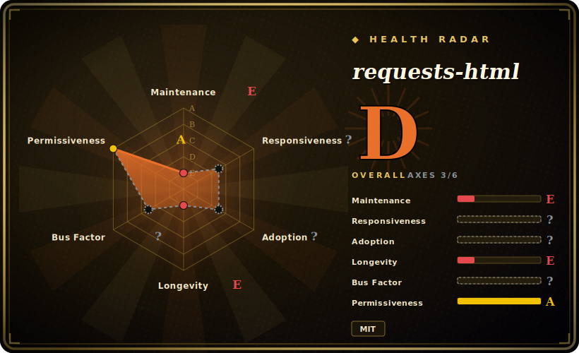

# requests-html

"HTML Parsing for Humans" — a Python library that bundles `requests`, PyQuery/lxml parsing, and optional JavaScript rendering (via pyppeteer/Chromium) behind one ergonomic API, so a small script can fetch a page and select elements without wiring three libraries together.

## When to use

You're a backend or data engineer writing a quick scraper for an internal report — a handful of pages off a stable site, and you just want to GET a URL, pull the rows out of a table, and grab a few links. You already know `requests`, and you don't want to bolt a separate parser on top, learn XPath, or stand up a crawling framework for a 40-line script. You `pip install requests-html`, do `session.get(url)`, and then `r.html.find('table tr')`, `r.html.absolute_links`, or a CSS/XPath search — the `requests`-style session and the parsing live in one object, with `.text`, `.links`, and `.absolute_links` already resolved for you. For a throwaway script over plain server-rendered HTML, that single-API convenience is the whole appeal.

Occasionally a page you scrape needs a little JavaScript to populate content, and `r.html.render()` will spin up a headless Chromium (pyppeteer) to execute it before you parse — handy for a one-off where you'd otherwise reach for a full browser-automation stack. **For any new work in 2026, though, treat this as a legacy-only choice**: the library is effectively unmaintained (see Health), so reach for it mainly when you're maintaining an existing script that already depends on it, not when starting fresh.

## When NOT to use

- **Anything new in 2026 — it is largely unmaintained.** Last pushed 2024-04 (~2 years idle as of 2026-06); a classic kennethreitz-project pattern (built fast, widely adopted, then coasting). For new code prefer **httpx + parsel** or **requests + BeautifulSoup/selectolax** — same job, actively maintained, no dead-dependency risk. [未验证]
- **You need reliable JavaScript rendering.** The `render()` path drives **pyppeteer**, an aging, itself-unmaintained Chromium driver that downloads a heavyweight browser and is fragile across Chromium/OS versions. For real JS-rendered pages use **Playwright (Python)** for the fetch and **selectolax/BeautifulSoup** (or Playwright's own locators) for parsing — far more robust than `requests-html`'s bundled pyppeteer. [推断]
- **Large-scale or production crawling.** No built-in concurrency model, scheduling, retry/throttle, dedup, or pipeline — it's a convenience wrapper, not a crawler. For breadth/throughput use **Scrapy** (or an async fetch loop over httpx). 
- **You care about parse speed on big documents.** It parses via PyQuery/lxml; if HTML parsing is your bottleneck, **selectolax** (Modest/lexbor) is dramatically faster.
- **You want long-term dependency hygiene.** Pinning a coasting library that pulls pyppeteer + a bundled Chromium into your tree is a maintenance and security liability — the transitive surface rots even if your code doesn't change.

## Comparison

| Alternative | In index | Tradeoff |
|---|---|---|
| httpx + BeautifulSoup / parsel | 未收录 | The mainstream modern split: an actively-maintained async-capable HTTP client plus a dedicated parser (bs4 for forgiving HTML, parsel for Scrapy-style CSS/XPath). Two imports instead of one, but both are maintained and you control each piece — the recommended replacement for plain HTML scraping. |
| Playwright (Python) | 未收录 | Real, maintained headless-browser automation (Chromium/Firefox/WebKit) for JS-heavy pages; far more robust than `requests-html`'s pyppeteer `render()`, but heavier and a different (browser-driving) mental model. Pair with selectolax/bs4 for parsing. |
| Scrapy | 未收录 | A full async crawling framework — concurrency, scheduling, middleware, pipelines, retries; the right tool when you're crawling at scale, overkill for a 40-line one-off. |
| selectolax | 未收录 | Very fast C-backed (Modest/lexbor) HTML parser with CSS selectors; parsing only (bring your own HTTP client), but the speed choice for large documents — what `requests-html` is not. |
| requests + BeautifulSoup | 未收录 | The classic, still-fine combo for simple synchronous scraping; `requests-html` is essentially this plus PyQuery selectors and an optional JS-render bolt-on, but without active maintenance. |

## Tech stack

- **Language:** Python (3.6+ historically; verify against the version you pin — the project predates current Python releases).
- **HTTP:** wraps `requests` (`HTMLSession`) for synchronous fetches; an `AsyncHTMLSession` exists for async use.
- **Parsing:** PyQuery + lxml under the hood, exposing `.find()` (CSS), `.xpath()`, `.search()`/`.search_all()` (parse-template), `.text`, `.links`, `.absolute_links`.
- **JS rendering:** `r.html.render()` drives **pyppeteer**, which downloads and controls a headless **Chromium**; rendering is optional and only triggered on demand.

## Dependencies

- **Runtime:** `requests`, `pyquery`, `lxml`, `parse`, `bs4`, `w3lib`, `fake-useragent` (the pulled-in stack is non-trivial for a "small" library).
- **JS rendering:** `pyppeteer`, plus a **bundled headless Chromium** it downloads on first `render()` — a large binary dependency, and pyppeteer itself is aging/under-maintained.
- **No services/infra:** it's a client-side library — no datastore, no daemon, no backend; the only heavy artifact is the Chromium download for `render()`.

## Ops difficulty

**Low for the parsing path, medium-and-fragile for `render()`.** As a plain library there is nothing to deploy or operate — `pip install`, import, run. The friction is entirely in two places: (1) the `render()` path downloads a full Chromium on first use and depends on pyppeteer working against your OS/Chromium versions, which breaks in containers/CI without the right system libraries and gets no upstream fixes; and (2) **dependency rot** — installing a coasting library on modern Python can surface version conflicts in lxml/pyquery/pyppeteer, and you won't get upstream releases to resolve them. Budget time for pinning and for replacing `render()` with Playwright if the JS path matters. [推断]

## Health & viability

- **Maintenance (DATED 2026-06).** **Last pushed 2024-04 — roughly 2 years idle**; no recent releases or commit activity. This reads as **effectively unmaintained / coasting**, the dominant signal for any 2026 selection decision. Not formally archived, but currency is dead. [未验证]
- **The kennethreitz pattern.** A kennethreitz-authored project (like `requests` itself and several others): built fast, beautifully ergonomic, widely adopted, then left to coast once attention moved on. Treat "popular and elegant" as orthogonal to "currently maintained" here. [推断]
- **Governance / bus factor.** Repo lives under the **PSF (`psf`) organization** (owner type Organization), which is *nominal* stewardship — PSF holding the repo does **not** imply an active maintainer is shipping fixes. No evidence of an active maintainer found; treat bus factor as effectively zero for new fixes. [未验证]
- **Age & Lindy verdict.** Created 2018-02 (~8 years old), so age alone looks Lindy — but **Lindy requires age × *still-active***, and this fails the still-active half. A long-lived **but idle** project is not a safe bet; the age is not protective here. [推断]
- **Adoption & the real risk.** Still widely starred (~13.8k) and referenced in old tutorials, so you'll meet it in legacy code — but the **dependency rot is the live risk**: the bundled pyppeteer/Chromium JS-render path is fragile and unmaintained, and the broader transitive stack ages with no upstream releases. Adoption inertia ≠ viability. [未验证]

## Caveats (unverified)

- [未验证] ~13.8k GitHub stars and MIT license as of 2026-06 — star counts are date-sensitive and unreliable as a health proxy; treat as indicative only.
- [未验证] "Last pushed 2024-04 / ~2 years idle / effectively unmaintained" is the dominant claim and the basis for the whole recommendation — re-confirm the repo's actual last-commit/last-release date before relying on it; the project is not formally archived.
- [未验证] PSF (`psf`) is recorded as the owning organization (owner type Organization), but PSF ownership does not confirm an *active* maintainer; no current maintainer/roadmap was verified.
- [推断] The "kennethreitz-project pattern" (build-fast-then-coast) is a characterization from the author's broader project history, not a stated project policy.
- [推断] pyppeteer being aging/unmaintained and the `render()` path being fragile across Chromium/OS versions is inferred from pyppeteer's general status and how the bundled-Chromium path works — verify against your target environment before depending on JS rendering.
- [未验证] The exact runtime dependency list and minimum Python version are version-dependent — check the version you pin rather than trusting this summary.
