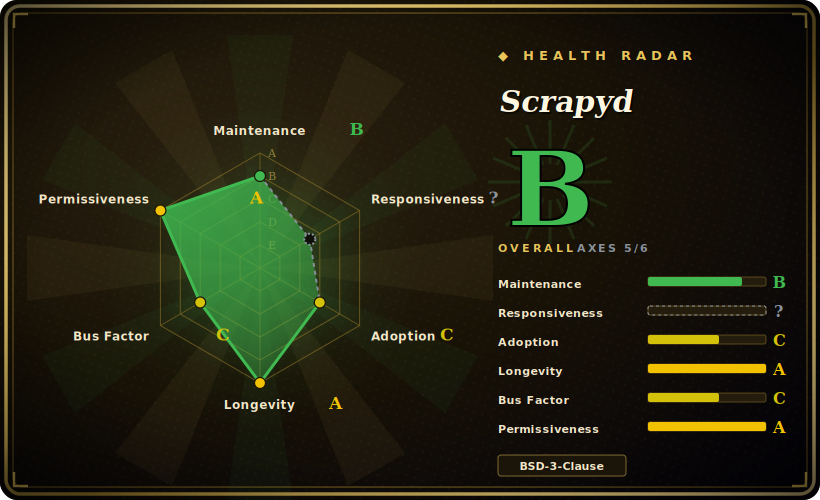

# Scrapyd

A service daemon for deploying and running Scrapy spiders over a JSON HTTP API — eggify a Scrapy project, upload it, and schedule/cancel/monitor crawl jobs remotely. The canonical "run Scrapy in production" daemon, from the Scrapy org itself.

## When to use

You're a data engineer who has written a handful of Scrapy spiders that work fine on your laptop, and now you need them to run on a server — on a schedule, restartable, with multiple project versions you can roll forward and back. You don't want to SSH in and `scrapy crawl` by hand, or hand-roll a supervisor around it. You install Scrapyd on the box, use `scrapyd-deploy` to package each project into an egg and upload it, and from then on you drive everything over HTTP: `POST schedule.json` to queue a crawl, `listjobs.json` to see what's running, `cancel.json` to stop one. Scrapyd spawns each job as a managed `scrapy crawl` subprocess with configurable parallelism, keeps logs and item feeds, and serves a minimal status page at port 6800. It's the standard, Scrapy-org-blessed way to turn local spiders into a deployable crawl service — and the API layer that admin UIs like ScrapydWeb, Gerapy, and SpiderKeeper sit on top of.

## When NOT to use

- **It only runs Scrapy.** It literally spawns `scrapy crawl`; it is not a general job scheduler. For orchestrating arbitrary tasks, use Airflow, Celery, or cron.
- **Single-node by default.** No built-in clustering or cross-machine distribution — horizontal scaling means running multiple Scrapyd instances and coordinating them yourself (typically via a UI layer that targets several daemons).
- **Minimal, opt-in security.** The JSON API is unauthenticated by default; do not expose port 6800 to the public internet without your own auth / reverse-proxy layer. [推断 — 基于"minimal web interface"文档措辞与 Twisted auth 痕迹，未逐行核验默认配置]
- **You'll want a UI on top for real usability.** The built-in web page is monitoring-only — day-to-day management expects [SpiderKeeper](spiderkeeper.md), ScrapydWeb, or Gerapy layered over it.
- **You want a managed, hands-off SaaS.** If you'd rather not run the daemon at all, Zyte Scrapy Cloud removes the ops burden Scrapyd leaves to you.

## Comparison

| Alternative | In index | Our verdict | Tradeoff |
|---|---|---|---|
| [SpiderKeeper](spiderkeeper.md) | ✅ | Use this page for its stated niche; choose SpiderKeeper when you need not a competitor. | Not a competitor — a Flask admin **UI on top of** Scrapyd (deploy, periodic scheduling, dashboard). Older/staler; complements Scrapyd rather than replacing it. |
| ScrapydWeb / Gerapy | 未收录 | Use this page for its stated niche; choose ScrapydWeb / Gerapy when you need also admin UIs over Scrapyd: ScrapydWeb adds multi-node/log-parsing/alerts. | Also admin UIs over Scrapyd: ScrapydWeb adds multi-node/log-parsing/alerts; Gerapy is Django+Vue and more modern. Both call Scrapyd's API, not replacements for the daemon. |
| Zyte Scrapy Cloud | 未收录 | Use this page for its stated niche; choose Zyte Scrapy Cloud when you need commercial managed SaaS for Scrapy (no self-hosting). | Commercial managed SaaS for Scrapy (no self-hosting); removes ops at the cost of vendor lock-in and per-usage pricing. |
| Apache Airflow / Celery / cron | 未收录 | Use this page for its stated niche; choose Apache Airflow / Celery / cron when you need general-purpose schedulers. | General-purpose schedulers — broader scope, but no Scrapy-native eggify/deploy/version model; you build the spider-running glue yourself. |

## Tech stack

- **Language:** Python (>=3.10–3.13).
- **Core framework:** Twisted — the daemon is a Twisted application (Twisted-style `render_GET`, avatar/realm auth primitives).
- **State:** job/version state persisted in sqlite3. [推断 — 从 ruff S608 忽略注释与配置推断，未读运行时源码逐行确认]
- **Runtime deps (pyproject, v1.6.0):** `scrapy>=2.0.0`, `twisted>=17.9`, `w3lib`, `zope.interface`, `packaging`, `setuptools`, plus `pywin32` on Windows.
- **Interface:** JSON HTTP API (`schedule.json`, `cancel.json`, `addversion.json`, `listjobs.json`, …) and a minimal status web page; `scrapyd-deploy` (from the separate `scrapyd-client`) handles eggify + upload.

## Dependencies

- **Runtime:** Python 3.10+, a Twisted/Scrapy install, and disk for eggs, logs, and the sqlite state file.
- **Companion tool:** `scrapyd-client` (separate package) provides `scrapyd-deploy` for packaging and deploying projects.
- **No external database/service required** for the daemon itself; state is local sqlite. A reverse proxy + auth is recommended if exposed.
- **Optional UI:** SpiderKeeper / ScrapydWeb / Gerapy if you want a management dashboard.

## Ops difficulty

**Low-to-medium.** The happy path is `pip install scrapyd`, run it, and `scrapyd-deploy` your project — one process, local sqlite state, no cluster. Difficulty appears at the edges: it ships unauthenticated, so you must add auth / a reverse proxy / firewalling before exposing it; scaling beyond one box means standing up several daemons and a UI/coordinator to target them; and you own the host-level supervision (systemd), disk hygiene for logs/eggs, and backpressure tuning of concurrent crawls. The daemon itself is stable and undemanding — the work is the production hardening around it. [推断 — 默认无鉴权的具体配置未逐行核验]

## Health & viability

- **Maintenance (2026-06).** Active — last pushed 2026-06-19, latest release v1.6.0 (2025-07-22), roughly one feature release per year, status "Production/Stable", not archived. Only ~6 open issues — a small, well-tended scope. [推断 — GitHub Releases API 只到 1.4.1，1.5.0/1.6.0 以 docs/news.rst changelog 为准]
- **Governance / bus factor.** Lives under the **`scrapy` GitHub org** (same community/team that maintains the Scrapy framework), not a solo account — `jpmckinney` is the notable current maintainer, with several core Scrapy-org names contributing. Low bus-factor risk.
- **Age × Lindy.** Created 2013 (~13 years) and still pushed this month ⇒ a **strong Lindy** signal: mature, slow-moving infrastructure that has long outlived hype cycles.
- **Adoption.** ~3.1k stars; it is the de-facto Scrapy deployment daemon, with a whole ecosystem of admin UIs (ScrapydWeb/Gerapy/SpiderKeeper) built to target its API.
- **Risk flags.** Few. BSD-3-Clause, no relicense history; the main caution is the unauthenticated-by-default API, which is a deployment responsibility, not a project-health problem. [推断]

## Caveats (unverified)

- [推断] sqlite3 persistence and the unauthenticated-by-default API are inferred from config/ruff comments and documentation wording, not confirmed by reading runtime source line-by-line.
- [推断] The GitHub Releases API stops at 1.4.1 (2023); 1.5.0/1.6.0 are taken from the `docs/news.rst` changelog, which is treated as authoritative — the team appears to have stopped cutting GitHub Release objects while still shipping to PyPI.
- [未验证] ~3.1k stars and ~6 open issues as of 2026-06; counts are date-sensitive and indicative only.
