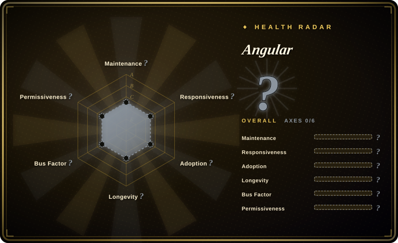

# Angular

A comprehensive web development platform for building mobile and desktop web applications using TypeScript. Built and maintained by Google with a strong focus on enterprise-scale apps.

## When to use

You're an enterprise team building a large, complex web application with dozens of screens, strict coding standards, and a need for long-term maintainability. You evaluate React, but its "bring your own everything" philosophy means you would spend weeks choosing and wiring together routing, state management, and form validation libraries. You evaluate Vue, but its gentler learning curve comes with less built-in structure for large teams. You choose Angular because it ships with everything you need: a powerful CLI for scaffolding, a reactive forms system, an HTTP client, a router with lazy loading, and a first-class TypeScript experience. You don't want to spend weeks evaluating and wiring together third-party libraries for routing, state management, or form validation. Angular's opinionated structure means new hires can onboard faster because the codebase follows predictable patterns, and Google's long-term backing gives you confidence the framework will still be maintained in five years.

## When NOT to use

- **If you need a small landing page, blog, or simple CRUD with fewer than 10 screens, use Vite + React or Vue instead of Angular, because** Angular's boilerplate and build complexity are overkill for small projects. You will ship faster with a lighter stack.
- **If your team avoids TypeScript, use plain React or Vue instead of Angular, because** Angular is deeply TypeScript-native. If your team prefers plain JavaScript or finds TS decorators and complex types burdensome, friction will be constant.
- **If you need rapid prototyping or a quick MVP, use Next.js or Vue instead of Angular, because** Angular's strict module system, build pipeline, and boilerplate slow down quick iterations. A lighter framework is better for hackathons and prototypes.
- **If you need SEO-first static sites, use Next.js or Nuxt instead of Angular, because** while Angular has SSR (Angular Universal), it is not as seamless as Next.js or Nuxt for static site generation. If your content is mostly static and SEO-critical, those frameworks are the better choice.
- **If you need mixed-framework micro-frontends, use React-based micro-frontends with module federation instead of Angular, because** Angular's zone.js and Ivy compiler create integration friction when mixing with non-Angular micro-frontends. If your architecture requires mixed-framework shells, the complexity is real.
- **If bundle size is critical for low-bandwidth or mobile-first markets, use Svelte or Preact instead of Angular, because** Angular's core framework is larger than React or Vue. For apps targeting low-bandwidth or mobile-first emerging markets, the initial payload can be a concern.

## Comparison

| Alternative | In index | Our verdict | Tradeoff |
| --- | --- | --- | --- |
| React | 未收录 | The most popular UI library with a vast ecosystem and a "just JavaScript" philosophy. | React is more flexible and has a larger job market; Angular is more opinionated and ships with more built-in tooling, reducing decision fatigue. |
| Vue.js | 未收录 | Progressive framework with a gentler learning curve and excellent documentation. | Vue is easier to adopt incrementally; Angular demands all-in commitment but rewards it with stronger enterprise structure. |
| Svelte / SvelteKit | 未收录 | Compile-time framework with minimal runtime overhead and no virtual DOM. | Svelte is faster and simpler for small-to-medium apps; Angular has deeper enterprise support, more third-party integrations, and a longer track record. |
| Next.js | 未收录 | Full-stack React framework with best-in-class SSR/SSG and Vercel integration. | Next.js is the default for React-based SSR/SEO; Angular Universal exists but is less dominant in that niche. |
| [shadcn/ui](shadcn-ui.md) | ✅ | A component distribution model, not a framework — often used inside React. | Not a direct substitute; shadcn/ui is about component ownership, Angular is a full application framework. |

## Tech stack

- **TypeScript** — primary language; Angular is one of the earliest frameworks to go all-in on TS
- **RxJS** — reactive programming library for async operations and state management
- **Zone.js** — change detection mechanism (being phased out in favor of signals)
- **Angular CLI** — build, test, and scaffolding toolchain based on Webpack / esbuild
- **Angular Universal** — server-side rendering (SSR) and static site generation (SSG)
- **Angular Material** — official Material Design component library
- **Ivy** — next-generation compilation and rendering pipeline
- **Signals** — modern fine-grained reactivity system (introduced in v16+, replacing zone.js gradually)

## Dependencies

- **Node.js** — runtime for the CLI and build tools (LTS recommended)
- **TypeScript** — the framework is designed around TS; plain JS is not practical
- **A modern browser** — Angular supports evergreen browsers; IE11 support has been dropped
- **Optional: Angular Universal** — for SSR, a Node.js server is required
- **Optional: Angular Material** — if you want pre-built Material Design components (not required)
- **Optional: NgRx / Akita / NGXS** — for complex state management beyond RxJS services
- **Build tools**: The CLI abstracts Webpack / esbuild / Vite, but you may need to customize builders for advanced use cases

## Ops difficulty

**Low to Medium**. Angular apps are static SPAs (or SSR apps) that deploy to any CDN or web server. The CLI handles the build pipeline, tree-shaking, and optimization. Complexity arises when:
- You need custom Webpack configs (e.g., for micro-frontends or legacy module federation)
- You enable SSR and must run a Node.js server
- You manage monorepos with multiple Angular apps (Nx is the common solution)
- You upgrade major versions (Angular's 6-month release cycle means annual upgrades are needed)

## Health & viability

- **Responsiveness**: Cannot be scored — no_traffic.
- **Maintenance**: Very active — maintained by Google with a 6-month major release cycle and a public roadmap. Long-term support (LTS) for the last two major versions.
- **Governance**: Owned by Google. The Angular team has historically been shielded from Google-wide re-orgs, but it is still a single-vendor project. The community has a voice through the Angular Community Discord and GitHub.
- **Backing**: Google is the primary backer. Angular is used internally at Google (Google Cloud Console, Firebase Console, etc.), which provides a strong incentive to keep it maintained.
- **Adoption**: Strong enterprise adoption with 100.4k stars, created in 2014 (12-year track record). A staple in large enterprise and fintech codebases. The job market is healthy, especially in enterprise consulting.
- **Risk flags**: The MIT license is permissive. Google has a good track record of maintaining Angular, but the risk of "Google kills things" is always a background concern. No relicense history. The shift from zone.js to signals represents a significant architectural change; existing apps may need migration.

## Caveats (unverified)

- [推断] Angular's zone.js to signals migration timeline and the exact proportion of Google-internal apps using Angular have not been verified.
- [未验证] The precise number of enterprise production deployments and their scale has not been independently audited.
- [未验证] Angular's market share relative to React and Vue in new project starts is inferred from job postings and community surveys, not hard data.
- [推断] Micro-frontend integration with non-Angular shells is possible but the exact friction level depends on the module-federation setup.
- [推断] The actual performance impact of Angular's bundle size compared to React or Vue varies by application and optimization strategy.
